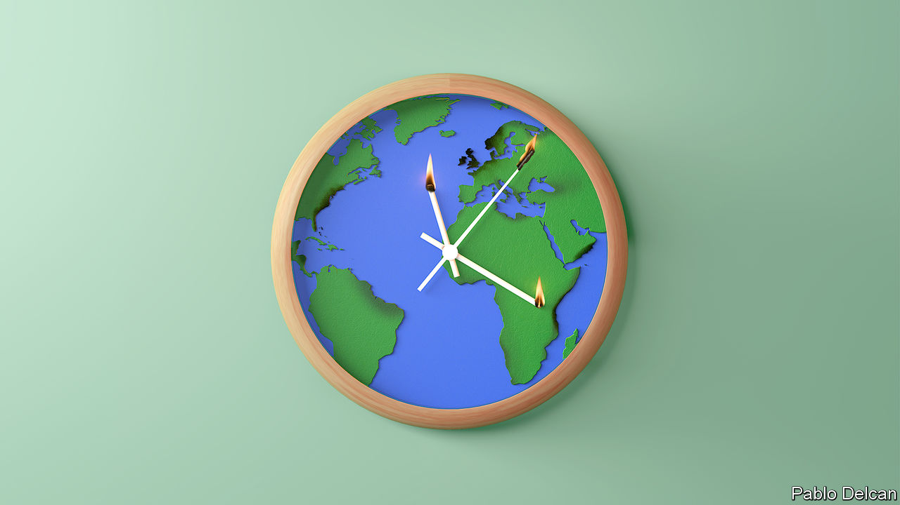
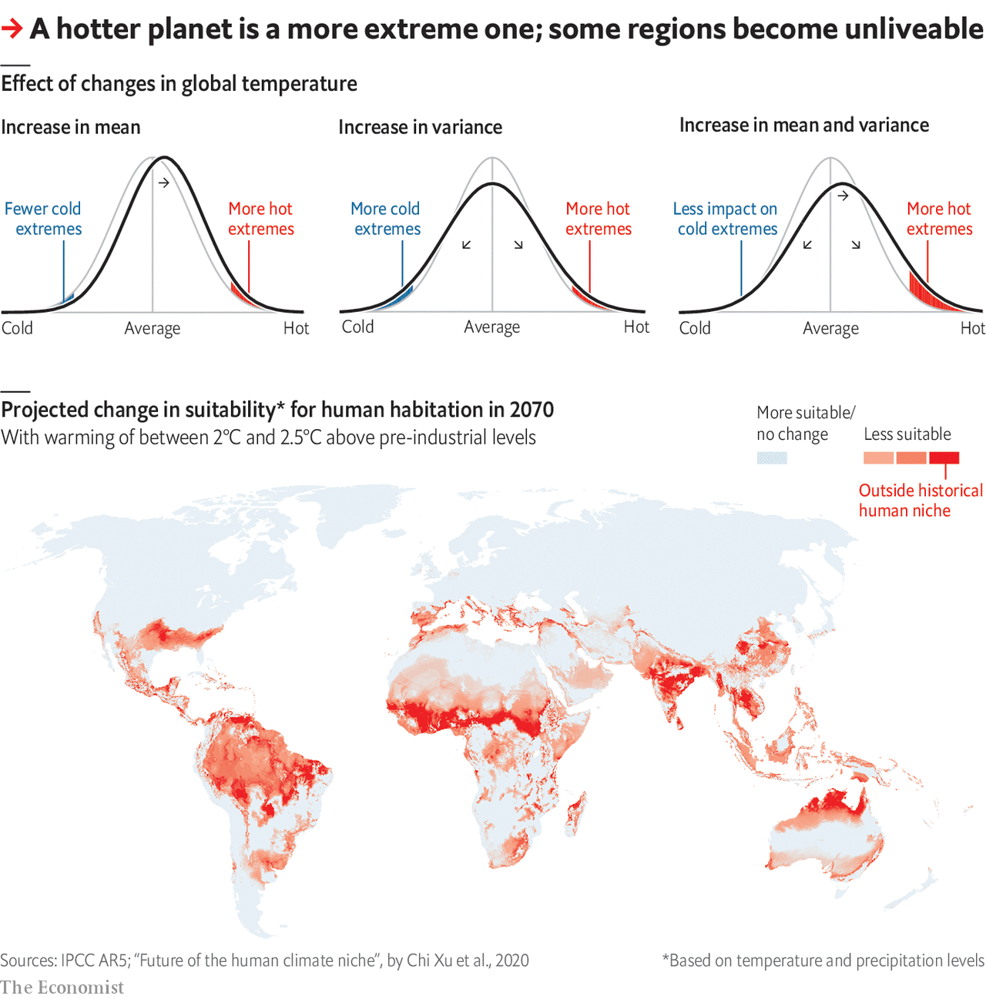

## Bad times

# Damage from climate change will be widespread and sometimes surprising

> It will go far beyond drought, melting ice sheets and crop failures

> May 16th 2020

Editor’s note: This is the fourth in a series of climate briefs. To read the others, and more of our climate coverage, visit our hub at [economist.com/climatechange](https://www.economist.com/https://economist.com/climatechange)

ON NOVEMBER 21ST 2016, a line of thunderstorms passed through the Australian state of Victoria. By the end of the following day, it had sent 3,000 people to hospital. Storms typically hurt people by blowing down buildings, flooding streets or setting fires. In this case, though, the casualties were caused by asthma. Late that afternoon a peculiarly powerful downdraft generated by the storm front pushed a layer of cold air thick with pollen, dust and other particles through Melbourne. The city’s ambulance service was swamped within hours. At least ten people died.

The risks that weather and climate pose to human life are not always as specific to the peculiar circumstances of time and place as that sudden-onset asthma epidemic. But they are complex functions of what, where and who, and their mechanisms are not always easily discerned. What is more, they can interact with each other. For example, if the southern spring of 2016 had not brought weather particularly well suited to the growth of allergenic grasses, would that stormy afternoon have been so catastrophic? Such complexities mean that a gradual change to the climate can lead to sudden changes in the impacts on human beings when things pass a certain threshold. And that threshold will not necessarily be discernible in advance.

Not all the ways in which today’s weather harms people will be exacerbated by climate change. But research suggests that many of them will. Most of the problems people have with weather and climate come from extremes. When means shift a little, extremes can shift a lot (see chart). Today’s rare extremes become tomorrow’s regular disturbances; tomorrow’s extremes are completely new.

How damaging these impacts will be to the economic and physical welfare of humankind depends on how much warming takes place and how well people adapt—both of which are currently unknowable. But it is possible to get a qualitative sense of what they could mean by looking at the range of timescales over which they operate. At one end, a thunderstorm’s pollen surge, sweeping by in minutes; at the other, sea-level rise which could last longer than any civilisation in human history.

In terms of short-lived events, the worst sort of bad day that the world’s weather can offer is generally taken to be the one on which you get hit by a tropical cyclone, which is why hurricanes (as they are known in the Atlantic) and typhoons (as they are known in some other places) have become so heated a part of the arguments about climate change. A single hurricane can do more than $100bn in damage, as Harvey did when it hit Houston in August 2017, or kill thousands, as Maria did the following month in Puerto Rico.

Tropical cyclones can only form over a sea or ocean with a surface temperature of 27°C or more. The area where such temperatures are possible will definitely increase with warming. But that does not mean hurricanes will become more common. Their formation also requires that the wind be blowing at a similar speed close to the surface and at greater altitudes—and this condition, models say, will become less common in future over many of the places where hurricanes spawn. Thus models do not predict a great increase in the number of tropical cyclones; Atlantic hurricanes may well become more rare.

But more heat in the oceans means that those tropical cyclones which do get going are more likely to become intense. There is thus broad agreement among experts that the proportion of hurricanes which reach category four or five looks set to increase. So, too, does the rainfall associated with them, because warmer air holds more moisture. Studies of the flooding caused by Hurricane Harvey suggest that warming due to climate change increased its rainfall by about 15%. Extreme rainfall events of many sorts increase in warmer worlds.

The heat which powers hurricanes at sea can, on land, kill directly. Humans cool themselves by sweating, a process that becomes less effective the more humid the atmosphere. Combining the heat and the humidity into something called the wet-bulb temperature (WBT) allows scientists to measure temperatures in a way that reflects that difficulty (similar measures in America are called the heat index). WBTs of 35°C and above are lethal.

Until recently it was thought that WBTs that high would not be seen until warming had continued for decades. A review of weather-station data from 1979 on, however, shows that for very brief periods local WBTs almost that high are already being experienced occasionally in South-East Asia, the Persian Gulf and the coastal south-west of America, and that their frequency had doubled since 1979. With 2.5°C (4.5°F) of global warming above pre-industrial levels, which is quite possible in the second half of this century if action on emissions is not significantly increased, these unliveable conditions will become a regular occurence in parts of the humid subtropics.

Another recent study defines climates which people find liveable according to where, historically, they have lived, and then sees which such areas move beyond those climatic bounds as the world warms. Temperature rises quite plausible by 2070 would see many areas where people live today develop climates unlike any that people have lived in before (see map). Some econometric analyses based on interannual differences suggests that, in general, higher temperatures lead to lower labour productivity and more violence.

In the nearer term, there is an increased likelihood of heatwaves. Between August 3rd and 16th 2003, Europe saw 39,000 more deaths than would have been expected on the basis of previous years. The excess mortality was due to a summer that was hotter, by some estimates, than any for the previous 500 years. Modelling suggests that, even in 2003, climate change had made such a heatwave at least twice as likely.

Extreme heatwaves are becoming more frequent not only because temperatures are climbing. Warming-induced changes in the climate system can weaken the processes that normally move weather around the world, allowing conditions to get stuck. Such stalling can be the difference between a hot week and a lethal month, or in winter a cold snap and a deep freeze.

Hot summers can also harm crops, both directly—many important crops are very sensitive to temperatures above a certain threshold—and through water stress. Milder winters can also do harm by allowing pests to survive, hurting yields.

When unusually hot and dry conditions suck the moisture off the land, the subsequent droughts do not just exacerbate the problems for farmers. They also increase the risk and severity of fires—which an increase in the amount of lightning will, in some regions, spark off more frequently. This is an issue not just in warm, fire-prone places such as Australia. For several months in the summer of 2019, large swathes of northern Russian and Canadian forest—and even some of Greenland’s few woodlands—went up in flames.

Unusual infernos have plagued California for many years now, again as a result of parched conditions, which are drying out rivers, lakes and underground aquifers across the entire south-west of the state. This is no regular drought. It is 19 years in the making, enough for it to be classed as a “megadrought”.

Tree-ring records show only four such in the region over the past 1,200 years, and suggest that this could be as bad as the worst of them, which took place in the 17th century. Such droughts are linked to changing patterns of circulation in the ocean. Models suggest that such patterns are themselves altered by warming, which can thus change the frequency of other large-scale regional shifts in the climate.

And then there is the longest term change: sea level. The sea’s rise comes from three different mechanisms—the expansion of the oceans as they absorb more heat, the addition of meltwater from shrinking glaciers on land, and the physical break down of ice sheets such as those on Antarctica and Greenland. The first two factors are currently driving an increase of about 1cm every three years, and are set to do so at a similar rate well into the 21st century even if global warming is held well below 2°C; the time it takes seawater to warm up gives the process a significant inertia. Such rises will erode coasts and increase flooding—especially when pushed inland by the surges intense storms produce.

The big unknown, though, once you get to the century time scale, is the stability of the great ice sheets. It is widely believed that there are points of no return after which such sheets are doomed slowly to collapse, thus increasing sea levels by many metres. Where these points of no return are is not clear. It is possible that they might be passed even if warming is kept to 1.5°C above the pre-industrial.

A high likelihood of drought and crop failures; changes to regional climate that upset whole economies; storms more destructive in both their winds and their rains; seawater submerging beaches and infiltrating aquifers: what is known about the impacts of climate change is already worrying enough. The known unknowns add to the anxiety. It is not just the question of the ice sheets, an uncertainty massive enough to weigh down a continent. There are other tipping points, too, which could see ocean currents shift, or deserts spread. And in the spaces between all these troubles are the unknown unknowns, as surprising, and deadly, as a thunderstorm that kills through pollen.■

Sign up to our fortnightly climate-change newsletter [here](https://www.economist.com//theclimateissue/)

Dig deeper:Climate brief 1: [Why tackling global warming is a challenge without precedent](https://www.economist.com//schools-brief/2020/04/23/why-tackling-global-warming-is-a-challenge-without-precedent)Climate brief 2: [How modelling articulates the science of climate change](https://www.economist.com//schools-brief/2020/05/02/how-modelling-articulates-the-science-of-climate-change)Climate Brief 3: [Humanity’s immense impact on Earth’s climate and carbon cycle](https://www.economist.com//schools-brief/2020/05/09/humanitys-immense-impact-on-earths-climate-and-carbon-cycle)[The Economist’s climate-change hub](https://www.economist.com/https://economist.com/climatechange)