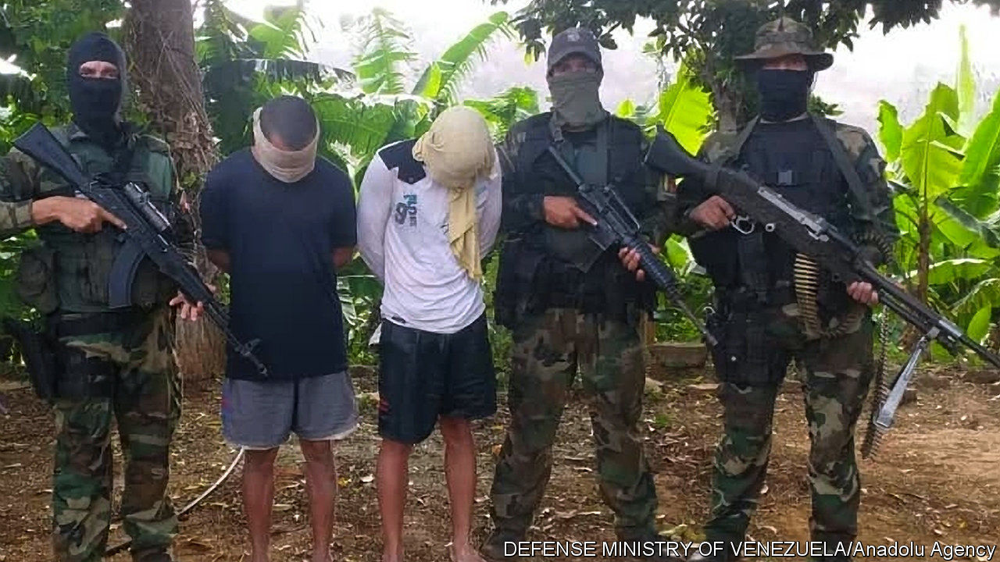

## Bay of piglets

# Nicolás Maduro celebrates a farcical attempt to remove him from power

> A botched raid embarrasses opponents of the dictatorship

> May 14th 2020

NICOLÁS MADURO, Venezuela’s dictator, always welcomes a distraction from the calamity of his rule. Early this month his enemies provided a good one. Two boats carrying a score of mercenaries attempted to land near Caracas, the capital. In a skirmish on May 3rd, Venezuelan forces killed eight raiders. The next day, two American former soldiers, apparently suffering from seasickness, were among the invaders captured from a skiff as it drifted 20km (12 miles) west of the earlier incursion. During their interrogations, later broadcast on state television, they confessed to taking part in a plot to kidnap Mr Maduro and fly him to the United States.

Some Venezuelans, used to Mr Maduro’s diversionary tactics, refused to believe the story. “It cannot possibly be real,” said Edgar, a van driver in Caracas. But it seems the plot was real, and that the plotters at least initially had the backing of the leaders of the opposition.

In September 2019 a team representing Juan Guaidó, the head of the National Assembly, who is recognised by most Western democracies as Venezuela’s interim president, met in Miami to consider plans to remove Mr Maduro by force. Juan Rendón, a political consultant who led the delegation, later said that Mr Guaidó had made it clear that he should explore “all options”. The team heard a pitch from Jordan Goudreau, an American special-forces veteran who is boss of Silvercorp, a previously obscure Florida-based security outfit. Its website portrays him boxing bare-chested. His private email address, now disabled, included the number 007. He proposed assembling several hundred fighters, mostly deserters from the Venezuelan army, to nab Mr Maduro and Diosdado Cabello, his number two. His price: $212,900,000.

Apparently impressed, the delegation signed a contract in October. The document, which Mr Rendón later described as “exploratory”, is detailed and delusional. The “service provider” would receive monthly instalments averaging $14.8m for a 495-day mission. After “project completion” its (undisclosed) financial backers would have “preferred-vendor” status with the government of a liberated Venezuela. Silvercorp would take 14% of the value of any art, cash and gold it seized.

Mr Goudreau says Mr Guaidó approved the plan, dubbed Operation Gideon. He has given the media a copy of a contract with Mr Guaidó’s signature. Mr Guaidó has denied signing it. The opposition says it ended the contract in November, when Mr Goudreau started behaving erratically and demanding huge payments. He accuses the opposition of reneging.

Despite that, Mr Goudreau set up camps in Colombia and began securing weapons with help from Clíver Alcalá, a former Venezuelan general. Waiting for guns, recruits trained with broomsticks. According to some reports, the American CIA urged Mr Goudreau to abandon the plan. In March the United States indicted General Alcalá (along with Mr Maduro and other regime members) for drug-trafficking.

The day before his voluntary extradition from Colombia, General Alcalá publicly revealed details of the plot, thus ensuring its failure. A rump of the invasion force went ahead anyway, perhaps enticed by bounties offered in March by the United States ($15m for Mr Maduro, $10m for Mr Cabello). Venezuelan troops awaited them. Mr Goudreau stayed at home.

The farce is such a godsend to Mr Maduro that many Venezuelans no doubt suspect him of having somehow connived in it. In other areas, his regime is in trouble. The price of oil, Venezuela’s main export, has plunged. Mismanagement, plus American sanctions, have led to fuel shortages. The pandemic has cut remittances from Venezuelans abroad. (It has also eased fuel shortages by reducing traffic.)

Thanks to Operation Gideon, the opposition, fractured at the best of times, is in no shape to take advantage of Mr Maduro’s weakness. Moderates may distance themselves from Mr Guaidó. International support may flag. The raid provoked much mockery, but Carmen, a shopkeeper in Caracas whose three children emigrated last year, has a wiser response: “This is a tragedy without end.”■