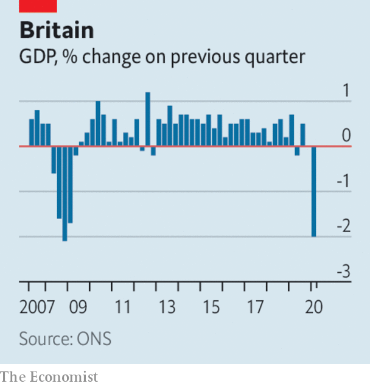

# Business this week

> May 16th 2020

Saudi Arabia said it would cut oil production by another 1m barrels a day from next month, furthering its effort to shore up oil prices. Kuwait and the United Arab Emirates swiftly followed with their own reductions. OPEC’s deal with Russia last month, which ended their abrupt price war and made record cuts to output, has done little to increase prices. Brent crude is trading at around $30 a barrel, half its level in mid-February.

Saudi Aramco reported that its net profit had fallen by 25%, year on year, in the first quarter, to $16.7bn. The state- controlled oil company will still pay a shareholder dividend, most of which goes to the Saudi government. With oil revenue sinking, the government is looking at other ways to raise money, and has tripled the kingdom’s value-added tax rate to 15%.

America officially lost 20.5m jobs in April. The number for just one month dwarfs the 8.6m jobs that were lost over the whole of 2008 and 2009 during the financial crisis. The unemployment rate has soared to 14.7%, the highest since the second world war. Steven Mnuchin, the treasury secretary, conceded that it could hit 25% in the coming months, a level last seen during the Depression. See [article](https://www.economist.com//united-states/2020/05/16/inefficiencies-bedevil-americas-response-to-soaring-joblessness).

Stockmarkets took fright after Jerome Powell, the chairman of the Federal Reserve, warned that more stimulus from Congress will be required. The Democrats have proposed an extra $3trn in spending, though their plan is not supported by Republicans.

Despite avoiding a prolonged lockdown, the South Korean economy shed almost half a million jobs in April, the most since 1999 at the tail end of the Asian financial crisis. The pandemic has created a “wartime situation” in the economy, said the country’s president, Moon Jae-in.

Britain’s economy was 2% smaller in the first quarter than in the previous three months, the fastest rate of contraction since the global financial crisis of 2007-09. However, the figure only captured a glimpse of the chaos caused by covid-19. Britain’s lockdown began in late March; the economy was 5.8% smaller in that month than it was in February. Forecasters think the economy could shrink by 20-30% in the second quarter. A study by academics at the London Business School found that household spending has plunged by 40-50% during the crisis. See [article](https://www.economist.com//britain/2020/05/16/the-cost-of-the-pandemic-to-britains-economy-is-becoming-clear).

The British government extended its pay-protection plan until October, through which furloughed workers receive 80% of their wages subject to a salary cap. But the government said that in the summer it would ask companies to start sharing the scheme’s cost in order to ease the strain on public finances.

Kristalina Georgieva, the head of the IMF, warned that the outlook for the global economy had worsened since the fund published a gloomy scenario just last month. See [article](https://www.economist.com//leaders/2020/05/14/has-covid-19-killed-globalisation).

PNC Financial, America’s ninth-largest bank, announced the sale of its 22% stake in BlackRock. The stake is worth around $17bn. PNC was BlackRock’s biggest shareholder, but as a regional bank it is potentially exposed to souring loans in the energy and hospitality industries during the pandemic. Selling its holding bolsters its capital defences.

Turkey’s financial regulator lifted a brief ban on BNP Paribas, Citigroup and UBS from trading in its currency market. According to the regulator the banks were barred because they had not settled with their Turkish counterparts. But the ban coincided with the lira falling to another record low, suggesting that the government was trying to prop it up. See [article](https://www.economist.com//finance-and-economics/2020/05/14/turkeys-defence-of-the-lira-has-been-unwise-and-ineffective).

Vehicle sales in China rose by 4.4% last month compared with April 2019, according to the China Association of Automobile Manufacturers. It is the first increase since mid-2018 (when a tax break on car purchases ended) and was driven by a surge in sales of commercial vehicles. Sales of passenger cars remain subdued.

Toyota said it expects operating profit for the current financial year to fall by 80%. The world’s second-biggest carmaker thinks its sales will drop to a nine-year low.

While industries in the physical world bear the brunt of locked-down economies, those in the virtual realm continue to thrive. Tencent, one of the world’s biggest tech conglomerates, reported a 26% rise, year on year, in quarterly sales, as the number of subscribers to its video service surged to 112m and that for its music service to 43m. It made a profit of 28.9bn yuan ($4.1bn) in the quarter.

Uber was reportedly in talks to merge Uber Eats, its food-delivery service, with Grubhub, a rival in that market. The combined operations would take a 55% slice of the food-delivery industry in America. That might be too much to swallow for trustbusters in Washington.