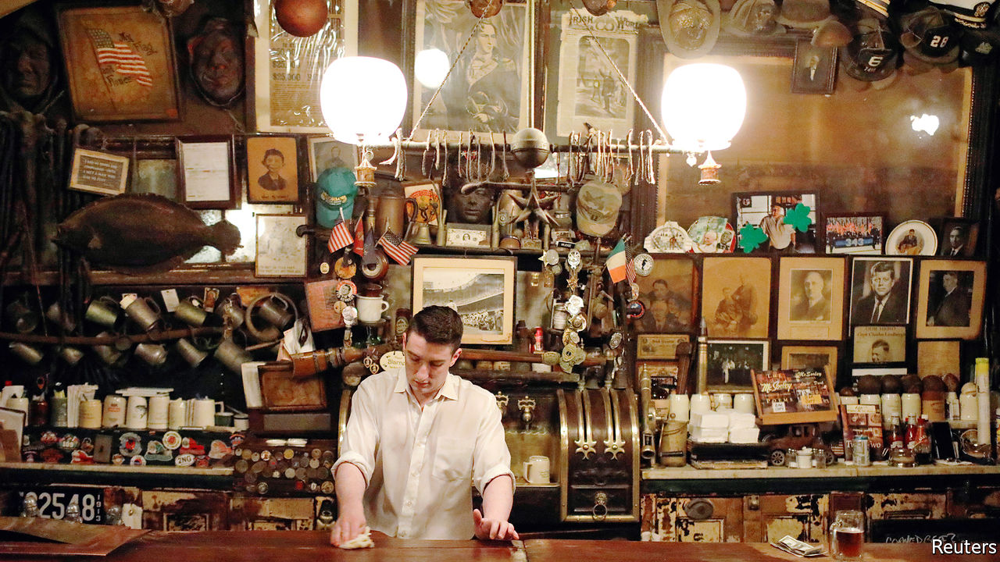

## Changing drinking habits

# Last call for Irish pubs

> Covid widens craics in the business model

> May 16th 2020NEW YORK

Editor’s note: The Economist is making some of its most important coverage of the covid-19 pandemic freely available to readers of The Economist Today, our daily newsletter. To receive it, register [here](https://www.economist.com//newslettersignup). For our coronavirus tracker and more coverage, see our [hub](https://www.economist.com//coronavirus)

ST PATRICK’S DAY was nearly two months ago, but shamrocks and leprechauns still decorate the windows of shuttered New York City Irish pubs. On the eve of one of the most profitable weeks of the pub year, in an attempt to stop covid-19 from spreading, City Hall closed down Irish pubs, along with other bars and restaurants. Some will never reopen.

“Even before the lockdown, the structural problems causing the decline of the Irish pub were already in place,” says Kevin Kenny, a historian at New York University. Many pubs in New York and Boston were struggling. Increases in rents and the minimum wage were eating into profits. And drinking habits have changed. Boozy lunches are frowned upon. People want healthier food than traditional pub fare. To survive, some pubs are becoming less overtly Irish. “You can’t get away with shepherd’s pie and chicken potpie anymore,” says Sean Hayden, co-owner of four establishments in midtown Manhattan.

Doyle’s Cafe in Boston pulled its last pint last year, ending 137 years in business; its owners sold its coveted liquor licence for a reported $450,000. Coogan’s, after nearly four decades in Manhattan’s Washington Heights, said it would close when it faced a steep rent rise in 2018. That prompted a public protest, and the owners managed to renegotiate the contract. Now the lockdown has done for it. It announced last month that it would not reopen.

Some neighbourhood bars have a chance of surviving the lockdown. It helps that they often own the building (rents in midtown Manhattan can be as high as $60,000 a month). They have lower overheads than those catering to tourists and the corporate-worker crowd. Their customers tend to be regulars. But it won’t be easy. Niall Henry, who owns three pubs in Upper Manhattan, including Tryon Public House, is open for food pick-up and deliveries for first-responders, but has seen an 85-90% drop in revenue. Seamus Clarke, who owns J.P. Clarke’s Saloon on McLean Avenue, just north of New York City, would be happy just to break even for the next few years. Rory Dolan, who owns a normally bustling pub on the same street, expects it will be at least two years before there is a return to normal.

Mike Carty, owner of Rosie O’Grady’s in midtown Manhattan, says he cannot see reopening his usually busy pub until October at the earliest. He may rejig the layout. Mr Clarke, meanwhile, will temporarily not allow people to sit at the bar. An Irish pub without bar service, he admits, is almost a contradiction in terms.

Still, many owners are confident that customers will be back. Mr Dolan thinks it will be impossible to stop young people socialising. Irish pubs such as McSorley’s survived Prohibition, when selling alcohol was banned for more than a decade. Molly’s Shebeen, operating since the 19th century, spent Prohibition selling groceries.

Historically, “the Irish pub was the place where business was done, jobs were found and favours were traded, a very important social function,” says Mr Kenny. Danny Price, an immigrant, says he got his first job in America and his first apartment through contacts made at J.P. Clarke’s. But although politicians still hold functions at pubs, they are no longer the hub for neighbourhood political-party machines.

People will keep going for the craic (Irish for fun). Not all pubs need to reinvent themselves, says Andrew Rigie, head of the New York Hospitality Alliance, an industry group. “Sometimes just being traditional and keeping to your roots is the best business plan possible.” But the days when you could slap an “O’Reilly’s” sign over the front door and get crowds are long gone. ■

Editor’s note: The Economist is making some of its most important coverage of the covid-19 pandemic freely available to readers of The Economist Today, our daily newsletter. To receive it, register [here](https://www.economist.com//newslettersignup). For our coronavirus tracker and more coverage, see our [hub](https://www.economist.com//coronavirus)

## URL

https://www.economist.com/united-states/2020/05/16/last-call-for-irish-pubs
