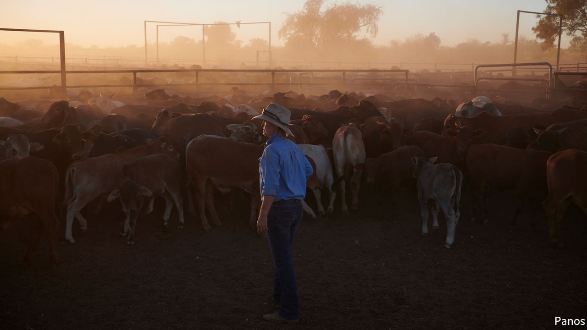

## Barley barney and beef beef

# China punishes Australia for promoting an inquiry into covid-19

> Crushing tariffs on barley follow a ban on certain beef imports

> May 21st 2020SYDNEY

CHINA’S AMBASSADOR to Australia, Cheng Jingye, recently warned Australia it was treading a “dangerous” path by pressing for an independent inquiry into the origins of the coronavirus (one that might reveal China doing more to suppress information about early infections than to quash the outbreak itself). If relations between the two countries soured, Mr Cheng threatened, Chinese tourists might have “second thoughts” about holidaying Down Under. Families might wonder whether Australia really was the “best place to send their kids” to study. Ordinary Chinese might no longer want to “drink Australian wine, eat Australian beef”.

In the event, China this week agreed to an inquiry, in the face of international pressure at the World Health Organisation’s annual assembly (held online). But it did so after slapping tariffs of over 80% on Australian barley on May 18th, having already banned beef from Australia’s four biggest abattoirs on May 12th.

The abattoir ban blocks perhaps 35% of Australia’s exports of beef to China. Karen Penfold, whose family is among the exporters affected, says it has been scrambling to find other buyers for its prime steak. Barley growers, based mostly in Australia’s west, send at least half, or A$600m ($393m), of their annual exports to China, where the grain is used as animal feed and to make beer. Farmers reckon the new tariffs will all but kill the trade.

China has not directly linked its measures to displeasure with Australia. It claims to be worried about labelling and sanitary standards when it comes to the beef. The barley tariffs are the culmination of an 18-month investigation into hidden subsidies. Moreover, Australia has itself imposed anti-dumping measures on 17 Chinese exports, including office printing paper and stainless steel sinks. Some of Australia’s trade complaints “have long stretched credibility”, says Gareth Evans, a former foreign minister.

Yet there is little doubt that China’s moves are in retaliation for criticism of the way it handled the pandemic. “This is clearly a case of political coercion,” says Peter Jennings of the (hawkish) Australian Strategic Policy Institute, a think-tank in Canberra. China has long resented Australia’s suspicious politicians, who have legislated to stop China meddling in Australian democracy and were quick to bar Huawei, a Chinese telecoms giant, from building 5G networks in Australia on security grounds. Australia has objected to China’s increasing aggression in the disputed South China Sea, and criticised the internment of over 1m Muslim Uighurs in China’s far west. Richard McGregor of the Lowy Institute, a think-tank in Sydney, says China sees Australia as stirring hostile sentiment by “going around the world and warning other countries about China’s misbehaviour”. Mr Cheng accuses the Australian government, under Scott Morrison, the prime minister, of following instructions from President Donald Trump to “launch a political campaign against China”.

The products caught up in the spat represent only a tiny sliver of Australian exports to China, which amounted to A$153bn (7.7% of GDP) last year. The biggest earners include coal, gas, iron ore, tourism and education. But the latter two are likely to shrink rapidly as fewer people venture abroad because of the pandemic. What is more, the huge scale of trade gives China ample opportunity to inflict further harm. Australia exports more to it than to its five next biggest markets combined.

Bloomberg, a news agency, reports that the Chinese government is considering submitting other choice Australian products, including seafood, dairy and wines, to new quality checks and anti-dumping reviews. Obscure changes to rules about iron ore are causing alarm. This highlights Australia’s conundrum: it has no consistent China policy. For years it has been happy to sell stuff into what Mr Jennings calls an “easy market”. But it also wants to continue to air ideological and geopolitical grievances. As a result, China has it over a few million barrels of full-bodied Shiraz. ■

Editor’s note: Some of our covid-19 coverage is free for readers of The Economist Today, our daily [newsletter](https://www.economist.com/https://my.economist.com/user#newsletter). For more stories and our pandemic tracker, see our [hub](https://www.economist.com//news/2020/03/11/the-economists-coverage-of-the-coronavirus)