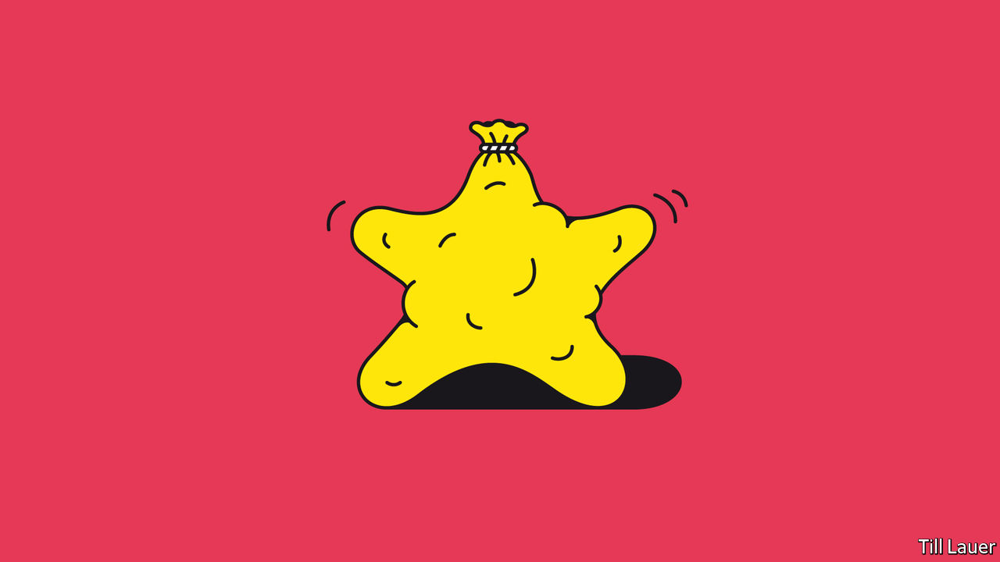

## Banyan

# Vietnam’s secretive Communist Party embarks on a leadership transition

> The jostling behind the scenes would put ferrets in a sack to shame

> May 21st 2020

IN JANUARY FOUR grey apparatchiks with little name or face recognition inside Vietnam, let alone abroad, will emerge from a five-yearly congress of the Communist Party to take charge of the youthful country of 96m. The line-up will telegraph order and consensus, the obsession of one of the world’s most secretive political organisations. Yet, out of sight, the struggle for the top jobs will put ferrets in a sack to shame.

The consensual order disapproves of the kind of personal power that Xi Jinping has garnered in China. It calls for four “pillars”: separate holders of the posts of party general secretary (the most crucial job), state president (often a figurehead), prime minister (who runs the government day-to-day) and chair of the National Assembly (which, once wholly obedient, is gradually finding a voice). It is exception enough that Nguyen Phu Trong, the current general secretary, had to take over the job of president when the incumbent died in 2018. Next year the highest leadership will almost certainly revert to four.

The parameters are long-established. Seven Politburo members over 65 must go, to be refreshed by seven or so new recruits from the party secretariat. Only one oldie is allowed to stay, as general secretary. It is unlikely to be the long-serving Mr Trong, who is 76 and thought to be in ill health.

The prime minister, Nguyen Xuan Phuc, who is 65, may fancy his chances. He directed the fight against covid-19, in which Vietnam excelled, with no confirmed deaths. A competent economic manager, he is now trying to revive battered trade and foreign investment. But, says Tuong Vu of the University of Oregon, Mr Phuc lacks the essential trait to lead the party: devotion to Marxist-Leninist ideology as demonstrated by experience in propaganda or disciplinary work. Of other contenders, the head of the National Assembly, Nguyen Thi Kim Ngan, suffers from being a woman, while the 49-year-old Vo Van Thuong, an up-and-coming propaganda wizard, is probably too young. So bet on the 67-year-old Tran Quoc Vuong, Mr Trong’s right-hand man, succeeding his boss.

After that, candidates for the other three posts more readily fall into place. Mr Phuc’s deputy, Vuong Dinh Hue, might succeed him as prime minister. Ms Ngan might hand over to another woman, Truong Thi Mai, steeped in party work. The current foreign minister, Pham Binh Minh, could become president.

All smooth enough. Yet three threats could challenge the consensual order in years to come. One is failing to control corruption. Scandals surrounding party bosses in the country’s two biggest cities, Hanoi and Ho Chi Minh city, have tarnished the party’s reputation. Mr Trong once said that fighting corruption while maintaining stability is like “catching a rat without breaking the pot”.

Another threat is the north’s hold on power. Since the Vietnam war, northerners have viewed the south as ideologically suspect. Hanoi and its surrounding regions have also hogged infrastructure development, paid for by the bustling south. If, as is likely, no one from the south is represented in the top leadership, says Le Hong Hiep of the ISEAS-Yusof Ishak Institute, a think-tank in Singapore, southerners must be promoted into the Politburo with an eye to the next reshuffle in 2026. Otherwise southern resentment will build.

The third threat comes from Vietnam’s complex relationship with China. Economic entanglement and ideological ties run deep. But Vietnam views its northern neighbour with distrust. That helps explain its coronavirus success: not trusting China’s reassurances about the course of the infection in its early days, Vietnam quickly put itself on a war footing, even launching cyberattacks against China to glean information about the real course of the epidemic.

Elsewhere leaders struggle to deal with China over disputed territory and maritime claims in the South China Sea. Under cover of the global pandemic, China has become increasingly assertive, sinking a Vietnamese fishing vessel, giving Chinese names to dozens of reefs and rocks in the sea and establishing new administrative districts over islands and atolls it controls, including the Paracels, seized from Vietnam in 1974.

Vietnam’s leaders anxiously foster peaceable ties with China. But if China’s expanding ambitions in the sea make no concessions to Vietnamese sensibilities, then an eventual rupture becomes more likely. That would ruffle the grey hairs of any leadership line-up.

## URL

https://www.economist.com/asia/2020/05/21/vietnams-secretive-communist-party-embarks-on-a-leadership-transition
