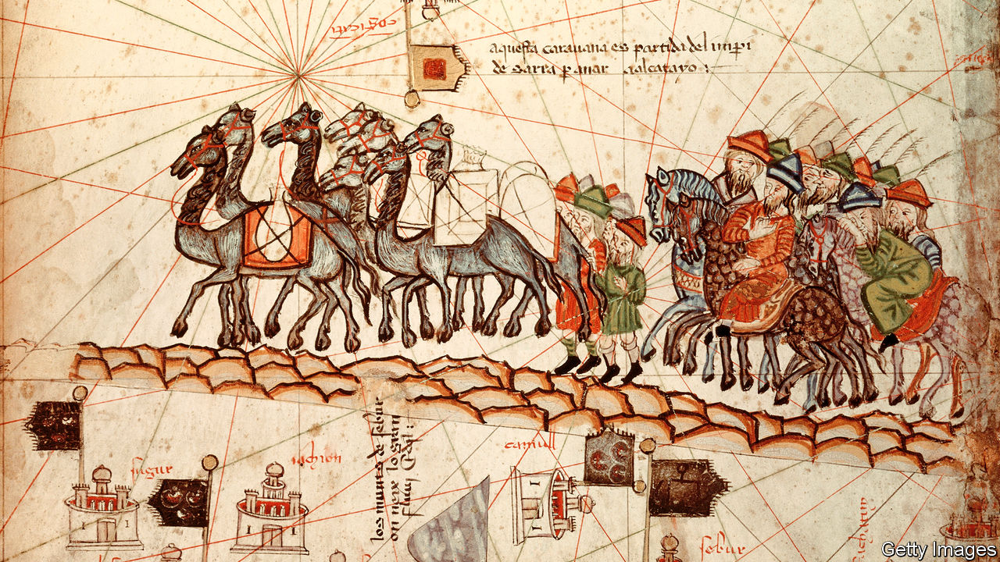

## Home Entertainment

# Confined in prison, Marco Polo roamed across the world

> His travelogue shows that you can go anywhere in your imagination

> May 23rd 2020

EXPLORERS DO NOT thrive in captivity, so it must have stung when Marco Polo was imprisoned in Genoa in 1298. The length of his internment depended on the course of the city-state’s war with his native Venice. But he did not waste it. “Rather than idle away time he decided to put together this book,” explains the prologue of “The Travels” (in Nigel Cliff’s translation). Written with Rustichello of Pisa, an author and fellow inmate, it is one of literature’s great travelogues—a meandering voyage through the cultures and kingdoms of the Middle East, China, South-East Asia, India and Russia.

A seasoned itinerant merchant, Polo lays out his material with a flourish, while doggedly assuring readers of its authenticity. Genuine and fake, history and dream are woven together. Detailed figures—the tonnage of ships on the Yangzi, the commission charged for exchanging old Chinese banknotes, the going rate in India for Arabian horses—sit alongside flights of fancy. The technique lends credibility to the magic and lustre to the humdrum.

If Polo’s body was imprisoned, his mind roamed free. Some of the inventions, such as a levitating column in Samarkand, are obvious. But elsewhere what looks like fantasy is fact seen through the lens of novelty. A “unicorn” in Sumatra, for instance, is “a very ugly beast to look at” with a black horn and stumpy feet. Hardly anyone from Europe had seen a rhinoceros before.

The intoxicating centrepiece is Polo’s sojourn in China, then governed by Kublai Khan, founder of the Yuan dynasty. His palace at Khanbaliq (modern-day Beijing) is topped with roofs of “scarlet and green and blue and yellow” that “shimmer like crystal” in the sun. Mile-long walls enclose a park filled with roe deer and white stags. The account of the Great Khan’s summer abode at Shangdu—built of bamboo canes tied with silk, and dismantled and moved at the Khan’s whim—inspired the “stately pleasure-dome” in Samuel Taylor Coleridge’s Xanadu.

Many of Polo’s contemporaries dismissed him as a fraud. Giant man-eating serpents were all very well, but what was this nonsense about paper money? Some modern academics still question whether he visited China at all. But his tales were too tantalising to resist. A well-thumbed copy of “The Travels” features in the library of Christopher Columbus. Children supposedly chased Polo through the streets of Venice, beseeching him to tell them “another lie”. On his deathbed, when asked for the umpteenth time to own up to his fibs, he is said to have responded: “I have not told half of what I saw.”

Today his book remains a feast, opening up places that are now inaccessible, or perhaps never existed. If writing it was Polo’s way of escaping his Genoese cage, for covid-era readers it is a chance to swap quarantine for a mysterious world where the wondrous becomes true. ■

Editor’s note: Some of our covid-19 coverage is free for readers of The Economist Today, our daily [newsletter](https://www.economist.com/https://my.economist.com/user#newsletter). For more stories and our pandemic tracker, see our [hub](https://www.economist.com//news/2020/03/11/the-economists-coverage-of-the-coronavirus)

## URL

https://www.economist.com/books-and-arts/2020/05/23/confined-in-prison-marco-polo-roamed-across-the-world
