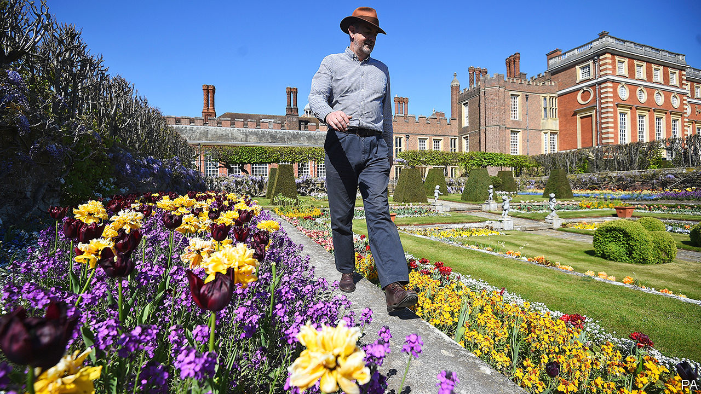

## Grand houses

# Britain’s palaces and stately homes are empty

> That’s quite nice for the people living in them

> May 23rd 2020

“SOMETIMES WHEN I’m here early in the morning, it’s like some kind of scene from ‘Brideshead Revisited’...this huge great rambling medieval palace, with the gardens slowly becoming overgrown, and there’s just a couple of people walking around.” Graham Dillamore (pictured), gardens and estates operations manager at Hampton Court Palace, Henry VIII’s favourite residence, is enjoying an experience which few have ever had before: being almost alone in a palace. The absence of visitors, he says, may have encouraged supernatural occupants to come out. “I keep looking behind me, and hearing footsteps.”

National crises tend to have nasty consequences for grand houses. About a sixth of those standing in 1900 were demolished in the 20th century. Socialism mostly did for them, but war didn’t help: houses were requisitioned and left in tatters, and hefty taxes followed. Planning laws put a stop to the vandalism in 1968, by forcing owners to seek permission to demolish listed buildings, and many of the landed gentry sold up, experimented with safari parks and adventure playgrounds to attract the hoi polloi, or handed their piles over to the National Trust, a charity that allows former owners to live in properties on condition that they are open to the public.

Those with the keys to Britain’s grand houses worry about the effect of covid-19. The National Trust, which owns 200 of them, is set to lose £200m this year through forgone entrance fees and cancelled subscriptions. “We have pulled back on over 60% of our projects,” says Hilary McGrady, the trust’s director-general. “We’re only continuing with the projects that we have to do—sewage, asbestos, a wall that is going to fall down. Tree planting, river restoration work, anything that wasn’t essential has had to be put on hold. The impact on us, from an economic point of view, is huge.”

But for the aristocrats who have continued to live in properties owned by the National Trust there is an upside: they are free to kick back and enjoy them as their forefathers had intended. “It’s a big change not to have the visitors, and in some ways, it’s very nice,” says Sir Charles Elton, whose family has lived in Clevedon Court in Somerset for 300 years. When he was seven, his father handed the place over to the National Trust, and this is the first time since then that the 11th baronet hasn’t had to accommodate paying visitors. He is exploring. “The house is full of evidence of the passions of various members of my family. So my great-grandfather was an arts-and-crafts potter; we’ve got a whole room devoted to it. My grandmother collected glass, my father had a huge collection of industrial art. They’re weird collections put together by a weird family.”

And for those who still own their country pile and need cash, covid-19 is a bonus. Rich urban types are keen to get out of the cities, and can’t take summer holidays abroad. Crispin Holborow, deputy chairman of Savills, an estate agent, says of owners, “Some have rented out their houses, and moved into an annex—suddenly you have this surge of people who want to rent a smart country house in good condition.” But there are new challenges for owners who have furloughed staff. “It’s all hands to the pump; the family is out mowing the lawns,” says Mr Holborrow of the owners of a country house he knows in Northamptonshire. “I don’t think the stripes are quite as good as they were before.”

It isn’t just the residents who are enjoying the shutdown. Dominic Hare, chief executive of Blenheim Palace, the Duke of Marlborough’s home, says that in the absence of tourists, locals have been making the grounds their own, walking their dogs and watching the lambing. “There’s an awful lot of families in the nearby area”, says Mr Hare, “for whom suddenly it becomes their personal oasis.” In this world turned upside down, Mr Dillamore finds his position as pseudo-aristocrat somewhat disconcerting. “I’m just waiting for someone to bring the guillotine out.” ■

Editor’s note: Some of our covid-19 coverage is free for readers of The Economist Today, our daily [newsletter](https://www.economist.com/https://my.economist.com/user#newsletter). For more stories and our pandemic tracker, see our [hub](https://www.economist.com//news/2020/03/11/the-economists-coverage-of-the-coronavirus)