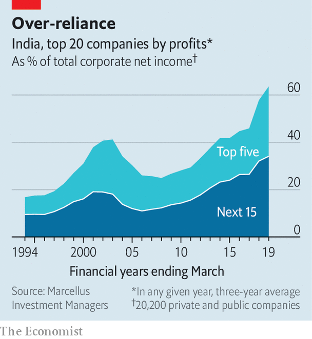

## Elephants in the room

# India Inc’s profits increasingly belong to a tiny clutch of companies

> Just 20 firms account for 70% of all corporate earnings

> May 21st 2020DELHI

AROUND THE world industries have grown more concentrated over the past few decades. In America 20 companies capture roughly a quarter of all corporate profits. If you thought that was sobering news for budding American capitalists, spare a thought for their Indian counterparts. According to a study by Marcellus Investment Managers, a Mumbai-based firm, last year a score of companies accounted for nearly 70% of India Inc’s total earnings, up from 14% three decades ago (see chart). In a growing number of product categories—from paint and adhesives to biscuits and baby formula—monopolies or duopolies skim off 80% of profits. 

Broadly, Marcellus’s top 20 can be split into three groups. The first contains well-run companies with strong management of capital and data. They inhabit vibrant sectors like information technology (notably Tata Consultancy Services and Infosys), finance (for instance, HDFC bank) and consumer goods (ITC, a cigarette-maker). Their capital costs are low; HDFC can fund itself more cheaply than India’s government. So is their level of debt—a blessing given that India Inc pays average interest of 9.25% on credit, three times as much as a typical American firm. ITC and the IT consultancies are in effect debt-free.

Companies in the second group are unusually lucrative for less deserving reasons. They include state-controlled remnants of Nehruvian socialism. They can count on cheap loans from state-owned banks and, often, cosy monopolies (like Coal India’s, until the government ended it to fight covid-19). This group is shrinking, albeit slowly: Marcellus’s top 20 contained seven state-owned firms in 2019, down from 13 in 2004.

The last bucket blends the other two. These are huge private companies with mediocre returns but a knack for navigating both India’s labyrinthine bureaucracy and its corridors of power. They operate in heavily regulated industries: Larsen & Toubro, an engineering group, builds roads; Hindustan Zinc, a subsidiary of London-listed Vedanta Resources, is a big miner.

The canonical example is Reliance Industries. Its net income last year of $5.2bn made it India’s most profitable firm—and accounted for 13% of the country’s corporate profits. Its businesses range from a core refining operation to the disruptive Jio mobile network. Despite negative cashflow and a meagre 7% return on capital, investors cannot seem to get enough of it. Reliance recently announced that Facebook and three large American private-equity firms, Silver Lake, Vista Equity Partners and General Atlantic, will buy large stakes in Jio. They may reasonably have concluded that it can count on continued support from its parent, which is alone in having featured among the top 20 profit-makers every year since 1992. ■

## URL

https://www.economist.com/business/2020/05/21/india-incs-profits-increasingly-belong-to-a-tiny-clutch-of-companies
