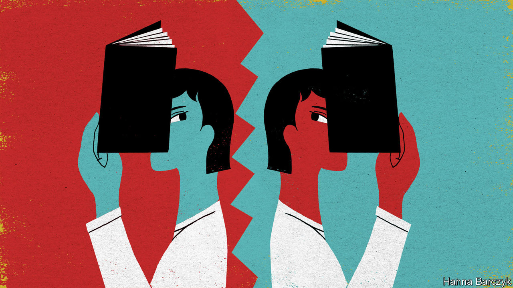

## Chaguan

# Educational freedom is under assault in Hong Kong

> “There is no room for discussion,” says the education secretary

> May 21st 2020

AT LUNCHTIME ON May 14th a chat group for Hong Kong history teachers buzzed with reviews of this year’s school leavers’ examination. Their tone was upbeat, seeing no surprises in the history paper. That included Question 2(c), which, as in previous years, used extracts of historical documents to prod students to consider both sides of a controversial question. This year’s extracts explored how early 20th-century reformers in China looked to Japan as a model of modernisation and indeed attended Japanese colleges in their thousands. Hong Kong pupils study that period rather briefly, spending more time on the years when Japanese nationalism led to violent imperialism, including Japan’s brutal occupation of swathes of China in the 1930s and 1940s. The paper asked candidates to weigh the statement: “Japan did more good than harm to China in the period 1900-45”. Teachers saw a familiar exercise: an invitation to set out a conventional view—that on balance Japan inflicted terrible suffering—while exploring a few counterarguments. In the chat group someone remarked: “These questions are so similar to previous years.” Then the sky fell in.

Over the next two days the question was called unpatriotic by a teachers’ union loyal to Hong Kong’s ruling establishment (and by extension, to Communist Party leaders in Beijing). It was denounced by officials in mainland China and disowned by Hong Kong’s education bureau. As framed, the question risked leading students to a biased conclusion that would “seriously hurt the feelings and dignity of the Chinese people”, the bureau said. That language is straight from mainland propaganda manuals, though the bureau is the education ministry of a territory that was supposed to enjoy considerable freedom after it returned to China in 1997, under the slogan “one country, two systems”.

Kevin Yeung Yun-hung, Hong Kong’s secretary of education, called for the question to be expunged from the exam, unmarked. Japan did only harm to China, Mr Yeung thundered. “There is no room for discussion.” China’s state news agency, Xinhua, declared that if the question were not struck down, “the rage of all Chinese sons and daughters” would be unquenchable.

These expressions of wrath are ominous enough. But the focus of the establishment’s anger is still more alarming. Officials and pro-government politicians in Hong Kong do not deny the authenticity of the texts quoted in Question 2(c). No cries of “fake history” fill the air. Nor is anyone claiming that local students are ignorant of mainland China’s suffering under Japanese occupation. Indeed, all evidence points the other way. A study by Edward Vickers of Kyushu University in Japan compared Hong Kong’s schoolbooks from before and after the end of British rule. Already, publishers have quietly responded to calls to instil patriotic values, the study found. Post-handover textbooks expanded sections about Japanese militarism and added more photographs of notorious events, such as Japan’s massacre of civilians in Nanjing in 1937. Recent editions of a popular textbook dropped an exercise that urged pupils to remember Japan’s wartime occupation of Hong Kong, and added an exercise recalling horrors on the mainland.

Instead, the complaint from pro-establishment types is simpler. They say it was harmful for Question 2(c) to ask for nuance at all, when youngsters should be bowing to what Mr Yeung calls “the nation’s common understanding of history”. Such attacks on a single exam provide cover for a larger assault on Hong Kong’s education system, and its emphasis on critical thinking. It is no accident that government loyalists pounced on Question 2(c) just days after the territory’s chief executive, Carrie Lam, declared that without stricter regulation, Hong Kong’s schools and colleges would resemble a “doorless chicken coop”, leaving the young unprotected from foreign infiltrators and false ideas. Ms Lam expressed special disdain for what educators in Hong Kong call “liberal studies”, namely secondary-school lessons promoting critical thinking and civic consciousness. The territory’s ruling elite blames liberal studies for fuelling student protests last year. That same elite had backed the subject’s introduction in 2009, fearing that rote learning was eroding the territory’s dynamism.

One of Ms Lam’s predecessors, Leung Chun-ying, announced that a website for pro-government tip-offs now offers rewards for reports about teachers who spread dangerous ideas. A history teacher describes a mood of growing insecurity. “Since teacher training I have been told to promote critical thinking. And now the education secretary tells me that some things cannot be discussed.” Bringing the young to heel will be a long and unhappy struggle, she predicts. “It is going to take at least ten years. They will have to indoctrinate them from primary school or kindergarten.”

Chaguan spoke this week to four teenagers who took the history paper causing all the fuss. Earnest and shyly twisting their headphone cables during a group Zoom interview, the students made clear that as they walked into their exam they saw exploring all sides of a historical question mostly as a step required to gain full marks. Yet now that others have politicised Question 2(c), they are ready to defend a quest for balance as a matter of principle.

One student said she had been pondering a history major, and possibly a teaching career. But seeing her own teachers self-censoring, she is having second thoughts. A second teenager moved from the mainland eight years ago. Frightened of how Hong Kong’s schools are becoming breeding grounds for protesters, her parents sent her younger sister to school on the mainland. A boy recalled rows with his pro-government parents, who dismiss liberal studies as “brainwashing”. It would hurt society if the young were less capable of independent thought, he argued. But maybe, he wondered, political leaders want a society that is easier to govern. That is a bitter lesson to draw from a school leavers’ exam. Alas, all signs are that Hong Kong’s youngsters have more harsh lessons ahead. ■