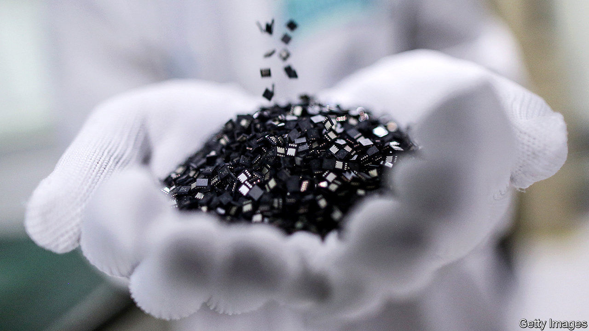
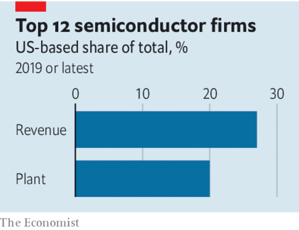

## Semiconductors

# America is determined to sink Huawei

> A new escalation in the tech conflict illustrates the limits of American power

> May 23rd 2020

IF AT FIRST you don’t succeed, try again. A year ago America forbade its high-tech companies from selling to Huawei, a Chinese maker of smartphones and mobile-network infrastructure. American officials worry that Huawei-powered phone networks could aid Chinese spying (something the firm denies), and about China’s growing technological prowess more generally. But the embargo turned out to be puny. Loopholes allowed American firms to carry on supplying Huawei from overseas factories. The Chinese firm’s revenues rose by 19% in 2019, to $123bn. Thanks to its efforts to stockpile parts, its purchases from American suppliers rose by 70%, to $19bn.

On May 15th America tried a different tack. It announced new rules that target Huawei’s in-house microchips, which power many of the firm’s products. The rules are aimed at the factories that take such designs and turn them into working silicon, such as those owned by TSMC in Taiwan and SMIC in China. They specify that no American tools can be used to make Huawei’s products. Since every big chipmaker uses some American tools, the effect is to freeze Huawei out completely. The Chinese giant denounced a “pernicious” decision that “threatens to undermine the entire industry worldwide”.

The microchip is an American invention. But the chipmaking business has gone global. These days the dozen biggest semiconductor firms make only 27% of their sales in America. Just 20% of their plant is physically based there. Huawei evaded the worst effects of America’s original blacklist by switching suppliers and buying from non-American factories. The new measures focus on a bottleneck instead: a cohort of American-based chip-equipment firms whose products lack substitutes.

Huawei has said its survival is at stake. Markets are more sanguine. The price of its bonds, which are traded in Hong Kong, barely dipped. It has spent the past year beefing up its large cash buffers and inventories. Now a hunt will begin for a new way to sidestep the rules. China’s long-term project to build up its own chip industry, of which Huawei is a vital part, will be seen as more important than ever. On May 15th SMIC, which is China’s biggest chipmaker, said it had raised $2bn from state investors and planned to increase its capacity in China six-fold.

The episode will have broader consequences for the tech industry. China could retaliate by hobbling American tech firms that make money on the mainland, including Apple. And as the decoupling of America and China accelerates, tech firms that straddle the two are experimenting with ways to try to keep both sides happy. On May 15th TSMC said it would build a $12bn chip plant in Arizona. Four days later ByteDance, a Chinese social-media giant, said that it had appointed Kevin Mayer, a Disney executive, to run TikTok, its most popular app. Having an American in charge may ease worries in Washington about a Chinese app that is installed on millions of American smartphones.

The tech war is guaranteed to make the chip industry less efficient. The big question is whether using technological clout ends up undermining the very American dominance that gives rise to it. No one knows how vital American chipmaking technology really is, because until now there has been no reason to find out. Many governments are wary of China’s power. But they may chafe at American policies that tell their firms who they are allowed to do business with. They may even conclude that wriggling out from under such restrictions by shunning American suppliers is worth a try.

This has, after all, happened before. The aerospace industry is another high-tech business that America jealously guards. The hassle of complying with draconian export rules has proved a selling-point for products that contain no American technology—“ITAR-free”, in the jargon. America’s hawks plainly think that the chance to spike Huawei’s guns, and to slow China’s technological development, is worth that long-term risk. ■