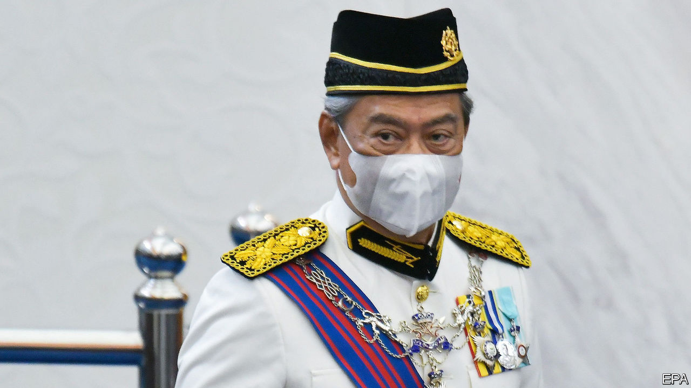

## No bail-outs without representation

# Malaysia needs a legitimate government to fight covid-19

> Prime Minister Muhyiddin Yassin must prove he has a majority

> May 21st 2020

“DO NOT DRAG the country again into political uncertainty,” Malaysia’s king, Sultan Abdullah, admonished the country’s parliament this week. It is too late, unfortunately. Ever since Mahathir Mohamad resigned as prime minister in February, politics has been in flux. In theory, the king’s decision to appoint Muhyiddin Yassin to head a new government on March 1st should have put an end to the turmoil. But because Mr Muhyiddin has spent two and a half months in office without proving he has a majority in parliament, the politicking has continued (see [article](https://www.economist.com//asia/2020/05/23/malaysias-shaky-government-dodges-a-no-confidence-motion)). Indeed, many speculate that the prime minister is avoiding a vote because he might lose it. The only way to stem the scheming is for Mr Muhyiddin to prove them wrong.

The parliamentary arithmetic is opaque because Mr Muhyiddin’s government was born out of a splintering of several parties in Dr Mahathir’s coalition. Defectors from both Bersatu, the party of the two prime ministers, and Keadilan, the biggest component of Dr Mahathir’s government, have joined forces with the opposition in what amounted to a parliamentary coup. The king, having consulted all MPs, believed that the turncoats, led by Mr Muhyiddin, had a majority. But the balance of power is held by fickle and mercenary regional parties. And it has only gradually become apparent where the loyalties of the 37 MPs from Bersatu, in particular, lie. Thirty-two of them support the government.

Parliament met this week, and could have set the record straight. But a no-confidence motion put forward by Dr Mahathir was postponed; instead, MPs listened only to the king’s speech before adjourning. As things stand, they will not meet again until July. The ostensible reason for the delay was covid-19. Malaysia has suffered more than 7,000 cases. It has closed its borders, restricted citizens’ movement and banned religious gatherings—a bold step in a country with a Muslim majority. How could MPs even consider repaying the sacrifices ordinary citizens are making by descending into another bout of infighting, critics ask? Worse still, what if no government is able to drum up a majority? How irresponsible would it be of MPs to pitch Malaysia into an election in the middle of a pandemic?

But politicking will not go away. The wobblier Mr Muhyiddin appears, the weightier the incentives he must dangle before wavering lawmakers to keep their backing. Already he has dished out more than 60 jobs as ministers or deputies—in a parliament of just 222 members. Castigating allies for insubordination is impossible. Squabbles between supposedly friendly parties within the government plague state politics.

Moreover, a government of dubious legitimacy is making unprecedented and sweeping decisions whose effects will be felt for years. As in many countries, the lockdown to curb covid-19 is bludgeoning the economy. The government has adopted a relief package with a notional value of 16% of GDP. It will soon have to decide whether to restrict Malaysians’ freedoms yet longer, and whether to spend even more money it does not have to mitigate the consequences. Decisions of such magnitude should be made only by a government that a majority of MPs and, by extension, a majority of Malaysians, support.

A vote of confidence may also be a way to force awkward MPs to behave. Would they really want to precipitate an election now? Some may be induced to support Mr Muhyiddin by their conscience—imagine!—rather than by bribes. And if an election really is the only way out, so be it. It would have to be conducted safely, of course, ideally with lots of postal voting or over several days, to allow social distancing. But it is when difficult decisions are being made that democracy is most needed—not when the going is smooth. ■