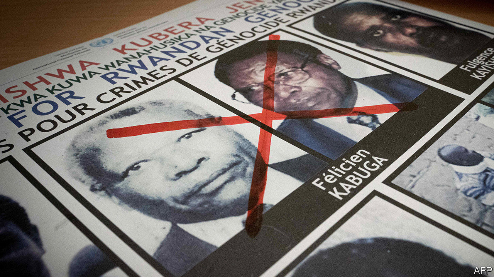

## A genocide suspect faces trial

# Félicien Kabuga, Africa’s most wanted man, is arrested

> But questions remain over how the Rwandan evaded the law for so long

> May 21st 2020NAIROBI

THE TRAP had been set. American and Kenyan investigators were in position outside a house in a smart Nairobi suburb. But Rwanda’s most notorious fugitive never showed up. When police finally burst in two days later they found not their target, Félicien Kabuga, but blood-spattered walls and the partially acid-dissolved corpse of William Munuhe, an FBI informant. An enterprising hack, Munuhe had promised to lure Mr Kabuga to his house under the pretext of discussing a business deal in exchange for the $5m reward promised by the State Department.

That was in 2003. For 17 years, Mr Kabuga, seen as a bankroller of the genocide in which perhaps 500,000 Rwandans were murdered in 1994, remained elusive. On May 16th police raided a flat on the northern outskirts of Paris. Inside they found a shuffling 84-year-old who had outwitted police forces all over the world for almost 25 years. “He was our Klaus Barbie, our Eichmann,” Reuters quoted Etienne Nsanzimana, the head of a group for genocide survivors living in France, as saying.

Mr Kabuga, once one of Rwanda’s richest men, faces three main accusations. First, in the months before the genocide, his company allegedly imported hundreds of thousands of machetes, the weapon of choice during Rwanda’s 100 days of slaughter. These were then doled out to the Interahamwe, the Hutu militia responsible for much of the killing. Second, Mr Kabuga is accused of having financed the Interahamwe, supplying uniforms and vehicles. Finally, he allegedly provided the genocide’s soundtrack. Radio Mille Collines, the station he partly owned, referred to Rwanda’s Tutsi minority as “cockroaches” and urged their neighbours to kill them all.

Most people had given up the idea of ever catching Mr Kabuga. The International Criminal Tribunal for Rwanda, which indicted 93 genocide suspects (including Mr Kabuga) and convicted 62 of them, wound up in 2015. But last year eight Western countries mounted a fresh mission to find him. Surveillance operations against Mr Kabuga’s 11 children in Britain, France and Belgium eventually led to his discovery in Asnières-sur-Seine.

Yet uncomfortable questions remain. How did Mr Kabuga escape detection for so long? Osama bin Laden skulked in caves and a nondescript house in Pakistan. Radovan Karadzic donned a beard and eked out a living selling quack medicine. But Africa’s most-wanted suspected génocidaire seems to have swanned around the world at will. At various times he lived in Switzerland, Germany, Belgium, the Democratic Republic of Congo and Kenya, as well as France, where the police say he had 28 aliases.

Some questions will be directed at Kenya. Much of Mr Kabuga’s time was spent there, almost certainly with the connivance of officials. Attempts to nab him in Nairobi in 1997, 2003 and 2008 came to naught. Instead, detectives would find a note on a kitchen table warning Mr Kabuga to get out—or find a corpse. In 2002 Pierre-Richard Prosper, America’s then special ambassador for war crimes, accused a Kenyan official of harbouring him, which the official denied.

Human-rights activists suggest that as recently as 2016 Mr Kabuga may have lived in the Kenyan town of Eldoret. By then, however, American investigators had given up trying to catch him, fearing that other informants could end up like Munuhe. Those trying to uncover who harboured Mr Kabuga will probably not get much help from Kenya, where the president and deputy president have both had run-ins with the International Criminal Court. ■

## URL

https://www.economist.com/middle-east-and-africa/2020/05/21/felicien-kabuga-africas-most-wanted-man-is-arrested
