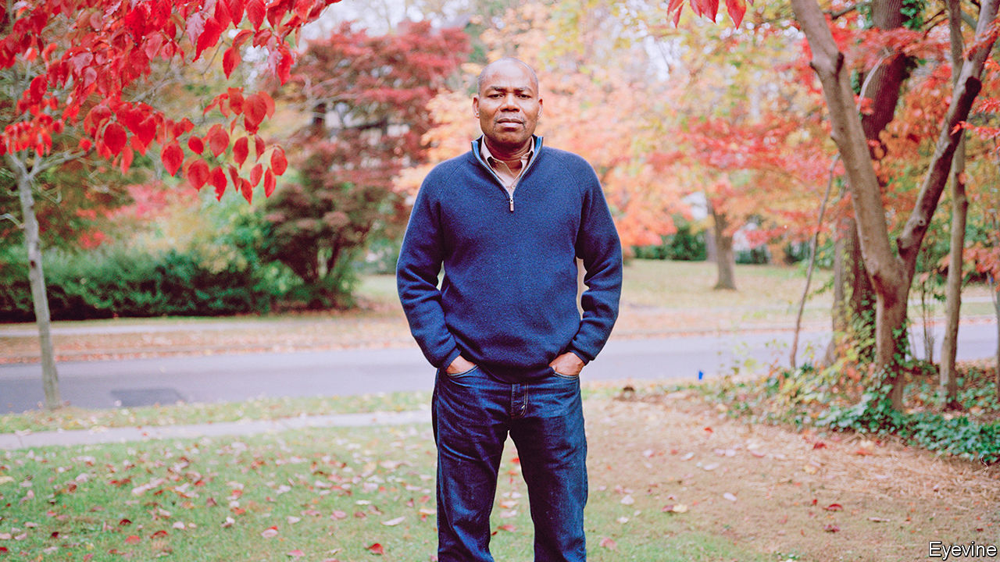

## No-frills education

# Trust, slavery and the African School of Economics

> Leonard Wantchekon is trying to build a world-class university in Benin

> May 21st 2020ABOMEY-CALAVI

AS LEONARD WANTCHEKON was having breakfast with his wife, Catherine Kossou, in 2007, she recalled how one friend could not trust anyone. Even as a child her friend would say: “That person is going to sell you,” or “He will make you disappear.”

The words struck a chord with Mr Wantchekon. Now a professor at Princeton University, he was born in Zagnanado in central Benin. Some of the music he listened to in his youth—such as that of Orchestre Poly-Rythmo de Cotonou—had songs that warned against trusting those close to you.

He wondered: “Does this have something to do with slavery?” Benin was a hub of the slave trade. More than 1m people were trafficked from the interior to the port of Ouidah, and then to America, Brazil or the Caribbean. Alongside Nathan Nunn of Harvard University, Mr Wantchekon looked for a relationship between the intensity of the slave trade and low levels of trust (and thus commerce). He found one. The resulting article is in the top 1% of most-cited economics papers.

The story of the paper has broader relevance, explains Mr Wantchekon (pictured). It was his data-mining skills that helped him find the answer. But it was his Beninese background that raised the question.

Mr Wantchekon is one of just a few African economists at elite Western universities. Most scholarship about Africa is done by academics who are neither African-born nor based in Africa. Influential development journals have few African scholars on their boards. Most major conferences about Africa do not take place there.

The imbalance is partly a result of bias in overseas universities. But it is also because of conditions at African ones. Higher education is not a priority for politicians, who often send their children abroad, or donors, who prefer to fund schools. The result is underfunded and overcrowded universities that do not equip enough African graduates with the skills required to get into world-class doctoral programmes.

The consequence is a profound loss, argues Mr Wantchekon. Countless young African intellectuals do not get a fair chance. The world gets a skewed picture of African countries because many of the best researchers come from elsewhere.

That may be changing. In 2014 Mr Wantchekon founded the African School of Economics in Abomey-Calavi, Benin. Its aim is to offer African students the highest standards of mathematics and economics teaching, ensuring they can compete with graduates overseas.

It is refreshingly drab, with no splurging on a flashy campus or needless technology. The 100 or so students pay $2,400 per year, about the same as at a public university. “This is not about doing something grandiose,” says Mr Wantchekon. It is a model that can be replicated. Another campus was opened this year in Ivory Coast.

The school draws on several influences. The name nods to the London School of Economics. Princeton is one of more than a dozen “academic partners”. But another institution serves as an inspiration, too.

Mr Wantchekon’s home town had one of the first schools set up by missionaries in Benin. Its presence changed the lives of many young people—and not just pupils. Studies by Mr Wantchekon and others have shown that the effects of missionary schools were felt broadly. Even children of villagers who did not go to the schools did better in life, a result of higher aspirations and a better-educated social network. Mr Wantchekon believes that his new school of economics can have widespread knock-on effects as well.

The journey of the son of two illiterate farmers from rural Benin to the Ivy League is remarkable. But so is the detour. After enrolling at university Mr Wantchekon became an activist, campaigning against Mathieu Kérékou, a dictator who ruled for nearly 30 years. He lived on the run for five years before being arrested in 1985.

A year and a half later, after charming prison guards and exaggerating his arthritis to get treatment outside the prison, Mr Wantchekon escaped. He crossed the border to Nigeria and, after a brief spell in Ivory Coast, became a refugee in Canada. He returned to his studies, completing a PhD at Northwestern University under the mentorship of Roger Myerson, a Nobel laureate, who describes him as “one of the best students I ever had”.

Mr Wantchekon retains a fascination for African politics. He has written about the conditions under which warlordism can turn into democracy. He has co-written probably the only studies in which presidential candidates running in elections have subjected themselves to randomised controlled trials. These have found that, while promises of patronage are powerful in swaying voters, as cynics suggest, there are caveats. Women are less wooed by patronage, for example. And when candidates held town-hall meetings to discuss policy platforms, voters became more likely to vote on the basis of education and health rather than handouts.

Another result of Mr Wantchekon’s political past is a preference for empiricism over ideology. A trip to Albania ended his blind affection for socialism. His school is not part of efforts to “decolonise” the African academy. Any student of politics must read Rousseau and Madison, he argues. The aim is to add to the sum of human knowledge, not subtract from it. “Be angry but also be thoughtful,” he says. ■