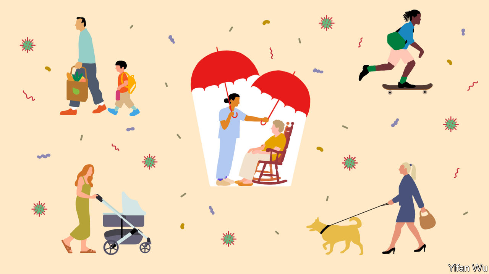
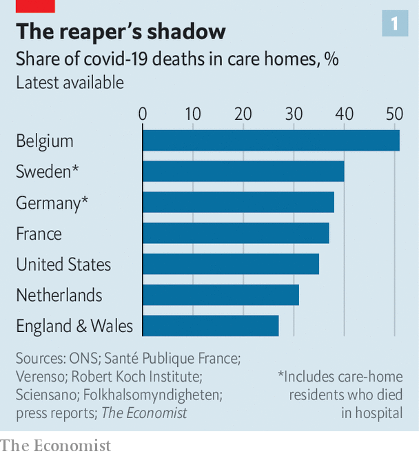
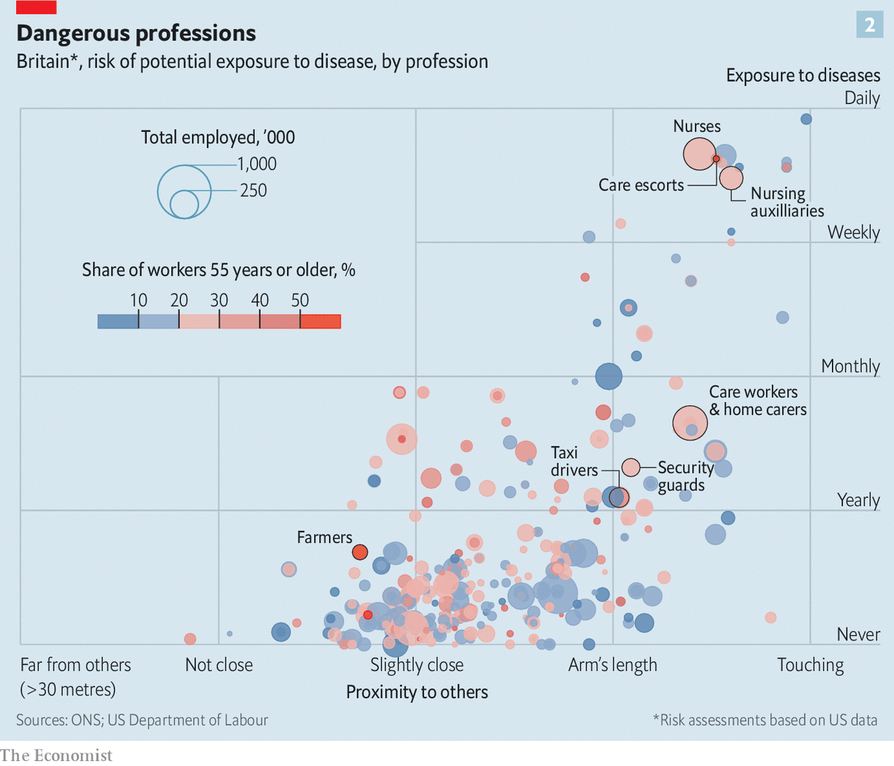

## To each according to his need

# The risk of severe covid-19 is not uniform

> That calls for a fine-tuning of measures to stop the disease spreading

> May 21st 2020

Editor’s note: Some of our covid-19 coverage is free for readers of The Economist Today, our daily [newsletter](https://www.economist.com/https://my.economist.com/user#newsletter). For more stories and our pandemic tracker, see our [hub](https://www.economist.com//news/2020/03/11/the-economists-coverage-of-the-coronavirus)

NABBING A DISEASE hotspot is to epidemic control what locking up a serial perpetrator is to crime investigation. Success hinges on similar skills, as John Snow, an Englishman who drew up the principles of modern epidemiology, demonstrated in 1854. That year a cholera outbreak in central London killed more than 500 people in just two weeks. Snow investigated around 60 of those deaths and found a common factor: a contaminated water pump. Removing its handle ended the outbreak.

The lockdowns to stop covid-19 have been a radical departure from the tenets of epidemiology. They are the equivalent, in cholera terms, of taking the handles from all of London’s water pumps. But emerging patterns in the outbreaks and deaths from the infection suggest that the post-lockdown phase will involve a return to classic epidemiology. It will, in other words, be calibrated to the places and people involved. What might work in densely packed, multicultural New York City will be different from what is suitable in homogeneous, rural Wisconsin. The ultimate goal is unchanged, however: to shield those most likely to develop severe symptoms from exposure to SARS-CoV-2, the virus that causes the disease.

Who these high-risk individuals are is now becoming clearer, as research from around the world piles up. Some of the strongest evidence is from a study published on May 7th by Ben Goldacre of Oxford University and his colleagues. This looked at the medical records of more than 17m people in Britain, about 6,000 of whom had died from the new illness. The Goldacre study confirmed previous suspicions that mortality risks are particularly high (after accounting for old age, smoking and poverty—which other investigations have not had the data to do) for people who are obese, who have diabetes, who have cancer or who have received a transplanted organ. Being a man is also risky. The biggest risk factor of all, nevertheless, is being old. People in their 60s are twice as likely to die of covid-19 than are those in their 50s. Mortality from the disease shoots up still more rapidly from the age of 70, so that even healthy elderly people are at significant risk. Data for nine rich countries gathered from various sources by The Economist show that care homes for the elderly and infirm have accounted for 40-80% of covid-19 deaths (see chart 1).

That is a dreadful fact. But it also offers an opportunity. Focusing efforts on care homes would cut the death toll considerably. This means implementing infection-prevention routines similar to those in hospitals, such as protective masks and gowns for staff, as well as testing both staff and residents frequently for active SARS-CoV-2 infection. Testing regular visitors may be prudent too—or finding other ways to stop them bringing in the virus. Some Dutch care homes, for example, have installed glass partitions in the rooms where residents and visitors meet.

Generalising this approach may offer lessons for dealing with the disease in the wider world. One strategy, put forward by academics from Edinburgh University, is to divide the population into three segments: those most vulnerable; their close regular contacts (which the researchers call “shielders”); and everyone else. Shielders include those who live with the vulnerable, relatives who visit them and social workers who care for them. In this analysis, the vulnerable themselves need to take the strictest precautions to avoid infection and shielders need to take greater precautions than everyone else.

Ideas about how to make this happen are already popping up. Gibraltar and Bulgaria, for example, have designated a Golden Hour each day, when parks and public spaces are reserved for the elderly, with others asked to stay home. Contact-tracing apps, which alert those who have been close to an infected individual, would be particularly valuable for shielders—along with stricter hand-hygiene measures, face masks and social distancing. Shielders could also be given priority for testing.

How many would be in each of these segments depends on the criteria for vulnerability. England’s National Health Service has identified 1.5m people at high risk because of a pre-existing medical condition. That is 2.7% of the population. If the definition were expanded to include people over 70 and those under that age who are in care homes, thereby accounting for roughly 80% of those who seem to suffer severe covid-19 infections, it would include 20% of the population. The Edinburgh team estimates that, on average, there is one shielder for each person in this expanded group. That would let 60% of the population go about their daily lives with only moderate levels of social distancing.

Identifying who is vulnerable is, though, itself fraught with difficulties. Besides the elderly and those with particular medical conditions, a third set of people confirmed to be at risk by Dr Goldacre’s study were members of certain ethnic minorities. Even after accounting for differences in other illnesses and poverty, black people and those whose ancestors came from South Asia were 60-70% more likely to die from covid-19 than white Britons. In Sweden the share of immigrants from Iraq, Syria and Somalia among those in hospital with severe covid-19 has been substantially bigger than their share of the Swedish population. In Norway, where 15% of residents are foreign-born, they constituted 25% of those who had tested positive for SARS-CoV-2 by April 19th. In America minorities are suffering too. Covid-19 deaths have been disproportionately concentrated among blacks and Hispanics.

These sorts of data can help disease-control authorities identify the mix of measures that can best cut SARS-CoV-2 deaths in specific subgroups. One revelation from the statistics so far is that living arrangements such as multigenerational households, which are common among some minorities for cultural and economic reasons, make it harder for them to prevent infection of vulnerable household members. In America 26% of blacks and 27% of Hispanics live either in households which include at least two adult generations, or in so-called grandfamilies of grandparents and grandchildren under 25, but without the intermediate children. That compares with 16% of white Americans in similar circumstances. Overcrowding is also a problem. In Britain about a third of Bangladeshi households and 15% of black-African households are classified as overcrowded by the Office for National Statistics, compared with 2% of white British households.

To resolve these matters some places have set up quarantine facilities for those who cannot isolate themselves at home. Sweden is particularly generous in this regard. Stockholm is offering separate flats to people in big immigrant households who are at high risk of severe covid-19.

Communication is also important. Translating information on SARS-CoV-2 prevention into the languages spoken by immigrant groups was an early omission in many sets of control measures. So was the dissemination of relevant information through the channels used to learn about such things, such as local community leaders and radio stations in people’s first languages. Measures of this sort are not a novelty in public health. They were deployed, for example, in recent outbreaks of measles in Britain, many of which started among immigrants from eastern Europe.

Certain jobs, too, carry a particular risk of infection. Some of the biggest outbreaks in America, Germany and Denmark have been in slaughterhouses, where crowded working conditions, and also possibly the cold (for there is evidence that SARS-CoV-2 survives better at low temperatures), make the spread of the virus particularly easy. Nor does it help that workers in these places are often migrants who live in crowded housing. Some other jobs, too—especially in the service sector of the economy—have a similar double-whammy: a greater risk for SARS-CoV-2 infection and a high share of older workers (see chart 2). In Britain jobs that fall into this category include security guards, plumbers and bricklayers. Employers need to follow stricter measures to shield such workers from infection. These could include reassigning the vulnerable to less risky tasks, stricter hygiene, rules that ensure physical distancing in the workplace and routine checks for symptoms.

All of these fine-grained prevention strategies would depend on the continued collection of data about the prevalence of infection in various groups. Increased testing capacity and better tests for current and past infection are making that easier. If these can be rolled out quickly and reliably, the next waves of covid-19 cases should be smaller and less damaging to social life and national economies. ■