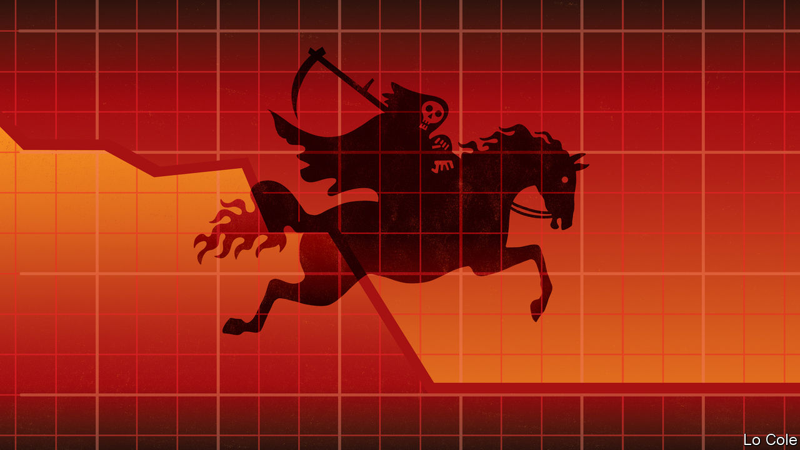

## Bello

# Latin America’s economic plight is getting worse

> Governments have limited firepower to deal with covid-19

> May 23rd 2020

IN SãO PAULO 91% of intensive-care beds in hospitals are occupied even as cases of covid-19 soar. The city has declared a four-day public holiday to reduce travel. In poorer parts of Brazil, such as Fortaleza and Manaus, hospitals are even fuller. Much the same goes for Peru and Mexico. In Chile, which seemed to have been controlling the coronavirus, a sharp rise in cases and deaths saw the government lock down greater Santiago and left the health minister “intensely worried”. Faced with a record rise in cases this week, Argentina extended its lockdown. As the pandemic slows in Europe, it is surging in the Americas.

For Latin America that is both disappointing and worrying. Forewarned, many countries were quick to impose lockdowns two months ago. In a region where one worker in two toils in the informal economy, these are hard to sustain. Many countries, too, have organised emergency payments for large segments of the population and given credit guarantees to firms. But Latin American governments lack the fiscal firepower, as well as the effective institutions, of their counterparts in Europe or the United States. As a result, rather than having a rapid recovery, as some hoped, the region risks entering a dark valley in which both public health and livelihoods suffer over many months. Already, the effects are exacerbating inequality in an unequal region.

Start with public health. The lockdowns did reduce the spread of infection in April, according to Jarbas Barbosa of the Pan American Health Organisation (PAHO). But economic pressures, and in Brazil and Mexico mixed messages from presidents, have led many people to flout the lockdowns. Traffic in the region’s biggest countries is back up to almost half of normal, according to the Inter-American Development Bank (IDB). Street markets are a source of contagion: in a wholesale fruit market in Lima almost 80% of vendors tested positive for the coronavirus. PAHO warns that the urban poor, many of whom live in dense areas, indigenous people in the Amazon and migrants and prisoners are especially vulnerable.

Several smaller countries, such as Paraguay, Costa Rica and Jamaica, have low rates of infection, as does Colombia. Some other governments have simply declared victory and are opening up their economies again. They include Mexico, whose president, Andrés Manuel López Obrador, claims that his country has “tamed” the virus. But even Mexico’s especially suspect official data show cases still rising. “Most countries can’t open up,” says Dr Barbosa. “It would be a recipe for disaster.” He thinks that if social distancing is properly adopted, cases could start falling across the region in the first half of June.

Although the lockdowns are popular, they carry a big socioeconomic cost. A 17-country poll for the IDB in April suggested that 57% of small businesses have shut down temporarily, while nearly 45% of respondents said a household member had lost a job. Countries such as Brazil, Chile and Peru have implemented three-month emergency income schemes. But getting the money to informal workers is hard (and has sometimes prompted infection-spreading crowds outside banks).

If the virus is to be contained, such policies will need to continue for longer. So will credit guarantees and emergency liquidity for firms, if they are to be able to drive economic recovery. Governments will struggle to find the money. “We don’t live in a ‘whatever it takes’ region,” says Mauricio Cárdenas, a former Colombian finance minister, referring to the stance of the European Central Bank. “We can do whatever we can,” he told a World Bank seminar this week.

Only the financially strongest countries, such as Peru and Chile, have public savings to draw on. Many Latin American countries can still raise money in financial markets, but for how long? Trying to reschedule debts, as Argentina is doing, takes time and carries costs. And rather than limiting capital outflows through debt forgiveness, Latin America needs additional inflows. Since March, a dozen Latin American and Caribbean countries have received a total of $4bn in emergency financing from the IMF. But demand for its money will exceed supply.

Mr Cárdenas suggests that the IMF should set up a fund that would issue bonds for rich-country central banks to buy, with the money being used to help Latin America weather the crisis. That may be a tall political order. But the alternative may be years of economic prostration and political instability.

Editor’s note: Some of our covid-19 coverage is free for readers of The Economist Today, our daily [newsletter](https://www.economist.com/https://my.economist.com/user#newsletter). For more stories and our pandemic tracker, see our [hub](https://www.economist.com//news/2020/03/11/the-economists-coverage-of-the-coronavirus)