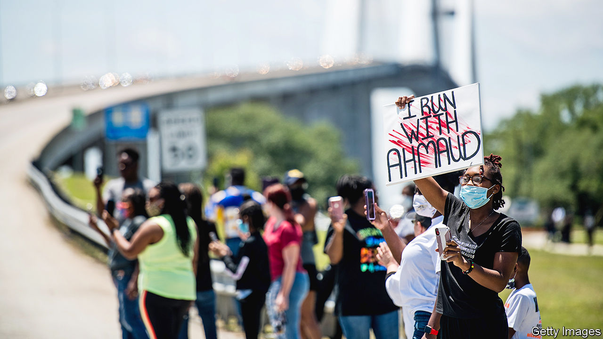

## Attention deficit disorder

# Whatever happened to Black Lives Matter?

> The group is still doing important work, but after Donald Trump became president liberal America stopped paying attention

> May 21st 2020CHICAGO

THE WAY Tef Poe sees it, nothing has improved in Ferguson, a mostly black suburb of St Louis, in the past six years. It was there that the rapper and activist co-founded Hands Up United, a campaign group, in 2014, after a policeman shot dead a local teenager, Michael Brown. Mr Poe became a voice of Black Lives Matter (BLM) as police clashed with protesters. He recalls a flurry of public interest, the “trendy movement”, and enthusiasm of hangers-on who saw activism “as the new Nike Swoosh”.

Today he is more guarded. He feels that TV news exploited him, dwelling on violence and drama, while liberal sympathisers online did nothing to improve conditions on the ground. Even “the way we discuss the social movement is problematic.” The “white media” now engage only with “celebrity cases”, such as the killings this year of Ahmaud Arbery, a black jogger shot by two white men in Georgia in February, and Breonna Taylor, a black health worker shot by police in her home in Louisville in March. “The American political gaze has been deactivated,” he says.

Attention is fleeting, but has BLM also lost its way? Interest in it, measured by Google searches, is much reduced. Though coronavirus has killed African-Americans at an estimated rate 2.6 times higher than white Americans, BLM has not been able to stir a national debate on it. Its unusual structure seems a hindrance. It is led by disparate individuals, rather than a single, charismatic figure in the mould of Martin Luther King. “It means there is no one person they had to take out,” explains Melina Abdullah, a co-founder of BLM’s LA chapter, referring to King’s murder. It also means some would-be supporters, donors or partners find it hard to relate to the movement.

Public interest has drifted. Ms Abdullah recalls how for two years she would speak daily on national television about BLM and black rights. Producers stopped calling, she said, the moment Donald Trump was elected. Some sympathisers have also been waylaid by other causes, such as supporting Bernie Sanders’s presidential run. “The general public has become a bit exhausted,” she concedes.

Mr Poe says BLM should “re-evaluate the effectiveness of a lot of our spokespersons”—he thinks many are too liberal, coastal and removed from places like Ferguson—and find ways to build a strong media voice of its own. Online, BLM’s once heavy presence has lost force. Activists still post a lot, seeking attention for black victims of violence. But they lack expertise with “all the apps, bots, to amplify, to get stuff to trend”, says Ms Adbullah. Perhaps, too, Russia’s lost interest matters: in 2016 Russian trolls devoted much effort to amplifying racial problems online in America. They stopped after the election.

Both Mr Poe and Ms Abdullah say BLM remains strong where it matters most, at local level. Ms Abdullah points to students passionate for the cause. She says that in Los Angeles, Chicago and Washington, the cities she counts as having the strongest BLM chapters, scrutiny of the police is stronger than ever. She credits that for a sharp fall in killings over five years. In 2015 police nationally killed 305 African-Americans, most by shooting, including 81 people who were unarmed. By last year that fell to 260 killings, 29 of persons unarmed.

Other factors could also be behind that. Police in both Chicago and Los Angeles have spent time under a “consent decree”, meaning years of scrutiny from the Justice Department to improve behaviour. Police who now do fewer stop-and-searches of young men end up shooting fewer of them. Legalisation of marijuana in some states may have calmed things down. Whatever the cause, fewer such killings could help to explain fading public interest in BLM.

Another way to look at it, argues Eitan Hersh at Tufts University, is that nearly six years after Ferguson, BLM counts as a rare success just for surviving, considering that it first existed mostly online. He has studied how most digital social movements, especially left-leaning ones, fizzle soon after they draw attention to a particular problem. Online outfits hardly ever build structures that have an impact in the real world. They are amplified by what he calls political “hobbyists”, those Americans who post avidly online about social matters—like racial equity—but do nothing practical to follow up offline.

In contrast, “BLM is very concrete and practical. It has a clear goal and is trying to tackle a salient problem,” says Mr Hersh. He too reckons its local actions, such as when activists turn out to speak at public meetings with police, are its most important contribution. Meanwhile, though core members stay committed—Ms Adbullah says black people don’t have the “privilege” of feeling exhausted by a campaign for civil rights the way “non-black folks” can—BLM’S wider allies, who are typically white, well-educated and liberal-minded, seem to have lost interest. The hobbyists now think “this is not a new, sexy thing”, says Mr Hersh: this Swoosh has lost its appeal. ■

## URL

https://www.economist.com/united-states/2020/05/21/whatever-happened-to-black-lives-matter
