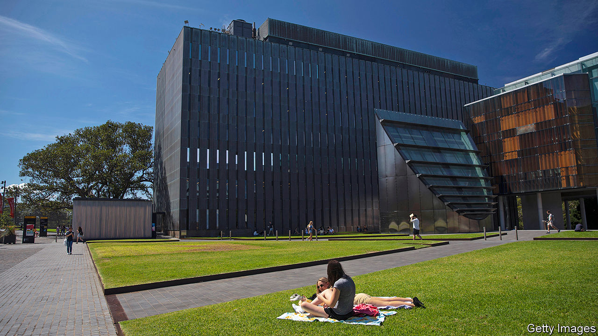

## Bye degrees

# Australia’s foreign-student bubble has burst

> But the government is reluctant to help stricken universities

> May 28th 2020SYDNEY

AUSTRALIA’S OLDEST university campus should be heaving on a sunny autumn afternoon. Before the pandemic, the University of Sydney hosted more than 70,000 students. At lunchtime they would cram into its cafés and crowd onto its lawns. Now its grounds are practically deserted. Although Australia has almost quashed covid-19, social-distancing rules forced the campus to close in March, and only a few stragglers have stayed on amid the historic sandstone and modern plate glass.

The abrupt halt to international travel is even more painful for Australian universities than their counterparts in other English-speaking countries (see [article](https://www.economist.com//united-states/2020/05/28/could-a-fifth-of-americas-colleges-really-face-the-chop)), because they lean more heavily on revenue from foreign students. More than 440,000 such students enrolled in Australian institutes of higher education in 2019. At the last count, they took up roughly 30% of all places. Almost 40% of them came from a single country, China.

The foreign students are lucrative. In 2018 they brought in almost A$9bn ($5.8bn) in revenue—just over a quarter of all university funding, and far more per head than local students bring in through fees and government subsidies. The boom turned education into Australia’s fourth-biggest export, behind coal, iron ore and natural gas. It funded world-class research centres, shiny new learning facilities and vast collections of art. Vice-chancellors’ pay packets swelled (in big universities they rake in well over A$1m). Campuses bulged to sizes, as an academic at La Trobe University puts it, “matched only by the epic institutions in India and China”.

For years, this has been the subject of heated political debate. Universities say they were forced to woo foreign students because the government does not give them enough money to cover their rising costs. Michael Spence, the vice-chancellor of the University of Sydney, says: “The education of domestic students doesn’t break even.” If Australia is “more dependent on student fees than comparable systems around the world,” he argues, “that’s a decision successive governments have made.”

Some in the current conservative coalition government retort that universities have brought the crisis on themselves. They “bet big on the international-student dollar” and “have become badly over-exposed”, James Paterson, a senator, recently declared. Vice-chancellors have “privatised the profits” from foreign students, “building Taj Mahals to themselves”, a conservative commentator complains. Even some of those employed by universities are critical. “It wasn’t a Ponzi scheme,” says the academic at La Trobe, “but it’s in that ballpark.”

Now, argues Salvatore Babones of the Centre for Independent Studies, a think-tank, “the chickens have come home to roost.” Australia’s academic year starts in January, so as covid-19 first appeared in China, a flight ban locked out an army of its students just as they should have been enrolling. Some wriggled back in through third countries, but Australia has since closed its borders to non-citizens, and they are not likely to reopen until at least the end of the year.

Universities Australia, which represents the industry, is not sure exactly how many foreign students it has lost. The University of Sydney has fallen 17% short of its enrolment target for 2020, according to Mr Spence, and now faces a budget shortfall of A$470m. Across the industry, revenue could fall by A$3bn-4.6bn, according to Universities Australia, putting 21,000 jobs at risk, many of them in research.

Since students who do not enroll this year will not pay fees in 2021 or after, a quick bounceback seems impossible. Peter Hurley of Victoria University’s Mitchell Institute, another think-tank, estimates that the industry might lose A$19bn over the next three years. Building projects and casual staff have already been axed.

So far, the government has been disinclined to help. It says it will still fund the places of domestic students, even if they drop out rather than embrace online learning. But it has excluded universities from its A$60bn wage-subsidy scheme, JobKeeper. Dan Tehan, the education minister, has called for “a greater focus on domestic students”.

Few seem to think universities will fail. Smaller, regional institutions are in the most danger, but since they are an important source of jobs, state and federal governments might be persuaded to prop them up. They will, however, have to shrink to survive. Universities will be “smaller in staffing and smaller in revenue”, says John Dewar, La Trobe’s vice-chancellor. There could be “a massive change in the types of courses they offer”, Mr Hurley predicts. That seems to be just what the government wants. ■

## URL

https://www.economist.com/asia/2020/05/28/australias-foreign-student-bubble-has-burst
