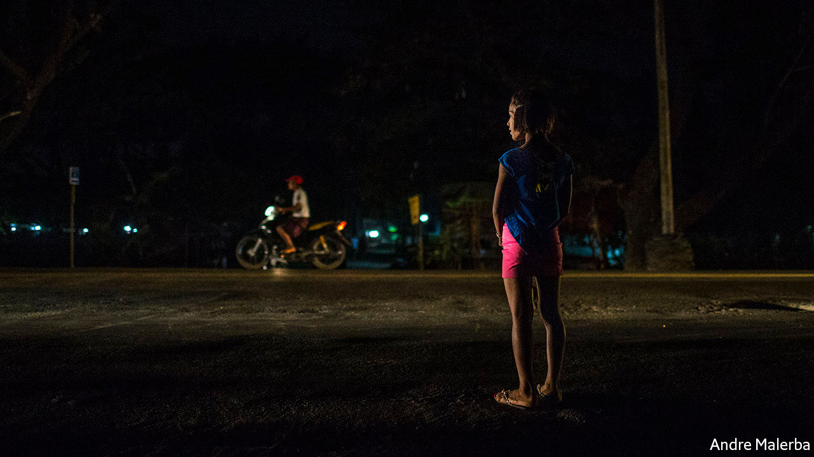

## Aygay angslay

# Gay people in Myanmar have adopted a secret language

> Their slang can help protect them from abuse

> May 30th 2020YANGON

WEDNESDAY HAS just turned into Thursday in Yangon, Myanmar’s biggest city, and pleasure-seekers are on the prowl in a glitzy neighbourhood. Drivers slow down to inspect sex workers waiting by the kerb. Three of them, all transgender women, chat brightly. Your correspondent tries to eavesdrop but even her translator cannot understand. Theresa, the most forthright of the three, withdraws the lollipop from her mouth. “Yeah, we’re speaking bansaka,” she shrugs.

A dialect of Burmese spoken by gay and transgender people in Myanmar, bansaka, meaning slang, involves switching vowels within words (coffee, a loan word from English, becomes keefaw) and giving new meaning to Burmese words. Puns feature heavily. Asin, an adjective used to describe gemstones of great clarity, refers to an attractive man. Neologisms often riff on popular culture. To say one likes reading Tayza magazine, once popular among young men, is to signal that one is attracted to such people.

The overall result is gibberish to outsiders. That’s the point. Sexual minorities often invent their own secret languages to conceal their identities and speak privately. Gay and transgender Burmese switch to bansaka when they want to gossip about somebody nearby. “When an ugly customer walks in wanting to look like Beyoncé,” explains Thu Yain Maung Maung, a make-up artist, “you’d bitch about this with your colleagues.”

In private, gay people deploy bansaka as a sign of affection and invent new words and even gestures to entertain each other. Moe Aung of Kings N Queens, an LGBT advocacy group, laughs as he and his friend explain the latest addition to their repertoire. The “OK” hand gesture, with thumb and index finger forming a circle and the remaining three fingers flared out, resembles wa lone, a letter in the Burmese alphabet; “wa” also refers to a full belly. To those in the know, the hand gesture therefore means “I’ve had enough, stop” and sometimes “Stop talking”.

Some 90% of Burmese are Buddhist, and many of them believe that being gay or transgender is punishment for sexual sins committed in a past life. LGBT people are seen as morally corrupt, a view which is bolstered by colonial-era laws that still criminalise homosexual sex. The more feminine the man, the fiercer the contempt. “Going from man to woman, you lose status and rank,” says La Min, a transgender woman. LGBT people routinely endure discrimination and abuse at school and in the workplace; many also report being assaulted by family members or the police, according to David Gilbert of Australian National University.

Bansaka can provide a modicum of protection. When Mr Moe Aung, who performs as a drag queen, wants to go to a public toilet, “I might want a friend to go with me for my safety. That conversation needs to be private. If I don’t use slang in that situation people can look at me funny.” He says that going solo invites rape.

Most gay men and transgender women learn bansaka at work, in the few jobs open to them: spirit mediumship, hairdressing, make-up and floristry. “[These jobs] offer more than employment,” says Mr Gilbert. “They operate more like alternative families.” Employees typically live together, in their workplaces. Younger members of staff, or “children”, pick up the lingo from their boss or “mother”.

Today bansaka offers less protection than it used to. Over the past 15 years, the public has cottoned on. Though most don’t understand it, they “do recognise that it’s bansaka”, says Mr Thu Yain Maung Maung, and have even adopted some words. Bansaka may also be losing its utility for the young. Hein Maung, a gay 24-year-old, says that gay youths hardly speak it anymore; instead they communicate privately with each other via social media. But Mr Moe Aung is sceptical. His organisation hosts picnics attended by lots of youngsters who find learning bansaka fun. “The slang will never disappear,” he says, before flashing the “OK” hand gesture. ■