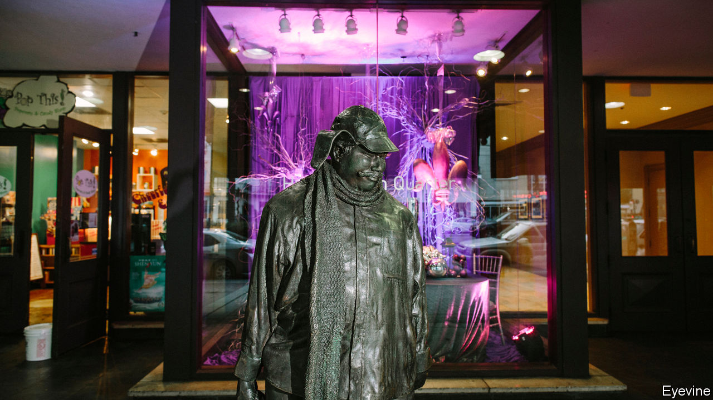

## Perish and publish

# Behind the scenes of “A Confederacy of Dunces”

> “I, John Kennedy Toole” tells the story of a cult novel and its ill-starred author

> May 28th 2020

I, John Kennedy Toole. By Kent Carroll and Jodee Blanco. Pegasus Books; 256 pages; $25.95 and £20.

SLOTHFUL, FLATULENT and imperious, Ignatius Reilly was a wholly original anti-hero when he burst from the pages of “A Confederacy of Dunces” in 1980. American readers fell in love with this bloated, hapless misanthrope in a green hunting cap, and the bestselling comic novel won a Pulitzer—one of the few times the prize has been awarded posthumously. Distressed by a publisher’s rejection, haunted by paranoid thoughts and oppressed by the obligation to support his enfeebled father and overbearing mother, the author, John Kennedy Toole, had gassed himself in his car near Biloxi, Mississippi in 1969. He was 31.

The mythology around the man and his book has led to several biographies, a couple of plays and a few doomed screen adaptations. Steven Soderbergh, the latest film-maker to give up, called the project “cursed”. Now comes “I, John Kennedy Toole”, a fictionalised portrait of the short-lived author, by Kent Carroll, who as an editor at Grove Press helped bring “Confederacy” to light, and Jodee Blanco. They had planned to write another biography, but found Toole an elusive subject. Few of his papers, or his acquaintances, were still around. After years searching for answers to key questions—why exactly did Toole kill himself? Was he working on another book?—they decided to use artistic licence to fill in the gaps.

Theirs is a work of fiction, but it sticks to the known facts. Toole is a handsome academic star and “gentleman’s gentleman”, with refined southern manners and regular bouts of depression. An only child, he felt burdened by his demanding mother, Thelma, who saw him as her one shot at greatness. An army draft interrupted his literature PhD at Columbia University in 1961, but also gave him space to write. He moved back to New Orleans, the heart of his novel, where he lived with his parents, paid their bills by teaching at a local college and finished his manuscript.

He sent his book to Robert Gottlieb, an editor at Simon & Schuster who had published Joseph Heller’s “Catch-22”. Mr Gottlieb admired Toole’s wit and verve, but asked that he trim the story and sharpen the plot. He tried to be encouraging, but, after Toole spent years tinkering, his rejection of the final draft (“It isn’t really about anything”) stung.

The young author began drinking heavily, putting on weight and behaving erratically. Friends noticed that he was talking to himself, and students complained about his rants. Then, in January 1969, he set off in his car, and was found dead two months later. Ms Blanco and Mr Carroll suggest Toole killed himself to allow his characters to live on. “He loved so many writers who found fame only after they died,” says Ms Blanco. But no suicide note survives, so it is impossible to know for sure. Ms Blanco suspects Toole’s mother, who otherwise kept every postcard and clipping, burned the note to preserve the legend of her golden boy.

Just how “Confederacy” came to be published is a story Walker Percy, himself an acclaimed southern writer, partly tells in a foreword he wrote for the novel. In the mid-1970s Thelma hounded him to read the manuscript, which many publishers had already rejected. Percy intended to scan a few pages and tell her to push off—but the book was too good to put down.

Eventually, he convinced Louisiana State University (LSU) Press to publish the novel in a small, untrumpeted print run. It found fame largely because LSU offloaded the paperback rights to Mr Carroll, who knew he had a winner on his hands and had the savvy to sell it. “I was just entranced,” he recalls. Millions of copies are now in circulation in dozens of languages.

For a tribute to such an original writer, “I, John Kennedy Toole” is a straightforward effort. You can imagine Ignatius dismissing the workmanlike prose for its “lack of theology and geometry”. But given the aura around Toole’s life, it is a pleasure to spend some time with him, if only to rue the books he never had a chance to write. ■

## URL

https://www.economist.com/books-and-arts/2020/05/28/behind-the-scenes-of-a-confederacy-of-dunces
