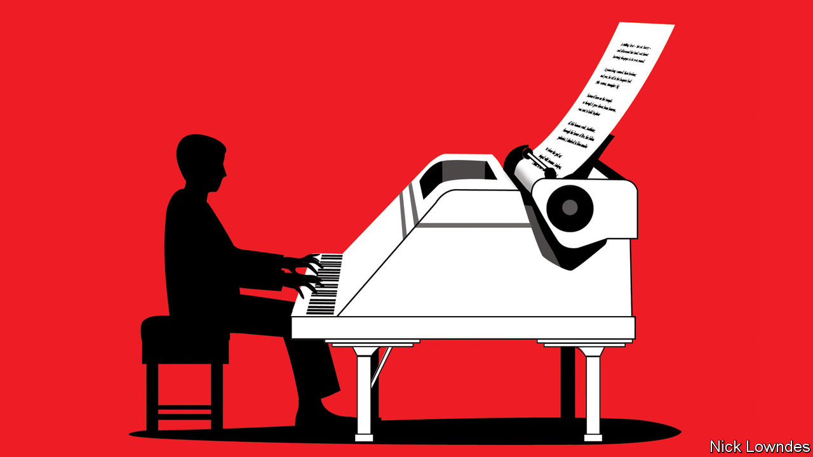

## Johnson

# Is music a language, as Stevie Wonder sang?

> A comparison between the two illuminates what is special about both

> May 30th 2020

ONE OF THE liveliest debates in linguistics is over whether all languages share fundamental properties. If so, perhaps language is a universal feature of evolution. To find out, scholars have looked to other universal features, and one in particular: no society on Earth lacks music. The comparison illuminates what is special about both.

Music and language seem intimately linked, but how? Did language start with song, as Darwin believed? Or is music “auditory cheesecake” that developed from language and other useful faculties, as Steven Pinker, a Harvard psychologist, has said? Is music itself a language, as Stevie Wonder intoned? Might the two be fundamentally the same?

Some similarities are obvious. Both can utilise the unique human vocal tract. Both have a kind of beat. Both can express emotion. Both can be either carefully composed or spontaneously improvised. And both are highly social. Although the origin of music is unclear, it seems likely to have involved celebration, communal worship or martial inspiration and co-ordination.

At a structural level the parallels are striking, too. With a finite set of notes or words, and a finite set of rules, an inexhaustible variety of novel melodies or sentences can be created. This “discrete infinity” is often said to be the hallmark of human language. Animal communication, by contrast, is only able to convey a limited number of thoughts (the location of a source of food, for example, or the presence of a predator).

Aniruddh Patel of Tufts University has argued that music and language, rather than being essentially the same, rely on the same bit of the brain. In an experiment he presented his subjects with a sentence that contained a grammatical trick (“The scientist confirmed the hypothesis was being studied in his lab”), revealing one word at a time. The subjects were to press a button for each word at their own pace. Many paused at the unexpected “was”. “The scientist confirmed the hypothesis” seemed a complete sentence.

They also heard music as they performed this exercise. Some were treated to a new chord in a pleasing progression with every word that was revealed. Others heard a jarring chord at the moment they reached the trick word “was”. Both groups slowed down—but those given the discordant notes did so much more. Mr Patel hypothesises that this is because sentence structure, and the structure of the harmony, draw on shared, limited resources in the brain.

For all the overlap, there are big differences. Both music and language can make you feel and even think, but only language is truly propositional. A quip attributed to Bertrand Russell—"however eloquently [a dog] may bark, he cannot tell you that his parents were honest though poor."—might be adapted for music. Language can express contingencies, pose counterfactuals and talk about the future. Music’s nuances are of a different order.

Another stark contrast lies in the range of human aptitude for each ability. Nearly all children produce complex sentences by the age of three and become fluent speakers just a few years after that. As adults, they create striking and novel utterances every day. Conversely, only a minority of adults are talented musicians; even fewer are skilled composers of new, hitherto unheard works.

Victor Wooten, a bass player and music teacher, has an explanation for that disparity. Children, he points out, learn to talk by being constantly surrounded by linguistic virtuosos—fluent older speakers who, in musical parlance, are “jamming” with the novices almost from birth. Their fumbling efforts are encouraged. On the other hand, students of music often keep company with other beginners, and are stopped every time they make a mistake.

It is not that simple, reckons Jay Keyser, an emeritus professor of linguistics at the Massachusetts Institute of Technology and a jazz trombonist. For him, music is not like spoken prose, which almost everyone can do proficiently, but instead resembles a specific, rhythmic form of language: poetry. And, he says, “most human beings are bad at poetry.” The number of grammatical sentences is vast. But the number that are fit for verse, in terms of both meaning and prosody, is much smaller. Finding those is hard—like composing music, or improvising jazz.

On Mr Keyser’s plausible view, using ordinary language is a less rarefied talent than making music. But while it may not instil wonder and joy, as music can, it is still a miracle—just an everyday one.■

Correction (June 22nd, 2020): The original version of this column repeated a widespread but incorrect variant of the Bertrand Russell quote.