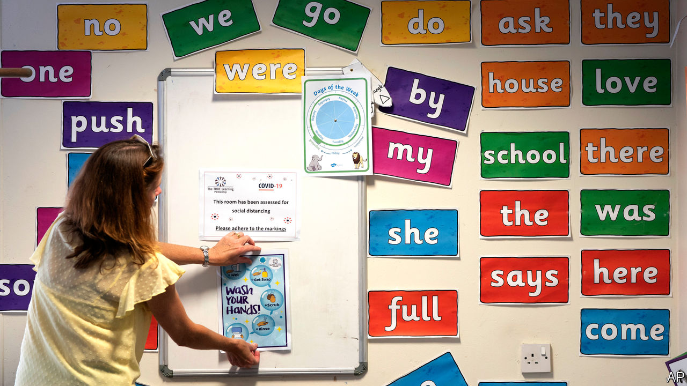

## Back for summer

# English schools reopen, but not without a fight

> Why the government has struggled to manage the return to class

> May 28th 2020

ON MAY 10TH, in the speech in which he began to lift the lockdown, Boris Johnson said he hoped schools would welcome back pupils at the start of June. The announcement was heavily caveated. Getting older children in before the summer break was an “ambition”. Primary schools would reopen with only three year groups. “I must stress again that all of this is conditional, it all depends on a series of big ifs,” the prime minister warned.

If the statement was designed to reassure, it did not succeed. The National Education Union, the country’s biggest teaching union, reckons that around 35 local councils in England are advising their schools to hold off; a rebellion the union has loudly supported. In some cases, schools won’t open because of problems putting in place precautions. More often, it is because they are unconvinced it is safe even with precautions. According to Teacher Tapp, a pollster, 60% of state-school teachers say they are “nervous” to return.

This nervousness is partly because reopening schools is inherently tricky. Modelling from the Scientific Advisory Group for Emergencies, which informs the government’s view it is safe, is sensitive to assumptions about how much children spread the virus, which is still uncertain. Although there is little doubt that keeping classrooms empty will cut the amount children learn and their parents’ productivity, the extent to which this is the case is hard to guess.

Even things that are clear—such as the fact that children are at little risk themselves from the virus—are hard to communicate. “We’re being asked by lots of parents: ‘Is my child safe if he or she goes back to school?’” says Sir Jon Coles, head of a charity which runs 85 schools, and who has advised the department for education on reopening. Misconceptions abound. One is that four- and five-year-olds will be expected to keep 2 metres apart. The government recognises this will not be possible, but to mitigate the risk of infection they will be kept in groups of no more than 15.

Yet lots of this is true across Europe, too, where the reopening of schools has proved less difficult. Some English teachers’ unions have been notably recalcitrant, perhaps because they know English people are nervous of ending the lockdown, and they therefore think this is a battle they can win. And the government messed up its negotiations: it annoyed the unions unnecessarily by going against their views on which years should return to school first, and by springing the approach on them.

It is harder for the government to order schools around in a system, like England’s, in which accountability is fragmented. “Schools have a vast amount of autonomy,” notes one former education secretary. “That is a strength of the system but there are times—and this is one—where it can create a tension.” In deciding whether to reopen, some heads are thus stuck between the wishes of the government and the wishes of their teachers’ unions.

The hope at the department for education is that, as children return to school, parents and teachers will be reassured it is safe; something which seems likely. Yet four in ten primary-school teachers expect less than half of their pupils to actually return when gates open. The way the government and the unions have handled the return to school has made it more fraught than it needed to be. ■

Editor’s note: Some of our covid-19 coverage is free for readers of The Economist Today, our daily [newsletter](https://www.economist.com/https://my.economist.com/user#newsletter). For more stories and our pandemic tracker, see our [coronavirus hub](https://www.economist.com//news/2020/03/11/the-economists-coverage-of-the-coronavirus)