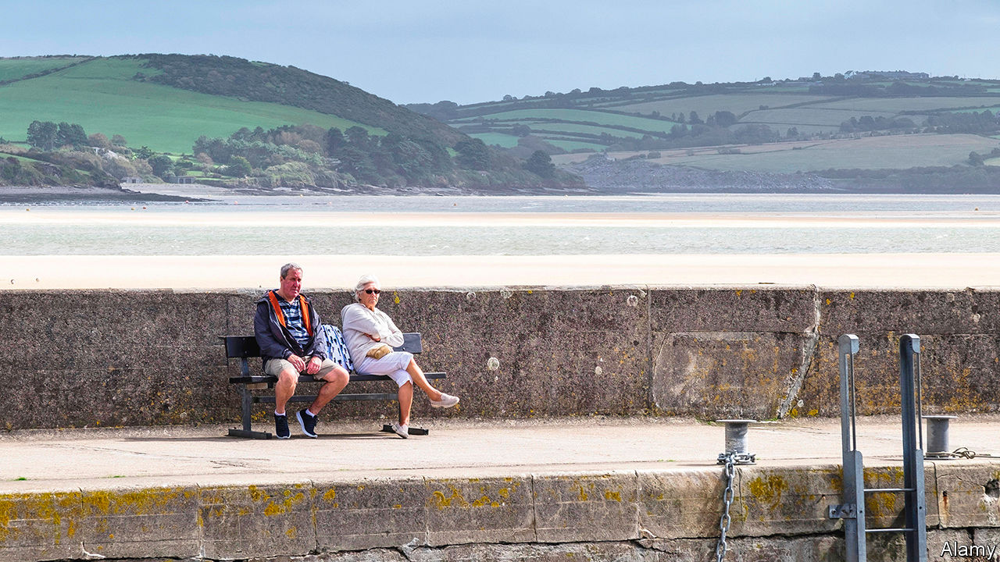

## Sad summer

# Holiday resorts need tourists but don’t want them

> Britain’s prettiest places fear an influx of people carrying lethal baggage

> May 28th 2020PADSTOW AND ORKNEY

Editor’s note: Some of our covid-19 coverage is free for readers of The Economist Today, our daily [newsletter](https://www.economist.com/https://my.economist.com/user#newsletter). For more stories and our pandemic tracker, see our [coronavirus hub](https://www.economist.com//news/2020/03/11/the-economists-coverage-of-the-coronavirus)

ON A BALMY day in the half-term holidays, a local man in late middle age sits on a bench at the top of a hill in Padstow, greeting everyone who passes by. “Afternoon!” he bellows each time. “Lovely weather!” Then, “Where’ve you come from, then?” or, occasionally, “What are you up to, then?” Few have come far, and they are not up to much. This Cornish town, where every second cottage seems to have the telltale key safe of a holiday let, is nearly empty. The benches on either side of the man, who confesses to being bored by lockdown, are deserted. Hardly any boats disturb the estuary. The seagulls remain ready to pounce, but the ice-cream shops and chippies that supply their prey are mostly shut.

That could soon change. Matt Hancock, the health secretary, has warned against “big, lavish, international” holidays this summer. The government’s decision that from June 8th most incomers to Britain, including those returning from holidays, will have to self-isolate for a fortnight should boost demand for small, frugal, domestic ones. If the virus is spreading at a low enough rate, the government plans to allow much of the hospitality sector to re-open in July so long as social-distancing measures are implemented. Hordes of cooped-up city-dwellers will head for south-west England, by far the most popular destination for domestic tourists.

They may not be welcome. So far, it is the English region with the lowest number of covid-19 infections per person. Many are therefore less than keen on an influx from virus hotspots. In Padstow, a sign in the window of a fudge shop urges any holidaymakers to go back home or self-isolate in their holiday let for a week. “Don’t pop to the beach,” it reads. “Don’t nip out to watch the sunset.” A family who arrived in town for the bank holiday weekend left after being challenged by an asthmatic resident who pointed out that she had been avoiding the beach. “Why is it fair that you can treat this as a holiday?” she asked.

Cornwall faces an extreme version of the challenge confronting every place coming out of lockdown: how to save lives and livelihoods in a county where tourism supports one in five jobs. David Lockyer, who runs the National Lobster Hatchery, a conservation charity in Padstow, embodies the conundrum. “Personally I’d like to see the lockdown for quite a period of time,” he says. “People are concerned that if we open the gates up we’ll see a big wave [of infections] down here.” But the charity relies almost entirely on tourism revenue, half of which it takes between July and September. “I’m in this real dilemma.”

Many rural areas popular with tourists also have an oldish population. Almost a quarter of the inhabitants of Scotland’s Orkney Isles are aged 65 or over, compared with 13% in Glasgow. So vulnerable is the archipelago’s population that most of those on its smaller islands, such as North Ronaldsay, which is known for its seaweed-eating sheep, have not even visited the main island during the lockdown. That caution seems to be paying off: Orkney’s covid-19 death rate has been less than a tenth of Britain’s. Yet the islands, too, depend on the income from visitors. Crispin Worthington, an 80-year-old who has been self-isolating with his wife in a fishing village, accepts that an influx of outsiders could mean a longer period of confinement for them. Still, he says, “money from tourists is necessary for Orkney”.

Sooner or later, Padstow will have to open up too. Rick Stein, a celebrity chef, employs 650 people there, about two-thirds of whom live in or near the town. All have been furloughed since his four restaurants, cookery school and holiday accommodation shut. His son, Jack, explains that the company loses money from November to April, making the next few months particularly crucial. “We’re just hoping we get some of the summer,” he says. But he is aware that the topic is a touchy one. He stresses that the family will canvass locals’ views and take government advice before reopening. “We don’t want to be seen to be profiting from tragedy.”■

## URL

https://www.economist.com/britain/2020/05/28/holiday-resorts-need-tourists-but-dont-want-them
