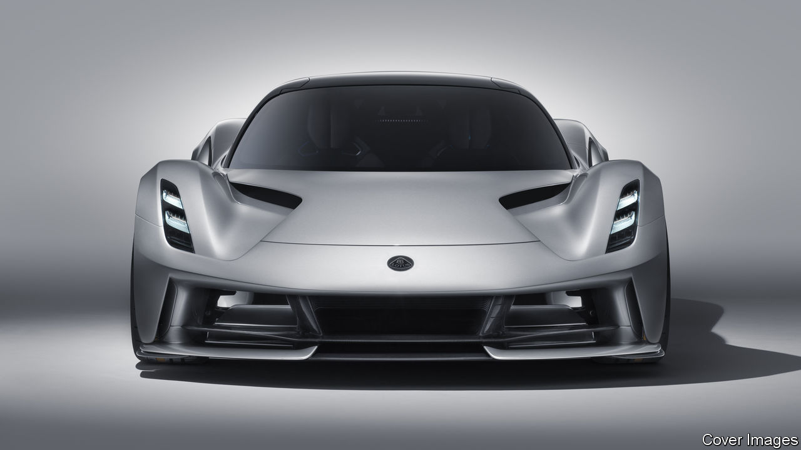

## Carmaking

# Lotus benefits from its Chinese connection

> The sports-car maker gets back to work

> May 28th 2020

NOTORIOUS MECHANICAL capriciousness once led frustrated owners to propose that Lotus was an acronym for “Lots of trouble, usually serious”. The cars are now reliable, but the accusation could be levelled at the firm, whose 72-year history is of elusive profits and periodic threats of bankruptcy. Yet just as petrolheads put a reputation for sobriety aside to own a brand burnished by past racing glory so too has Geely, a privately owned Chinese carmaker, which acquired a controlling stake in 2017.

For now, admits Phil Popham, the carmaker’s boss since 2018, the “brand is bigger than the business”. Last year 1,700 cars rolled off the production line in its Norwich factory, which has the capacity to build 10,000. But at least the Lotus badge remains attached to cars. Since the heyday of British sports-car manufacture in the 1960s many of the marques such as Austin Healey, Sunbeam and Triumph have perished. Lotus suffered from a string of unsuitable owners.

Geely might succeed where others have failed because it comes with financial backing, and a track record of expanding abroad and turning round struggling car firms. In the decade since it acquired Volvo the Swedish firm has thrived. Since taking over the company that manufactures London Taxis in 2013 it has developed a smooth-driving electric black cab that has cleaned up London’s air by reducing emissions and improving the mood of tetchy cabbies.

Geely is rumoured to be pumping around £1.5bn ($1.8bn) into the firm, an estimate that Mr Popham says is “conservative”. The cash will pay for the firm’s first new model for a decade—the Evija £2m electric hypercar, a “halo” vehicle designed to restore Lotus’s reputation for technology and speed; 130 of them will be made. A cheaper new sports car will follow in 2021.

The relationship should benefit both sides. The British firm can piggyback on Geely’s investment by outsourcing the development of a new platform, the basic underpinning of a car, and the costs of electrifying all future models. Geely can tap British expertise in aerodynamics and building light vehicles, important for keeping down the tonnage of electric cars with hefty batteries.

The tie-up may also insulate Lotus from some of the worst effects of the viral slowdown on Western carmakers, which will be aiming to cut costs and retrench. Forecasts suggest that China’s carmakers will not suffer as badly as those in the rest of the world. But questions remain over how well sports cars which mostly sell for between £55,000 and £110,000, and that are basically toys, will sell in a post-covid world of recession and gloom.