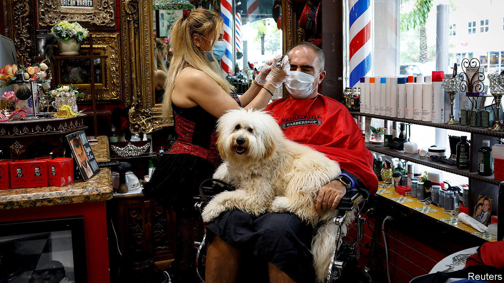

## Things get hairy

# The global grooming industry gets cut down to size

> Itinerant hair stylists and barbers are a rare bright spot in a clobbered business

> May 28th 2020ISTANBUL

Editor’s note: Some of our covid-19 coverage is free for readers of The Economist Today, our daily [newsletter](https://www.economist.com/https://my.economist.com/user#newsletter). For more stories and our pandemic tracker, see our [coronavirus hub](https://www.economist.com//news/2020/03/11/the-economists-coverage-of-the-coronavirus)

SOME THOUGHT a mirror and a pair of clippers from Amazon would do it. Some gave up after the first flesh wound. Some braved a trim by spouses or children. Now, as hair salons reopen the world over after a covid-19 hiatus, the bearded and bedraggled are flocking back to the pros. They find an industry—with annual sales of $20bn in America alone—transformed.

Social-distancing rules force hairdressers and barbers to serve fewer clients. “If we could seat ten people before, now we can only seat three,” says Cristina Solymosi, whose beauty salon in Madrid has gone from 40-50 customers a day before the pandemic to 15-20. Protective gear and disinfectant are a must. Salons, which often double as social clubs mixing gossip with endless arguments about sports and politics, may soon resemble labs.

If they survive at all, that is. Kline, a consultancy, sees a decrease of over 30% in salon revenues in a dozen big markets this year. That could kill many firms in a trade with razor-thin margins—with knock-on effects on global sales of cosmetics, perfumes and hair products, worth $500bn a year. McKinsey, another consulting firm, thinks these may decline by 20-30%.

The lockdown has spawned a market for house calls by roving covid coiffeurs, often in defiance of quarantine orders. Tahsin, a barber in Istanbul, says he has trimmed up to 15 beards a day, mostly in private homes but sometimes in abandoned depots, after Turkey’s government ordered barbershops to close. (They reopened on May 11th.) Hairdressers across Europe gripe that the rovers are poaching customers, says Jef Vermeulen, head of Coiffure EU, a trade body. “Even before the coronavirus, many of them did not respect health and safety rules,” he complains. Still, their future may be the industry’s bright spot. As salons, with higher fixed costs, go under, freelancers may pick up the slack, predicts Kline.

Some stylists were shifting to house calls before covid-19 hit. In France itinerant coiffeurs made up 8-10% of the market, says Pierre André, who runs Wecasa, an app which arranges home cuts. Hairdressers he works with are all licensed, he says; nine out of ten freelance. All must now wear masks and gloves. Wecasa paused work in March, after France locked down, and relaunched on May 11th. “That week”, says Mr André, “we received four times as many orders as in our best week on record.”■