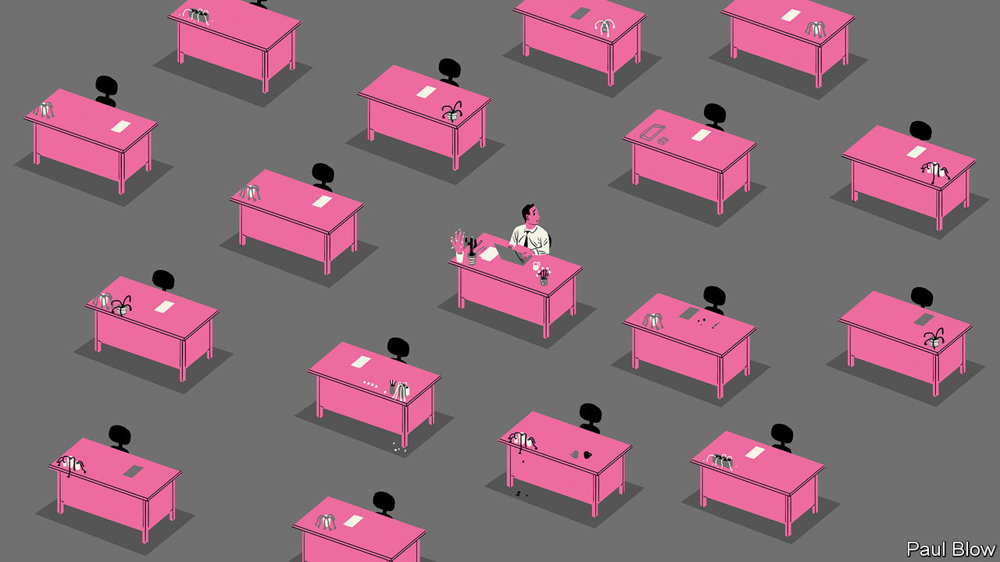

## Bartleby

# Working life has entered a new era

> Farewell BC (before coronavirus). Welcome AD (after domestication)

> May 30th 2020

ON MARCH 16TH Bartleby left the offices of The Economist to head home. That was the last day when all editorial staff assembled in our London redoubt. And, at the time of writing, no date for a return to the office is in sight.

It is remarkable how quickly we have adapted. The newspaper has been written, edited and produced from couches and kitchen tables. January and February seem like an ancient era—the BC (before coronavirus) to the new AD (after domestication). The shift may rival great workplace transformations in the 19th and 20th centuries. Twitter has already said that all its employees will be allowed to work from home permanently and Facebook expects half its staff to do so within a decade.

It has been a much more sudden transition than occurred with factories. Steam power meant they were designed around one great power system, complete with belts and pulleys that snaked through the building. A failure at some point in the system meant the whole thing might grind to a halt. Then electrification allowed individual machines to have their own power source. But it took half a century from the introduction of electricity in the 1880s before factories were reconfigured to take advantage of the new power source.

The current, rapid shift to AD was enabled by preconditions. First, broadband services are today quick enough to allow for document downloads and videoconferencing. Second, advanced economies revolve around services, not manufacturing. Back in the 1970s, when Britain adopted a three-day week (to combat a miners’ strike), there were power cuts and TV stations had to close down early. In other words, home life was severely affected as well. The pandemic has not turned the lights off.

Not only that, it has made remote work seem both normal and acceptable. In the past employees who stayed home had to overcome the suspicion that they were bunking off. Now those who insist on being at the office sound self-important.

Things are missing, of course. Video calls lack the spontaneity of a normal meeting; no off-the-cuff remarks to lighten the mood. Distance makes it difficult to generate camaraderie. Creativity is probably harder to foster. Octavius Black of Mind Gym, a training company, says new ideas come from weak links in networks—ie, people you meet occasionally. Such “casual collisions” have become rarer.

Yet although offices will not disappear, it is hard to imagine that working life will return to BC ways. For more than a century workers have stuffed themselves onto crowded trains and buses, or endured traffic jams, to get into the office, and back, five days a week. For the past two months they have not had to commute, and will have enjoyed the hiatus.

Employers, for their part, have maintained expensive digs in city centres because they needed to gather staff in one place. The rent is only part of the cost; there is the cleaning, lighting, printers, catering and security on top. When you work at home, you pay for your own utilities and food.

Many businesses and employees may thus have had their “Wizard of Oz” moment: the corporate HQ is shown to be an old man behind the curtain. Faith in the centralised office may never be restored.

Another aspect of the AD era may be the disappearance of the five-day working week. Even before the pandemic many workers became used to taking phone calls or answering emails at the weekend. In the AD era the barrier between home and working life, a useful way of relieving stress, will be even harder to sustain.

It may be lost altogether. Without the Monday-to-Friday commute, the weekend seems a more nebulous concept, as does the 9-to-5 working day. In future employees may work and take breaks when they please, with the company video call the only fixture. The downside, however, is that the rhythm of life has been disrupted and new routines are needed: as Madness, a British pop group, sang about school in “Baggy Trousers”, people are reduced to “trying different ways to make a difference to the days”.

Looking further out, the AD era may bring other changes. Some may decide to live in small towns where housing costs are lower, since they have no need to commute. Men will have fewer excuses to skip cleaning or child care if they are not disappearing to the office. In a sense, this is a return to normal: until the 19th century most people worked at or close to their homes. But social historians may still regard 2020 as the start of a new age.

Editor’s note: Some of our covid-19 coverage is free for readers of The Economist Today, our daily [newsletter](https://www.economist.com/https://my.economist.com/user#newsletter). For more stories and our pandemic tracker, see our [coronavirus hub](https://www.economist.com//news/2020/03/11/the-economists-coverage-of-the-coronavirus)