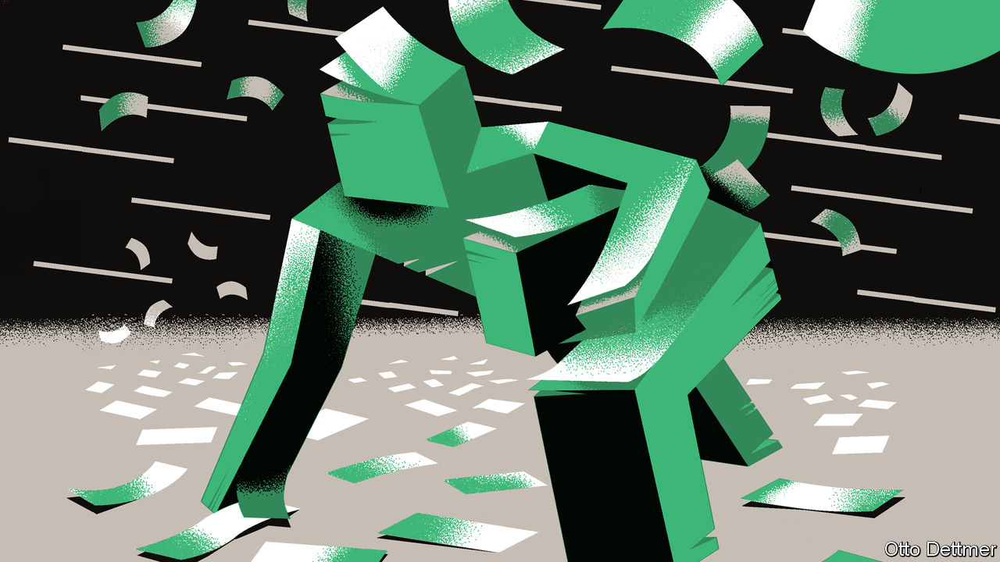
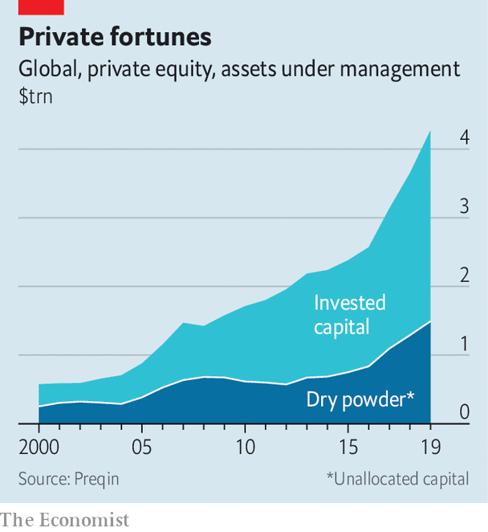
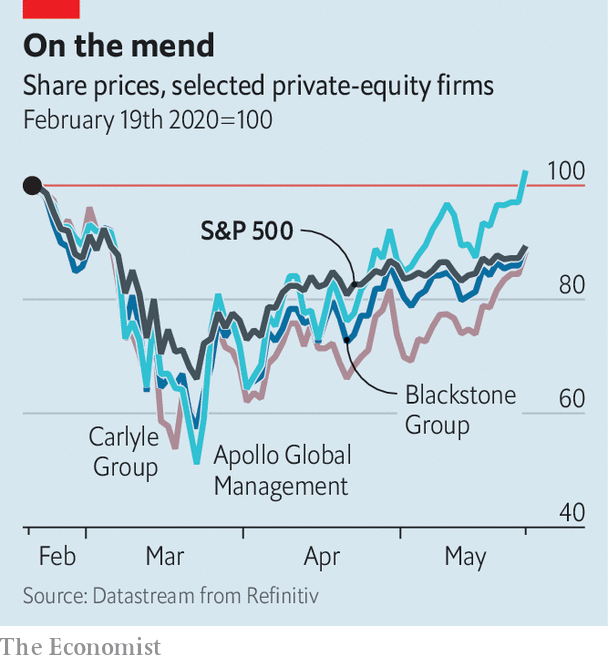

## More money, more problems

# Can private-equity firms turn a crisis into an opportunity?

> Their performance matters both for investors and the wider economy

> May 30th 2020NEW YORK

MOST APPARENTLY sound stewards of capital were revealed to be anything but during the 2007-09 financial crisis. Bank bosses were shown to have taken on too much risk. Star hedge-fund managers suffered losses. Nor have the years since then been kind. Banks have been tied up in regulatory knots and returns at hedge funds have been pedestrian at best.

The private-equity (PE) industry has been an exception to the trend. The funds it deployed during the crisis in 2007-09 have ended up yielding a median annualised return of 18%. And it has become far more important. Investors, from university endowments to public pension funds, have handed over ever more cash to PE managers (see chart). The biggest PE firms have evolved into financial conglomerates straddling buy-outs, property and credit markets, taking over some of the roles that Wall Street banks used to play. Assets under management have swollen to more than $4trn. The 8,000 firms run by PE in America account for 5% of its GDP, and a similar share of its workforce.

Now another savage recession is in full swing and the performance of PE is a crucial question for investors and the economy. The leveraged companies and debt instruments in PE portfolios are vulnerable and much depends on whether managers can tide these investments over. Meanwhile they have amassed $1.6trn in dry powder that they can deploy on new deals. PE shops’ fate depends on whether the hit to their existing investments is nasty enough to wipe out the potential gains from dealmaking afforded by the crisis.

Start with the potential losses. In the first quarter of 2020 the four large listed PE firms, Apollo, Blackstone, Carlyle and KKR, reported paper losses on their portfolios of $90bn. That sounds big, but is just 7% of their assets under management, reflecting their ability to control how privately held assets are valued and, perhaps, their investment acumen. After an early scare PE firms’ shareholders have concluded that the outlook is fairly bright (see chart).

Are they right? Many PE managers have been juicing up returns by piling debt on to the companies they buy. In the years immediately after the last crisis most buy-out deals were done with debt worth no more than six times gross operating profits. By 2019, according to Bain & Company, a consultancy, three-quarters of deals were leveraged at over six times. That would suggest that PE-run firms are vulnerable. More than half of the 18 junk-rated firms that defaulted in the first quarter of the year were PE-owned, according to Moody’s, a rating agency. It expects the overall junk default rate to triple to 14% by 2021.

Over the past decade PE lending has shifted away from dopey, distracted banks towards specialist private-credit firms. These may be more hard-nosed about accepting a haircut on their debt in order to keep a PE-run business afloat. And making things trickier still, most big PE managers say that the firms they own are either ineligible for, or unwilling to tap, the American government’s business bail-out schemes, the Paycheck Protection Programme and the Main Street Lending Programme.

Even so, several other factors may have changed to work in PE’s favour. Much debt issued to back PE deals has become “covenant-light”, meaning that companies can endure a big slump in profits without triggering penalties from their lenders. Since the 2007-09 crisis many PE managers have also set up huge credit arms—for the big four firms, these now account for a third of their assets. They may give managers more in-house expertise and mechanisms for raising debt, making it easier to restructure the debts of fragile portfolio companies on favourable terms.

The strange nature of the recession may mean PE managers are unwilling to pull the plug, as activity is likely to resume after the shutdown. “There is a problematic gap,” says Marc Lipschultz, co-founder of Owl Rock, a private-credit fund. “We don’t know how deep or how wide it is, but funds need to find a bridge across.” And if PE-run firms cannot raise more debt, default or restructure their borrowings, the remaining option is an “equity cure”: PE shops stump up the cash to keep their firms afloat. Already around 70% of PE bosses polled by EY say they will need to inject fresh equity into their portfolio companies.

The way funds are structured means that managers cannot deploy their “dry powder” raised for new funds into firms owned by older ones. But most older funds do have big reserves. Michael Chae, the chief financial officer of Blackstone, says that around $30bn of its $152bn of dry powder is set aside for them. “We have those reserves ready to support companies on the defensive and also to go on the offensive when opportunities arise.” Funds are also gathering capital in other ways. Typically, a PE fund returns cash to its investors once it sells its stake in a company—but if the investment period is still ongoing, the fund can ask for it back. According to an industry body for PE investors, the number of calls for such “recycled capital” has risen.

Bailing out existing investments will drag down returns for PE shops. It remains to be seen if buying opportunities can make up for that. Most PE managers hope to use their newly expanded credit arms to scoop up bombed-out loans and bonds with collapsed prices—Leon Black, the founder of Apollo, has said the opportunity is “massive”. But the volume of traditional buy-outs dropped sharply in March, and only a few firms have since made purchases. For years PE barons have boasted of their huge piles of dry powder, which, if spent in a downturn, might generate outsized returns. Now it is time to pounce.■

Editor’s note: Some of our covid-19 coverage is free for readers of The Economist Today, our daily [newsletter](https://www.economist.com/https://my.economist.com/user#newsletter). For more stories and our pandemic tracker, see our [coronavirus hub](https://www.economist.com//news/2020/03/11/the-economists-coverage-of-the-coronavirus)