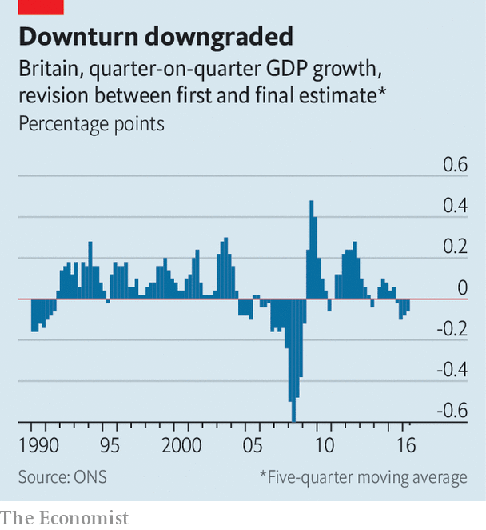

## Crisis measures

# The pandemic could lead statisticians to change how they estimate GDP

> Data gaps are rife, but statisticians may eventually understand better how the economy works

> May 30th 2020

AN AIR-CONDITIONER that overheats in hot weather, or an insurance policy that fails to pay out after a natural disaster: some things do not work as expected, just when you need them most. So it is with official statistics in the pandemic. As they try to gauge the depth of the downturn, policymakers and investors are keener to pore over the latest GDP figures than ever. But estimates have rarely been as uncertain.

Many economists expect the initial estimate of America’s output growth in the first quarter of 2020, published on April 29th, to be revised downwards eventually. Some of that may arrive as soon as May 28th, after The Economist went to press, when an update to the figures was due.

Analysts at Goldman Sachs, a bank, reckon that early estimates might capture only around 60% of the economic drag from the coronavirus. If the true year-on-year fall in America’s GDP is around 12% in the second quarter, as many economists expect, the initial release might indicate a decline of only 7-8%.

Statisticians are well aware of the uncertainty. Britain’s Office for National Statistics (ONS) has mulled introducing confidence intervals for its estimates—but no one knows quite how wide the bands should be. France’s statistical office says that its first-quarter estimate of GDP is “fragile”. Many are trying to fill in data gaps where they can.

Estimates of GDP during downturns tend to be revised downwards significantly (see chart). Response rates to surveys often fall in slumps; because firms doing badly are particularly likely to stop responding, the data gleaned paint a misleadingly optimistic picture. Though statistics offices are encouraged, if not required by law, to produce estimates quickly, many data sources are only published with long lags. Wonks can temporarily fill in figures for the missing sectors, but their techniques for doing so may not be up to scratch during periods of economic stress. America’s GDP was first estimated to have fallen at an annual rate of 3.8% in the fourth quarter of 2008, compared with the previous three months. That was eventually revised to a decline of more than 8%, in part because statisticians’ guesses for some manufacturing inventories for the month of December were too optimistic.

During the pandemic, these problems have been turned up a notch. Many businesses have temporarily stopped trading and thus responding to surveys. The sectors of the economy most affected by lockdowns, such as education, leisure and hospitality, often have the longest lags in reporting, making early estimates especially unreliable. In some cases, collecting data is impossible. In Britain a survey of travellers at airports and ports, which helps measure activity accounting for 20% of its trade in services, was halted in March.

In response, statisticians are making quick fixes. In America the output of public-education services is usually estimated using teachers’ pay. But statisticians have weakened the link between pay and measured activity to reflect the fact that, though teachers continue to receive salaries, students have missed hours of instruction. Others are using conversations with companies, statistical techniques and guesswork to fill in gaps.

Many are also looking to make more drastic changes by incorporating “real-time” data. Timely figures ranging from restaurant reservations to prices on Amazon are already widely used by private-sector economists. Institutional inertia and tight budgets had led many statistics offices to shun them; now they have little choice but to experiment. A handful of those in the European Union are using credit-card data to help measure GDP. In place of the survey of international travellers, the ONS is looking at passenger numbers from the aviation regulator, ferries and the Eurostar—as well as meteorological data. Other statisticians are scraping web pages. Things are tough now, but the wonks could emerge from the pandemic with a better understanding of how the economy really works. ■

Editor’s note: Some of our covid-19 coverage is free for readers of The Economist Today, our daily [newsletter](https://www.economist.com/https://my.economist.com/user#newsletter). For more stories and our pandemic tracker, see our [coronavirus hub](https://www.economist.com//news/2020/03/11/the-economists-coverage-of-the-coronavirus)