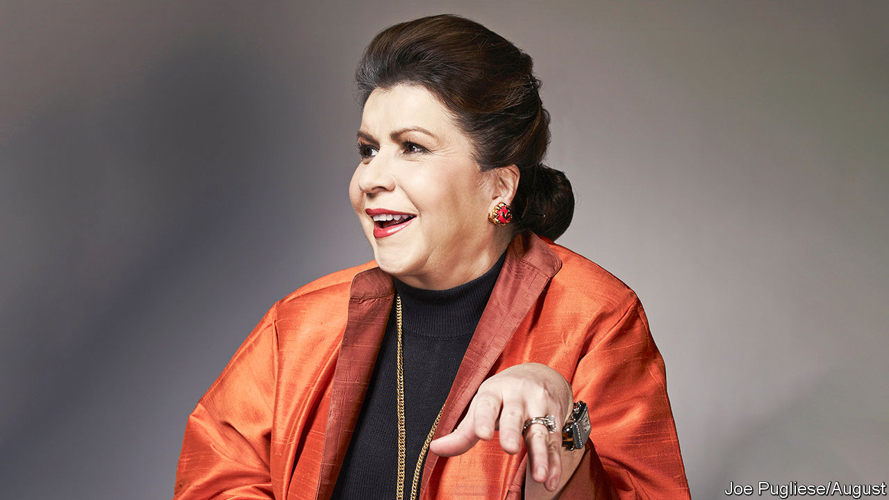

## No fear of floating

# The World Bank lands Carmen Reinhart as chief economist

> Ms Reinhart is one of the most widely cited economists in the world

> May 30th 2020HONG KONG

SOME OF THE best economists in the world have served as chief economist of the World Bank. But not all of them stay for long. Paul Romer, who subsequently won a Nobel prize, left after 15 months. His successor, Penny Goldberg, returned to academia just as quickly. And a new layer of management is soon to be inserted between the research department and the bank’s president. It was not obvious, therefore, that the bank would find another chief economist as illustrious as past holders of the post. The institution might have had to settle for a safer, more mundane choice. Instead it has hired Carmen Reinhart of Harvard University, one of the most widely cited economists in the world (and the most cited female economist).

She is, according to Guillermo Calvo of Columbia University, an “original”. Her family fled Cuba for America in 1966, when she was ten. A course on fashion merchandising at Miami Dade College introduced her to economics. Before she turned 30 she was chief economist of Bear Stearns, an investment bank, a post later occupied by her new boss, David Malpass, who became the World Bank’s president last year. Her two stints at the IMF mean she is accustomed to working at Bretton Woods institutions.

An article she wrote with Mr Calvo and Leonardo Leiderman at the IMF anticipated Mexico’s tequila crisis of 1994. It argued that capital inflows to Latin America reflected global conditions (including low American interest rates), not just domestic reforms. Any reversal of those conditions could trigger a reversal of flows, they warned. And in such a scenario, “policy options”, they noted tersely, “are limited”. The paper’s argument applies equally well to the recent troubles of Argentina, which relied too heavily on the passing enthusiasm of foreign investors from late 2016 to 2018.

Ms Reinhart’s best known work is her history of financial folly written with Kenneth Rogoff of Harvard, which spans eight centuries (why only the last eight, joked Dennis Snower of the Kiel Institute when presenting her with the Bernhard Harms prize in 2018). The book drew on a variety of historical sources, including prices culled from monastery records, and reports from the League of Nations, which her husband, Vincent, who was then working at the Federal Reserve, gave her as a Valentine’s gift. The authors’ aim was to create a run of data long enough to understand the kind of rare but deep financial crises that rocked the world in the 1930s and again in 2007-09.

Her most controversial work with Mr Rogoff claimed that government debt exceeding 90% of GDP is correlated with weaker growth. Critics argued over causality; one found a spreadsheet error. The 90% threshold became a favourite statistic for advocates of austerity. But Ms Reinhart herself has highlighted the importance of writing off debt. She was one of three lead authors of a recent open letter, signed by about 150 economists, defending the Argentine government’s offer to creditors to swap their bonds for new instruments with easier terms.

This concern with debt also animates a recent effort to fill in the statistical record. With Sebastian Horn and Christoph Trebesch of the Kiel Institute, Ms Reinhart has tried to measure China’s lending to the rest of the world, combining and cross-checking prior piecemeal efforts. “To say that [Chinese lending] is opaque is an understatement,” she has noted. Without a more accurate record, it is impossible to assess the macroeconomic vulnerabilities of many low-income countries, she argues. And any effort to relieve the debts of poor countries during the pandemic is likely to fall short if China’s loans are not included.

Her concern overlaps with Mr Malpass’s preoccupations. In his previous job at America’s Treasury, he voiced concerns that China was drawing countries into debt and thereby expanding its geopolitical influence. In his current role, he has insisted that countries should be more transparent about their lending and borrowing.

Ms Reinhart’s investigations do not always reflect badly on China. Her list of the 50 countries most indebted to the Middle Kingdom (relative to their GDP) includes few places of great geopolitical significance (exceptions include Pakistan and Sri Lanka). And she and her colleagues have uncovered 140 examples of China restructuring or relieving the debts of poor countries, although it rarely co-ordinates with other creditors. (China has also signed up to the G20’s recent initiative to suspend debt service on bilateral government loans to 73 poor countries.)

The World Bank, then, has found another world-class chief economist. Ms Reinhart’s tenure is unlikely to be much quieter than her predecessors’. The hope is that it is a little longer. ■

## URL

https://www.economist.com/finance-and-economics/2020/05/30/the-world-bank-lands-carmen-reinhart-as-chief-economist
