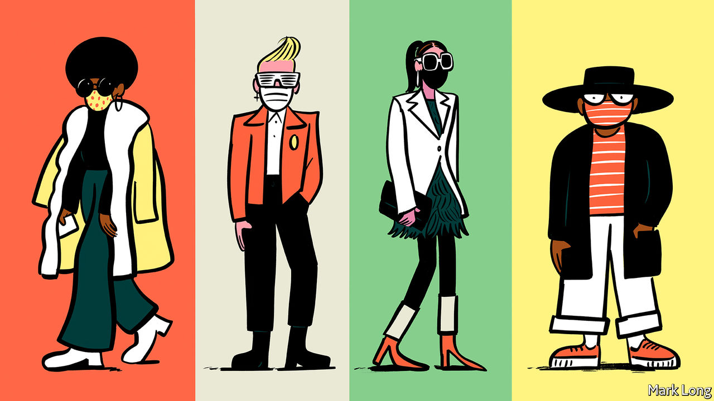

## Face it

# The case for mandatory masks

> In places where covid-19 is still rife, governments should require people to wear face coverings in crowded public spaces

> May 28th 2020

Editor’s note: Some of our covid-19 coverage is free for readers of The Economist Today, our daily [newsletter](https://www.economist.com/https://my.economist.com/user#newsletter). For more stories and our pandemic tracker, see our [coronavirus hub](https://www.economist.com//news/2020/03/11/the-economists-coverage-of-the-coronavirus)

THE PANDEMIC has not been kind to fashionistas. Shops are closed and online purchases can be displayed only through the dismal prism of Zoom. Yet there is a chink of light in this dark sartorial night, for it offers the opportunity for self-expression through this season’s latest must-have item: the face mask.

The fact that the market for chic masks is well-developed in Paris (see [article](https://www.economist.com//node/21786917)) is hardly surprising, but the explanation does not lie only in the exquisite taste of its citizens. Since May 11th Parisians have been required to wear masks on public transport or face a penalty of €135 ($150), so it is rare to see anybody on the Métro without one. On London’s Tube, by contrast, where the government merely advises people to wear one, only around a third of people are doing so.

In much of the rich world, governments now require people to wear masks when they are in crowded public spaces. Britain and America are among the few hold-outs. In America, where few states away from the east coast make them compulsory, the issue has been infected by the polarisation that bedevils the country’s management of the outbreak. That is regrettable, for masks could both save lives and allow people to get back to work.

People think of masks as protecting them from nasty stuff in the air. They can do that. But in the case of covid-19, their more important job is to protect others from an infected wearer. That is because of one of the peculiar characteristics of this disease: it seems likely that infection by people who have not, or not yet, developed symptoms accounts for about a third to a half of cases. So even if everybody with symptoms stays at home, the virus will still spread. Social distancing can help, but is hard to maintain in crowded places. Masks block the respiratory droplets that carry the virus, so make risky situations safer.

In normal times, governments should require solid evidence, such as a randomised controlled trial in which a treated group is compared with a control group, before advocating some new health practice. But these are not normal times, and the need for speed makes that impossible.

Besides, there are signs that masking is useful. Even home-made face-coverings can block spit. Experiments show that a tea towel over the mouth and face can block 60% of droplets—not as good as a medical mask, but a great deal better than nothing. That puts to rest the concern that advising the public to wear masks will deprive health workers of vital equipment.

East Asian countries’ success in controlling the disease argues in favour of masks. In many of their cities, masks have been worn for years to protect against pollution or disease, so people covered their faces as soon as they got wind of covid-19. In the West mask-wearing is alien. And in all of the countries where mask-wearing is common practice, the epidemic was swiftly suppressed.

This is not incontrovertible evidence in favour of masks. Other factors distinguish those mask-wearing countries from bare-faced Western nations: some (such as South Korea) had rigorous track-and-trace systems; some (such as Japan) do not shake hands. And countries that adopted masks only recently (such as Germany) have successfully suppressed the epidemic.

Yet the combination of this natural global experiment, laboratory studies and asymptomatic transmission suggests that masks can help keep people safe. The clincher is cost. Lockdown destroys economies. Social distancing damages them. Masks cost next to nothing. They will not by themselves stop an epidemic. Hand-washing, track-and-trace systems and widespread testing are all essential, too. But masks can do their bit to protect people and rebuild economies. And they can be stylish.■

## URL

https://www.economist.com/leaders/2020/05/28/the-case-for-mandatory-masks
