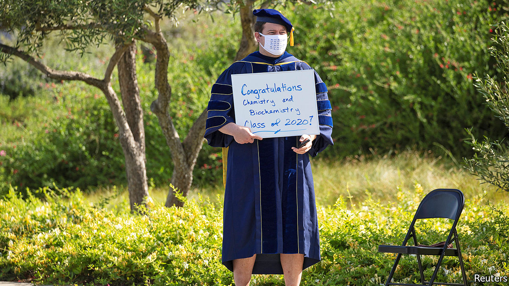

## College blues

# Could a fifth of America’s colleges really face the chop?

> Problems that predated the virus have been accelerated by it

> May 28th 2020CHICAGO

MARTYNA MALECKA, a criminology student at Stonehill College, can’t wait for classes to restart in August. Her campus in Easton, Massachusetts, “feels like a village”: its elegant red-brick buildings sprawl over 384 bucolic acres. She judges time spent there less of a coronavirus risk than staying at home in Chicago.

Universities everywhere have made valiant efforts to function remotely. A few, such as California State University, say they will continue teaching only online next year. Ms Malecka doubts that distance study works. She gets top marks, but laughingly admits she has “no idea” what she has learned after being at home since March. It is too easy to ignore lecturers who appear by video, she says, and some hardly set assignments. Like other students, families and faculty, she craves in-person learning.

Whether or not universities get back quickly to that, many are likely to suffer. Stonehill is private and Catholic, with 2,500 students and a $200m endowment. It looks in good shape, but many similar liberal-arts colleges, especially in the north-east and Midwest, are not. Their problems are long-standing. Nathan Grawe of Carleton College in Minnesota, who researches demography and higher education, says the core difficulty is the slipping fertility rate. Overall enrolment has drifted down over the past few years.

This squeezes smaller colleges hardest. A study by Parthenon-EY, an education consultancy, of over 2,000 colleges suggested 800 are so small or inefficient that they may go bust. Around one-fifth run budget deficits. Others pile up debts, fail to build sufficient endowments or sustain student numbers only by agreeing to painfully big discounts on fees. Mr Grawe points out that eight colleges were already closing each year before the pandemic.

Those that fail are usually small, among the 40% of higher-education institutions with fewer than 1,000 students. In the past decade these have seen enrolments slip faster than medium-sized ones. (The biggest typically still thrive.) Of the 72 colleges Parthenon found had shut since 2007, almost every one was small. They are vulnerable because they depend most on revenue from students; others find ways to hire out campuses for conferences, raise research funds, earn bequests and the like.

Robert Zemsky of the University of Pennsylvania, who co-wrote a recent book on the growing woes of universities, expects a “collapse, lots of closures” of smaller colleges, notably in the wider Midwest. He blames both demography and teaching methods that do not suit some students, noting how, at many universities, more than a quarter of freshmen quit in their first year. Curriculums, he says, are outdated, faculty are out of touch and four-year degrees should be cut to three to save costs and force a rethink of higher education.

Among the most vulnerable colleges are those that cater mostly to non-white students. “African-Americans are more than two times as likely to attend an institution at risk, compared with whites and Hispanics,” he says. Crystal Nix-Hines, a lawyer in Los Angeles who specialises in the education sector, also expects an “enormous winnowing” of historically black colleges.

Consolidation of higher education is overdue. Students increasingly prefer bigger and more urban institutions, so some smaller, rural ones will go. How many? Just before the pandemic, Mr Zemsky and his co-authors suggested that 10% of colleges would eventually close. He now expects 20% to shut or merge with others.

The pandemic further dims their prospects in several ways. Take universities’ efforts to recruit foreign students, who typically pay full fees. For each of the past three years, enrolments of foreign undergraduates have slid. A drop in Chinese students explains much of that. Travel bans and concern that America has bungled the coronavirus will only put off more.

The economic slump means some poorer families will not send youngsters to study. Others will delay. Funding from states for public universities is certain to fall. A report by Pew Charitable Trusts published on May 18th points out that states cut funds for higher education by 29% per student between 2008 and 2012. This time the slump is likely to be worse. Already Nevada and Ohio say they have plans to cut. The University of Michigan has talked of losing out on $1bn. Federal spending will rise ($14bn in emergency help went to universities and students under the Cares Act), but is unlikely to make up all the shortfall.

Finally, many universities face possibly costly legal trouble. Ms Nix-Hines counted 134 lawsuits, mostly class-action ones, levied against the “whole gamut” of private and public colleges by late May, mostly as students sought the return of tuition fees, saying they received a substandard service online. Some colleges might now seek a “liability shield” to protect against future prosecutions before they reopen. For universities, it all adds up to “their greatest challenge in history”, she says. That may sound alarmist, but it is probably true.■

Editor’s note: Some of our covid-19 coverage is free for readers of The Economist Today, our daily [newsletter](https://www.economist.com/https://my.economist.com/user#newsletter). For more stories and our pandemic tracker, see our [coronavirus hub](https://www.economist.com//news/2020/03/11/the-economists-coverage-of-the-coronavirus)