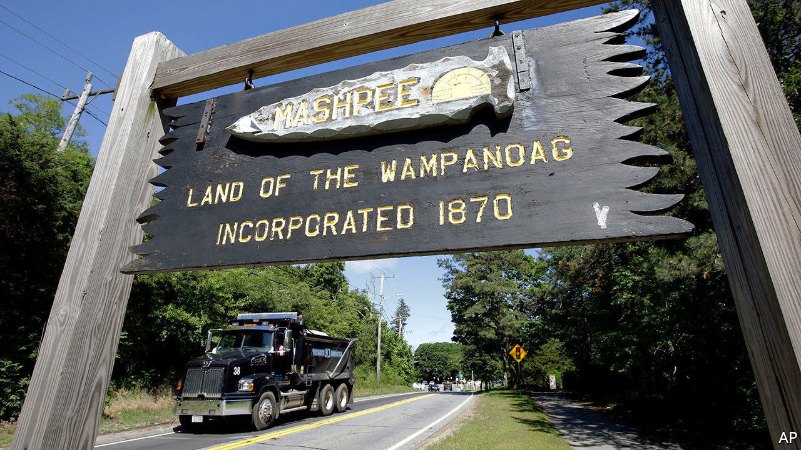

## Native America

# What connects casinos, the first Thanksgiving and the Trump administration?

> The Mashpee Wampanoag tribe, which stands to lose its land again

> May 28th 2020NEW YORK

“UNLESS YOU walk in moccasins” it’s a difficult concept to capture, says Cedric Cromwell, chairman of the Mashpee Wampanoag tribe in Massachusetts, of the tribe’s link to its land. In March the federal Bureau of Indian Affairs informed Mr Cromwell that the reservation will be “disestablished”, meaning the land will be taken out of trust and would lose its federal protection. The tribe says this is a blow to tribal sovereignty and undermines the future and sustainability of the Mashpees. Taking land out of trust is exceedingly rare. It was last done in the 1960s.

The Mashpee Wampanoag tribe, also known as the People of the First Light, has occupied the same spot for more than 12,000 years. Every American child knows that the tribe befriended the newly arrived Pilgrims and was part of the first Thanksgiving in 1621. The tribe was not recognised as a sovereign nation until 2007, after decades of pushing for it. Federal recognition meant that it could resume control of some of its ancestral lands beyond Cape Cod, through a trust held by the government. The land is not subject to state or local tax laws and cannot be sold without the federal government’s approval.

In 2015 the Obama administration approved the transfer of lands in Taunton, a city in south-eastern Massachusetts. About 63% of Taunton’s voters endorsed the tribe’s plans to build a casino on the land. Not everyone was happy: two dozen residents living close to the proposed site sued to block not just the casino, but whether the land should be held in trust. One of the plaintiffs told the Boston Globe that it was not so much the casino they opposed, but the “incredible arrogance” of the federal government in building an Indian reservation in their backyard.

In 2018 the Department of Interior reversed the decision to recognise the reservation, rolling back the interpretation of what is an “Indian”. “They’re not supposed to change the rules on you mid-game,” says Heather Sibbison of Dentons, the tribe’s law firm. The tribe sued. A federal appeals court ruled in February that the tribe must show it was “under federal jurisdiction” in 1934, when the Indian Reorganisation Act was passed. This statute allowed Indian tribes to govern themselves and protected tribal land by putting it into trust.

The tribe has asked for a preliminary injunction to prevent the land from being taken out of trust until the cases are resolved. A judge will make a decision by early June on whether to grant the order. Congress, meanwhile, is working on a bill that would supersede the court ruling. A bill backed by both parties passed the House last year, but has yet to reach the floor of the Senate. Donald Trump is not a fan of Indian-run casinos. He believed that “so-called Indians” undercut his casinos in the 1990s. Some of his inner circle and donors are in the casino business and may agree.

Other tribes are worried about what the decision means for them. More than 100 other tribes have gained federal recognition since 1934 and hold thousands of acres of land in trust. Mr Cromwell said he was “blindsided” by the call in March from the Bureau of Indian Affairs. He thought the bureau was checking in to see how the tribe was coping with covid-19, which has hit Native Americans particularly hard.

The impact of disestablishment extends beyond the casino. The tribe had started building housing for its community and a childcare centre on the land. Those projects, along with a tribal courthouse, could be in jeopardy. Losing the land itself is a possibility, if they cannot pay taxes. Federal recognition is not at risk, but Ms Sibbison wonders what that is worth if land and sovereignty can be taken away.■

## URL

https://www.economist.com/united-states/2020/05/28/what-connects-casinos-the-first-thanksgiving-and-the-trump-administration
