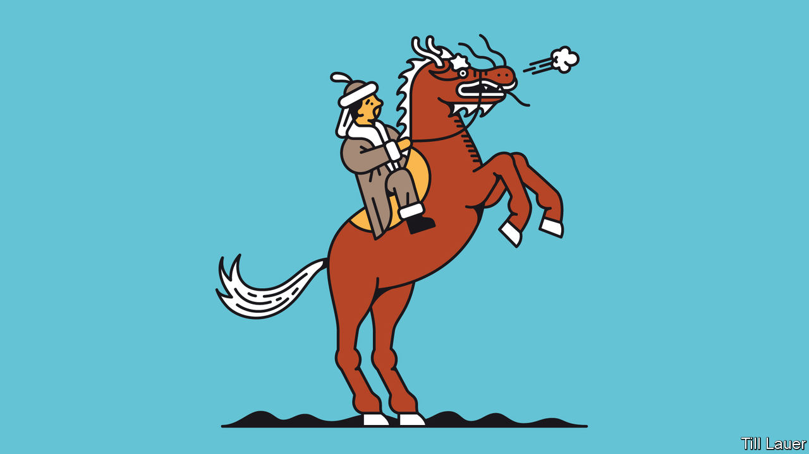

## Banyan

# Central Asian governments do not know how to talk about China

> Their citizens are suspicious, but want investment

> Jun 4th 2020

FOR MILLENNIA fierce horsemen from Central Asia harried the Chinese empire’s flank, often setting the terms of engagement with their giant, settled neighbour to the east. In February an echo rolled out of the past when a horde of whooping riders galloped through the town of At-Bashy in south-central Kyrgyzstan, close to the border with China.

Their target was a planned Chinese logistics centre: a $275m investment in roads, malls and warehouses that was touted as a crucial node in China’s Belt and Road Initiative, a funnel for revived trade along the old silk road and a source of future prosperity for the locality. But the horsemen of the pristine valley were having none of it: they feared their land would be grabbed and jobs would go to imported Chinese. Facing such hostility, the Chinese investors angrily pulled out, leaving politicians in Kyrgyzstan with egg on their faces.

The incident highlights a growing tension between rulers and ruled in the Central Asian states of Kazakhstan, Kyrgyzstan, Tajikistan, Turkmenistan and Uzbekistan. China is the chief and sometimes only source of prosperity in the impoverished region. It dominates foreign direct investment as well as commercial and concessionary lending.

When Banyan was last in Nur-Sultan, the capital of Kazakhstan, a foreign-ministry official explained that in return for copious investment in oilfields, infrastructure and manufacturing, the only explicit demand China makes of his government is for vocal support for China’s territorial integrity (see [article](https://www.economist.com//china/2020/06/04/the-pandemic-is-hurting-chinas-belt-and-road-initiative)). In particular, China’s government wants no objections to its campaign against Muslims in the province of Xinjiang whom it deems “terrorists” out to split the motherland.

If that stricture is met, the money flows. In Kazakhstan Chinese investment underpins nearly a quarter of the country’s oil output. Despite the horsemen’s protests, logistics is one of the few ways tiny Kyrgyzstan can earn foreign exchange apart from gold mining—in which Chinese firms are also involved. Though Turkmenistan shares no border with China, it is about the most China-dependent economy in the world, sending eastward four-fifths of its exports (almost entirely gas via the China-Central Asia pipeline). Exports of gas to China also provide crucial revenue for Uzbekistan and Kazakhstan.

But such dependence on a single power—in deals often murkily struck by the countries’ elites—is not always easy to explain to compatriots. Awkwardly, the notion of self-reliance is at the core of the personality cult surrounding Turkmenistan’s strongman, Gurbanguly Berdymukhamedov. All Central Asian governments fete their independence, after centuries under the Russian and Soviet yoke. The dissonance is another reason, if Central Asia’s authoritarian leaders wanted one, to keep a lid on the press and stifle dissent. Without that, complaints about China would be louder.

Yet still they bubble up. In September several anti-China protests erupted in Kazakhstan, over rumours that dozens of obsolete Chinese factories would be relocated to the country, over accusations of land grabs by Chinese firms, and over China’s repression in Xinjiang, where more than 1m Muslims are detained in camps. A more recent grumble in private conversations is Central Asian regimes’ growing enthusiasm for high-tech surveillance and social-control systems, which China is keen to supply.

The grievances will only grow. Not least, the economic picture is worsening as the covid-19 pandemic has brought a sharp slowdown in Chinese investment and demand. In March China claimed force majeure to start negotiating reduced gas imports from Kazakhstan, Turkmenistan and Uzbekistan.

Those hostile to Central Asian governments can piggyback on anti-China sentiment. The protests in Kazakhstan last year were cheered on by an exiled oligarch who needles the regime, Mukhtar Ablyazov. In Kyrgyzstan protests near the Chinese border may be stoked by those who feel left out of immense cross-border smuggling rackets involving customs officials and politicians.

And so the tension between the elites’ priorities and those of ordinary Central Asians will persist. It does not help that the unspoken rule in dealings with China, according to Temur Umarov of the Carnegie Endowment for International Peace in Moscow, is never to acknowledge there is a problem in the relationship. Even less helpful is rulers’ inability to acknowledge a problem over China in their relationship with the ruled.