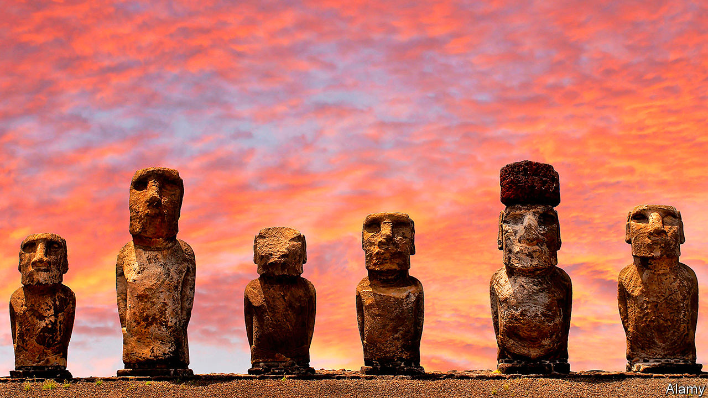

## Hearts of gold

# Are humans innately good? Rutger Bregman thinks so

> In “Humankind” he tries to refute the idea that people are naturally prone to wickedness

> Jun 6th 2020

Humankind. By Rutger Bregman. Translated by Elizabeth Manton and Erica Moore.Little, Brown; 480 pages; $30. Bloomsbury; £20.

AS THE SON of a Dutch Protestant cleric, Rutger Bregman was brought up in a religious tradition that regards mankind as incorrigibly prone to wickedness, yet called by the Creator to veer towards goodness, a transformation that the faith promises to abet. As a young, bestselling proponent of catchy ideas about history and economics, he has rejected parts of that outlook while retaining others.

Mr Bregman does not believe wickedness is innate, but, on the contrary, that people are naturally inclined to good and helpful behaviour. In the original Dutch version of his new book, its title means something like “most people fit”; he uses a verb, deugen, that conveys not self-sacrificial courage but having a decent, sensible attitude that meets the needs of society. To support his thesis, he tries energetically to discredit pieces of evidence cited by others to demonstrate humanity’s badness, which range from dodgy psychological research to supposedly egregious real-life events and dark interpretations of history.

In every case, Mr Bregman insists, the true story is different. Take the famous experiments in which subjects were persuaded to administer painful electric shocks to strangers: that research was dishonestly conducted and reported, he argues passionately. Or consider the brutal murder in 1964 of a young woman in New York, who might have survived if somebody had alerted the police in time. That, he says, was also misreported. A stranger comforted the victim before she died.

And he assails one explanation for an anthropological mystery—the near-deserted state of Easter Island in the Pacific. The theory he detests is that there was a catastrophic war between two resident groups. For eco-pessimists, Easter Island foreshadows the destiny of the Earth: as its population grows and resources dwindle, humans may annihilate each other. But Mr Bregman thinks the premise is wrong. There never was a big war on the island.

He cannot deny that people sometimes commit unspeakably evil acts. One section looks at the character of Adolf Eichmann, the Nazi war criminal who was hanged in 1962; what strikes the author is the monster’s adamant, twisted belief that he was doing good. Mr Bregman also considers why Nazi troops went on fighting tenaciously when their cause seemed doomed. Like most soldiers, he concludes, they persevered not out of ideological belief, nor even fear of their commanders, but from loyalty and love for each other. Perhaps so, in many cases; but one of the weaknesses of his book is that it fails to grapple frankly with the wrenching moral tests posed by 20th-century totalitarianism—tests that many people failed. (In the shadow of their country’s past some Germans were sceptical about his project, he confides.)

At times, readers of “Humankind” will sense Mr Bregman wrestling with his heritage, stamping on pessimistic aspects but affirming positive bits in a tone some will find starry-eyed. For example, he likes the Christian admonition to “turn the other cheek” in the face of violence. His argument that news reports are too downbeat, and should focus more on positive stories, could come from a Sunday sermon. When he writes about the dawn of human history, he correctly asserts that agriculture and fixed settlements transformed warfare. But his confidence that before those changes hunter-gatherers were getting along fine, and loved meeting strangers, sounds naive.

Still, in a world of sophisticated pessimism, the book is a refreshing change. Where Mr Bregman grates is in his claim to be the first to wrestle with deep, paradoxical truths about mankind. In the opening lines, he says he is presenting an idea “denied by religions and ideologies” yet of vital importance, for example in management theory or criminal justice.

Well, some religions and some ideologies. In one strand of the Judeo-Christian tradition, including Dutch Calvinism, Adam’s and Eve’s disobedience to God underpins a theory of original sin in which every human is born guilty. But another strand emphasises a different part of the Genesis text, affirming humanity’s creation “in the image and likeness” of a benign deity. As for ideologies, Karl Marx took on the notion that acquisitiveness was universal, maintaining that its roots were only as old as modern capitalism.

Both Mr Bregman and Marx are too sure of a lost—but real—Eden in which people lived co-operatively before the sudden rise of factors that distorted human goodness. In both cases, the resulting worldview is atheistic yet intensely religious, an odd mix. But 21st-century readers are short on prophets, especially the optimistic kind, and will give this one a cheerful hearing. ■