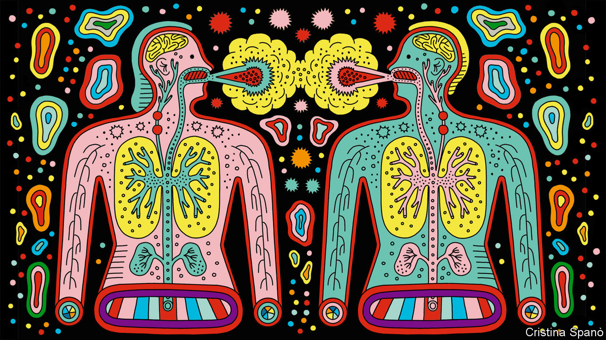
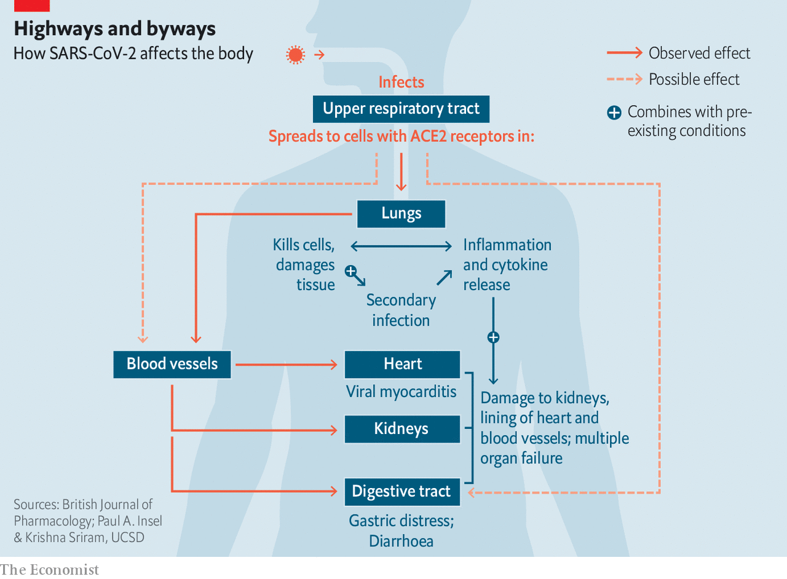
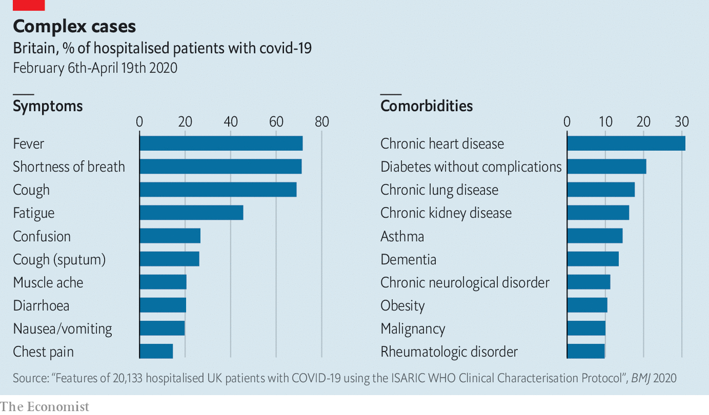
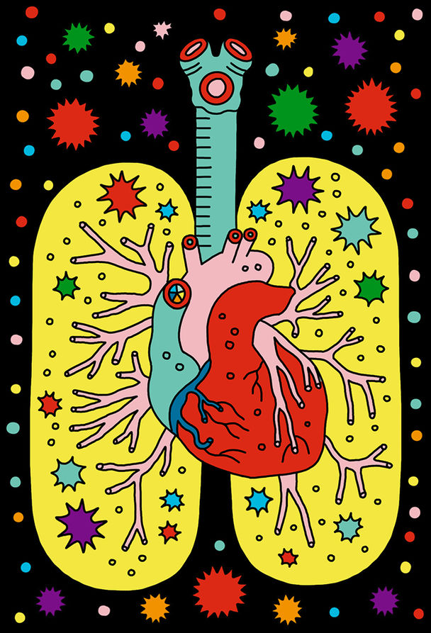

## The paths of destruction

# How SARS-CoV-2 causes disease and death in covid-19

> There are direct routes and indirect ones

> Jun 6th 2020

Editor’s note: Some of our covid-19 coverage is free for readers of The Economist Today, our daily [newsletter](https://www.economist.com/https://my.economist.com/user#newsletter). For more stories and our pandemic tracker, see our [coronavirus hub](https://www.economist.com//news/2020/03/11/the-economists-coverage-of-the-coronavirus)

THE FIRST SET of lungs felt like rubber, says Rainer Claus, so damaged that it was impossible to imagine how any amount of oxygen could get through them. The lungs in the rest of the ten covid-19 victims that he and his colleagues at the University Medical Centre Augsburg, in Germany, autopsied in early April were in similarly awful condition.

This has been, for the most part, the story around the world. People get infected with SARS-CoV-2, the virus which causes covid-19, by breathing in tiny liquid droplets containing virus particles. Those particles gain entry to the lungs, where they start reproducing themselves. If the immune system does not stop it—which it mostly does—the virus causes so much damage that the lungs can no longer do their job, ending up like those in Augsburg.

But there are other facets to the disease not so easily understood. It robs some of the infected of their sense of smell; in others the toes or fingers darken as if bruised. Hearts swell; blood clots; immune systems cripple organs they are meant to be saving. Doctors around the world are trying to find out how much these various symptoms are attributable to direct effects of the virus, to secondary effects of the damage it does to the lungs, or even, in some cases, to the treatments used against it. The more of the story they can disentangle, the better the standard of care is likely to get.

For the virus to attack a cell, the cell’s surface needs to be adorned with a protein which plays a role in the regulation of blood pressure and inflammation called angiotensin-converting enzyme 2 (ACE2). This is found on plenty of cells in the upper respiratory tract and lungs, as well as the linings of blood vessels and the heart, kidneys and intestines. In some cases the virus may get into those intestinal cells directly, having been swallowed. In other cases it seems to get to the gut, and other susceptible organs, via the blood.

Mostly, though, the virus seems to get no further than the ACE2-rich cells of the nose and throat, and perhaps the lungs, before the body’s defences take care of it so well that its presence is never even noticed. Tests which look for genetic material from SARS-CoV-2 in swabs from the nose and throat frequently find it present in people who show no other sign of it at all: in one British survey 70% of those who tested positive were asymptomatic.

Most of those who do fall ill suffer flu-like symptoms, typically with a fever and a cough, sometimes with diarrhoea, that get better after a week or so. But some suffer for longer, failing to shake the infection before getting badly sick. Many of these people will, after a time, start to feel a shortness of breath as the lungs’ ability to oxygenate the blood weakens. About 10-15% of those who are diagnosed—which may mean less than 5% of those infected—eventually become ill enough to need a hospital.

Almost all of those hospitalised have symptoms of pneumonia—the general name for the response of the lungs to a variety of viral, bacterial and fungal infections. When they get deep into the lungs, the SARS-CoV-2 particles find a target-rich environment in the alveoli, tiny air sacs which hang like bunches of grapes off the lung’s branching network of bronchial tubes and are lined with cells festooned with ACE2. It is in these sacs that oxygen from the air breathed into the lungs passes into the blood stream, and carbon dioxide from the blood passes into the lung to be breathed out. The more the virus damages and kills the cells lining the alveoli, the more difficult this exchange of gases becomes. Hence the shortness of breath.

In some covid-19 cases, though, this shortness of breath—a textbook symptom of pneumonia—does not show up. Doctors have got used to seeing patients with blood-oxygen levels so low that they should be dizzy or unconscious, but who show no sign of respiratory distress.

Daniel Johnson of the University of Nebraska Medical Centre says his theory is that SARS-CoV-2 may be affecting the nervous system. That it can do so in some ways, at least, is hinted at by the fact that some patients report a loss of the sense of smell early on in their infection; there are other signs, too. Perhaps the virus has an effect on the part of the brain which tells the lungs to work harder when carbon dioxide builds up in the blood.

Another possibility is that the lungs are not the only thing at fault. In some of these atypical patients the perilously low blood-oxygen level “seems to be out of proportion to the overall injury to the lung,” says Joseph Levitt of the Stanford University Medical Centre. The lungs of covid-19 patients feel different, too, he says. Typically, the lungs of patients with severe pneumonia become stiffer, which makes moving air in and out of them increasingly hard. The ventilators on to which such patients are put pump in oxygen under pressure, thus doing some of the lungs’ work for them. The lungs of covid-19 patients with blood-oxygen levels low enough to need a ventilator, though, are not so stiff, says Dr Levitt. They have not exhausted their ability to do their job. But the job is not getting done.

Dr Levitt wonders whether the problem may be in the blood vessels. ACE2’s role in looking after blood pressure depends on its ability to regulate signals that make blood vessels constrict or dilate. The way SARS-CoV-2 binds to ACE2 probably makes it less able to take part in that signalling. Covid-19 may thus reduce the amount of oxygen which gets into tissues not just by damaging the lung, but also by narrowing and damaging blood vessels. If so, drugs to dilate the blood vessels might help, at least in some cases. Finding out what treatment works best along those lines, though, requires clinical trials, says Dr Levitt.

In hospitals the treatment will normally start with extra oxygen supplied through a nasal cannula (a plastic tube with a prong for each nostril) and therapy to combat dehydration: patients have typically had a fever for days and not been drinking enough, leaving their bodies badly short of fluids. Rest, rehydration and extra oxygen, along with drugs for any secondary infections that have taken advantage of the body’s stressed-out state, give the immune system a chance to get the upper hand.

The immune response to a virus starts with infected cells producing a suite of signalling molecules called cytokines. Some of these tell other cells nearby to be on their guard against attack, thus stymying the virus’s ability to replicate itself. Others tell the immune system to come and put some stick about. Thus called to arms, the immune system launches both a prompt all-purpose response—inflammation—and a subsequent targeted counter-attack using antibodies and cells specifically programmed to attack both virus particles and the cells they have infected. Unfortunately SARS-CoV-2 seems able to interfere with the early steps of the immune response. It can apparently counteract the part that dampens replication in nearby cells. It may also enhance inflammation.

Whether the virus helps it along or not, severe inflammation of the lungs often leads to what is known as acute respiratory distress syndrome (ARDS). It is ARDS that sees people rushed to intensive-care units (ICUs) and put on ventilators.

Because it is hard to tolerate having a tube stuck down your throat and into your lungs, patients on ventilators are heavily sedated and unable to do anything for themselves. Nurses must reposition them every few hours to prevent bed sores. Their doctors keep watch for kidney failure, blood clots and heart problems—risks to critically ill patients in ICUs that anecdote has suggested may be more common in covid-19 patients than in others. Those anecdotes are now being backed up by a few studies. However, as Dominic Wichmann of the University Medical Centre Hamburg-Eppendorf points out, this correlation does not necessarily mean SARS-CoV-2 is itself damaging the organs involved.

A quarter of covid-19 patients in British ICUs have had kidney problems severe enough to require dialysis. “It’s all part of the second phase of the illness when people, eight to ten days in, suddenly get worse,” says Claire Sharpe of King’s College London. A big part of the problem, she says, is just dehydration, always a risk in ICUs, all the more so when patients are feverish. On top of this, the stress caused to the body by having air pumped in and out amounts to “a double hit on the kidneys”.

Early in the pandemic critical-care doctors in various countries added to the problem by flushing fluids from the body in order to keep the patients’ damaged lungs from filling with liquid. They appreciated the risk of crashing the kidneys that this involved. Their thinking in doing it anyway, Dr Johnson says, was “I have to do everything I can to try to help their oxygen levels, because if I don’t win that then the whole game is lost.” Once doctors began to see high rates of kidney failure in covid-19 patients, though, they stopped “running them dry”. Dr Johnson, whose unit had the benefit of the experience from New York and other early hotspots, says kidney failure is now no more common in his covid-19 patients than in those with other viral pneumonias.

Blood clots are another worry for patients in ICUs—so much so that mild blood thinners are routinely used as a prophylactic. Again, the problem may be worse in covid patients. Autopsies of the first 12 people to die of covid-19 in Hamburg found that four had died from a blood clot in the lungs. Autopsies by other teams have turned up lots of small clots in the blood vessels traversing the lungs.

There are lots of reasons why covid-19 patients might be at higher risk of clots in the lung and elsewhere. Immobility is one: patients on ventilators are essentially paralysed, and those with covid-19 tend to stay on ventilators about twice as long as other ICU patients. Dehydration thickens the blood. The severe inflammation seen in covid-19 patients has a big role, too, says Jean Marie Connors of the Harvard Medical School, because clotting substances in the blood tend to increase in lockstep with the chemicals that bring on inflammation. There is also some evidence that the cells which line blood vessels are infected by the virus, she adds. These cells regulate substances that prevent clots—if the virus kills them off clotting can run wild.

At this stage of the disease, cardiologists are also on high alert. Some covid-19 patients whose lungs start to improve then see an extreme deterioration in their heart function. This is not likely to be simply the effect of being in an ICU. But no one knows whether the damage comes from the virus itself infecting the heart, or from the inflammation it triggers.

Harlan Krumholz of the Yale School of Medicine thinks both the virus and the immune response can be involved. In some people the antibody-making process can go awry, and their newly developed antibodies may confuse a healthy cell for an infected one, marking it for destruction by the immune system. That seems to be what happens in a rare sort of inflammation of the heart seen in some children with antibodies to SARS-CoV-2.

In most cases, though, it is the generalised immune response, inflammation, that goes into overdrive. Why some patients are prone to this problem remains unclear. But as data piles up from hospitals around the world clues about the biological pathways of the disease are starting to emerge.

Some of the clues come from the conditions which predispose people to the disease. “You’d think underlying lung problems or immune system problems will be the greatest risk,” says Dr Levitt. “But it seems the biggest risk factors have been hypertension, diabetes and obesity.” That has led many scientists to suspect that the profound inflammation seen in severe cases of covid-19 may be yet another problem linked to SARS-CoV-2’s fondness for ACE2. People with diabetes, hypertension and heart disease have more ACE2 on their cells as a response to the higher levels of inflammation that come with their condition; ACE2 has an anti-inflammatory effect. When SARS-CoV-2 sticks to ACE2 and reduces its ability to do its job, the underlying inflammation gets worse.

When inflammation gets completely out of control the body enters what is called a cytokine storm. Such storms drive the most severe outcomes for covid-19, including multi-organ failure. There is thus an obvious role for anti-inflammatory drugs. But knowing when to administer them is hard. Go too late, and the storm will be unstoppable; go too early, and you may dampen down an immune response that is turning the tide. A recent article in the Lancet suggests that it would help if covid-19 patients were routinely screened for hyper-inflammation to help identify those who might benefit from anti-inflammatory drugs. But not everyone is convinced today’s drugs have much to offer. “We tried [a range of anti-inflammatory treatment] and it actually didn’t work,” says Rajnish Jaiswal, who has been working on the front line of covid-19 treatment at New York’s Metropolitan Hospital.

All told, just 58% of those who have gone into British ICUs and are not still there have been discharged alive. The rest have died. This mortality rate is double that seen for other viral pneumonias in the past three years.

Many of those who survive a severe bout of covid-19 are likely to have long-term health problems. The Society of Critical Care Medicine based in America has identified a collection of health problems including poor muscle strength and sub-par heart and lung function as “post-intensive care syndrome”; people who have had ARDS get it worse than most. Damaged lungs and kidneys can be expected to make good a lot of the harm done to them once a crisis is over, but for some it will take time, and long-term loss of function is possible.

A big worry is what happens to the brain. Sherry Chou of the University of Pittsburgh says that there is no evidence so far that SARS-COV-2 directly harms the brain or the central nervous system, but in parts of the brain, the spinal cord and the nerves the inflammation associated with the disease can lead to muscle weakness and other problems.

The mere fact of being in an ICU can also lead to cognitive impairment. The effect of more than a week in intensive care is comparable to that of a major head injury. The problems are linked to the delirium people often fall into when severely ill and heavily sedated in an unfamiliar environment. Delirium is a particular problem with covid-19, says Dale Needham of Johns Hopkins University. Patients spend a long time in the ICU during which they see no one they know—and the strangers caring for them in heavy-duty protective wear “look like aliens”.

Patients who have come through ARDS may also suffer from anxiety and post-traumatic stress disorder. It all adds up to a bleak prospect. In 2017 a study in the Baltimore-Washington area found that a third of previously employed patients who survived ARDS were not back at work five years on. Covid-19 will cast as long a shadow over some survivors’ lives as it will over those who mourn the dead. ■