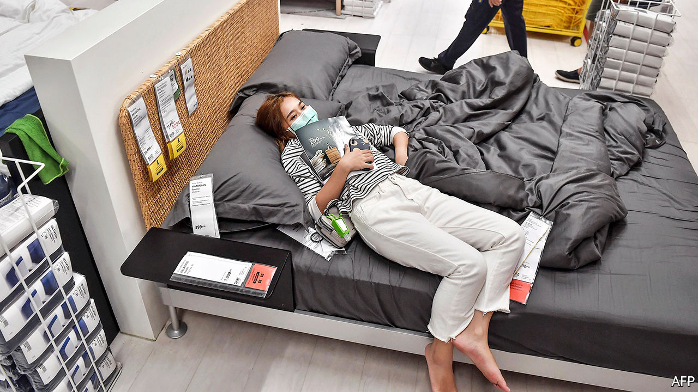

## Part of the furniture

# The boss of IKEA on dealing with the fallout of the covid crisis

> The Swedish giant tries not to let a crisis go to waste

> Jun 4th 2020BERLIN

IKEA IS KNOWN all over the world as the biggest furniture retailer, the most successful Swedish brand—and the cause of family quarrels over the assembly of BILLY bookshelves or HEMNES wardrobes. It has so far never made a name for itself as a place of worship. But on May 24th the car park of an IKEA shop in Wetzlar, a city in Germany, welcomed hundreds of Muslims for a Sunday prayer to mark the end of Ramadan, against the backdrop of the blue-and-yellow storefront. It was a nice gesture in times of social distancing.

Like all non-food retailers, IKEA needed a lift. Around 80% of its 433 shops in 50 countries had to shut and many are still closed. Its shops in Germany only reopened their doors in early May, after two months of pandemic lockdown.

Another important pick-me-up is that shoppers have returned in force, starting in China. Having entered lockdown before the rest of the world, Chinese consumers also emerged from it earlier—and plenty of them immediately hit IKEA shops. Many bought big and expensive items, says Jesper Brodin, chief executive of Ingka Group, the parent company that holds and operates most IKEA shops (as well as running Ingka Centres, which manages the group’s shopping malls, and a fund called Ingka Investments).

To Mr Brodin’s surprise, reopenings in Europe have involved “an effort in crowd control”. In Germany, Austria and Switzerland customers thronged to IKEA once its shops were allowed to open. They were undeterred by long queues: all three countries have strict limits on the number of people permitted in a shop at the same time. In Germany and Austria, for example, one customer is allowed per 20 square metres (215 square feet) of floor space. People, it seems, are as desperate as ever for home improvements and kitchen utensils—more so, perhaps, after a period of confinement in which home-cooking revealed domestic inadequacies. 

IKEA’s online-shopping figures tell the same story. Internet sales were growing fast before the pandemic, by 43% last year compared with 2018, to 10-11% of total sales. In the past couple of months they jumped to 60% of all sales on peak days of the lockdown across the group. In America, where the furniture giant is planning to start reopening its 50 shops in June, IKEA started to bring back its furloughed workers to look after online orders and provide customer service.

Despite the European crowds, Mr Brodin expects the shift online to continue. Surveys in Europe suggest that consumers will continue to shop online for furniture in greater numbers even once the virus has faded. He is also soldiering on with two other pre-pandemic plans. The first is expansion into city centres. Ingka Centres already owns 45 malls (with an IKEA store as anchor) in Europe, China and Russia. The firm is experimenting with 25 different “touch points” in cities, ranging from the IKEA planning studio on Manhattan’s posh Upper East Side to a mini-store that will open next spring in West London. In the next couple of years it is planning to expand in large cities in America. Falling commercial-property prices resulting from pandemic-induced business failures may bring bargains.

The second bet is on greenery. IKEA began making an effort to be kinder to the environment earlier than rivals. It is planning to be “climate positive” by 2030, which means that it will reduce greenhouse-gas emissions by more than its supply chain emits. To that end Ingka Group has invested €2.2bn ($2.5bn) in renewable energy, some of which it could sell back to the grid, and in forests, which suck up carbon from the air. All this makes business sense in a world of increasingly climate-conscious consumers, according to Mr Brodin. He cites surveys showing that 70% of shoppers profess to be deeply concerned about the climate.

Last year IKEA’S retail sales grew by 6.5% compared with 2018, to €41bn—and Ingka Group’s revenues grew by 5% to €36.7bn. This year sales will dip, though it is hard to say by how much. The company is in sound financial health. It has plenty of liquidity and, in line with the thrifty philosophy of its late founder, Ingvar Kamprad, no net debt. During the global financial crisisIKEA also took a hit, says Mr Brodin, but increased its market share after the recovery. Swedes are a hardy bunch.■

## URL

https://www.economist.com/business/2020/06/04/the-boss-of-ikea-on-dealing-with-the-fallout-of-the-covid-crisis
