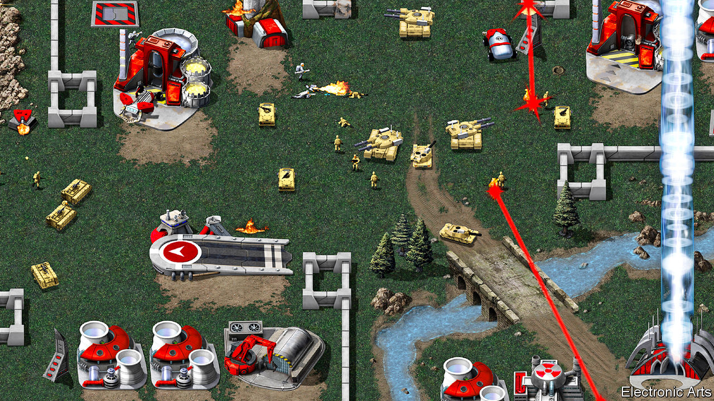

## Command & reconquer

# The video-games industry raids its back catalogue

> Risk aversion is one reason for a rush to revamp old games

> Jun 4th 2020

“COMMAND & CONQUER” chronicles a war between the Global Defence Initiative and a band of techno-terrorists called the Brotherhood of Nod. The video game was cutting-edge in 1995, when it was first released on a pair of compact discs. Their vast capacity (for the time) allowed a high-fidelity soundtrack and cheesy videos with human actors which advanced the plot between levels. Players could challenge their friends using a new-fangled technology called “the internet”. It got rave reviews and sold an estimated 3m copies.

That number will rise further when a revamped version called “Command & Conquer Remastered” is released on June 5th. It is the same as the old one in nearly every respect, except that the cartoonish 2D graphics of the original have received a high-resolution makeover.

The music business milks fans with remixes, remasters and special editions of famous albums. Film studios sell extra-long “director’s cuts”. Revisiting products may seem a riskier strategy in a medium where the state-of-the-art advances as fast as it does in video gaming. But it is an established trend. More than 30 revamped games have been released in the past year. Some have topped sales charts. “Final Fantasy VII Remake” a reimagining of a PlayStation game from 1997, sold 3.5m copies in three days after its release on April 10th.

Nostalgia is one explanation. The video-game business is now middle-aged, giving it a deep back catalogue. Many of its customers have fond memories of the games they played in their youth. That can make for exacting critics. “Warcraft III: Reforged”, released by Blizzard Entertainment in January, was panned by fans for unwelcome tweaks to gameplay and the removal of features from the 2002 original.

Remaking games also helps keep valuable franchises in the public eye while new games are in development, says Morris Garrard of Futuresource, a consultancy. He also points out that console gaming is governed by the release of new hardware. Refreshed games can do well at the end of a cycle when there is less competition from flashy new boxes. The deluge may slow as Sony and Microsoft, the dominant firms, are releasing new consoles soon.

Remakes appeal for another reason, too. The cost of developing high-end video games has ballooned. Budgets can exceed $100m for the glitziest titles. The industry has thus become afflicted by the same risk-aversion that keeps Hollywood churning out endless franchise films and sequels. Remixing an old game, which has sold well once and will probably do so again, is quicker and cheaper than coming up with a new one.

## URL

https://www.economist.com/business/2020/06/04/the-video-games-industry-raids-its-back-catalogue
