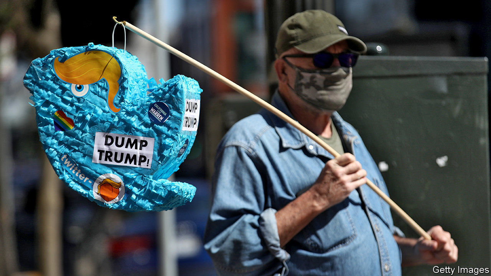
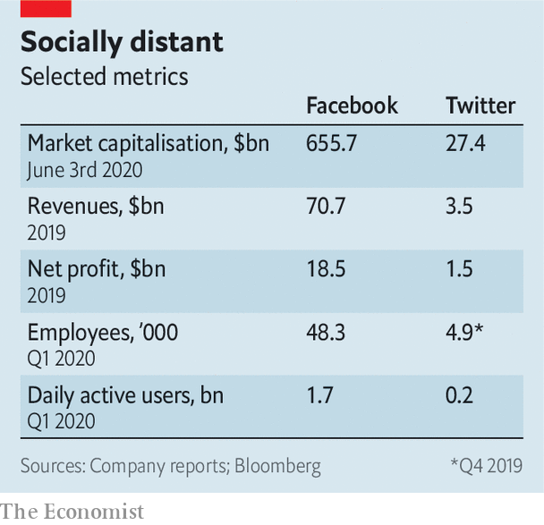

## A tale of two social networks

# Twitter and Facebook have differing business models

> And that makes for differing attitudes to politics

> Jun 4th 2020SAN FRANCISCO

BIG EGOS butting heads has been a constant theme of the technology industry. When the personal computer was still young, Microsoft’s Bill Gates, a super-pragmatist, was pitted against Apple’s Steve Jobs, an extreme aesthete. In business software, a later duel was fought between Oracle’s Larry Ellison and SAP’s Hasso Plattner, who locked horns because they were so alike. The latest clash is in social media, between Twitter’s Jack Dorsey and Facebook’s Mark Zuckerberg—one a hands-off new-ager with a taste for fasting and ice baths, the other an absolutist ruler on a mission to bring the world closer together.

This difference in personality, as well as in their politics, undoubtedly played a role when Mr Dorsey allowed Twitter to flag two recent tweets from President Donald Trump as unacceptable: one for its falsity, the other for glorifying violence. Mr Trump immediately shot back, threatening in a hastily issued executive order to rein in social media, but not before Mr Zuckerberg had appeared on television to protest that he did not want to be the “arbiter of truth” and would never follow Twitter’s lead.

Yet a less noticed factor that governed their responses is their differing “business model”. In Silicon Valley this is a fuzzier concept than in the world beyond, describing not just how a company makes money but the fundamental workings of its economic engine.

At first blush, Twitter and Facebook look similar. Each is a social network, connecting users online and presenting them with content in a “feed”, a never-ending list of posts, pictures and videos of pets. Each makes money by selling advertising, and thus has an interest in using every trick to attract users’ attention. And each employs gobbets of data gleaned from users’ behaviour to allow advertisers to hit targets precisely, for which they pay handsomely.

Look closer, however, and these combinations of similar attributes have created two very different firms, explains Dipayan Ghosh, a fellow at the Harvard Kennedy School and author of “Terms of Disservice”, a new book on social media. Twitter is essentially a modern-day “Speakers’ Corner”, where anyone can hold forth and others can talk back. Social-media scholars refer to it as a one-to-many broadcast network. Facebook is at its core a one-to-one or one-to-a-few network, replicating social relationships of the sort between friends, family or colleagues.

The difference may seem subtle, but it has several implications for the two firms’ businesses. For starters, Facebook is able to gather more data about its users because they are more engaged with other users. This makes it easier to target ads. Facebook also benefits from stronger “network effects”, meaning that each additional subscriber makes the service more useful for others, which attracts more subscribers, and so on. Twitter cannot rely on such a turbocharged engine of growth: while having friends is a human need, maintaining a soapbox is non-essential even for the world’s extroverts.

This goes a long way towards explaining why in 2019 Facebook boasted nine times the users, 21 times the revenue and 12 times the profit of Twitter (see table). More importantly, the strong network effects are a prime asset that Facebook has defended vigorously: it has spent vast sums on buying firms it considers likely future competitors, such as Instagram, acquired in 2012 for $1bn, and WhatsApp, for which it paid $19bn in 2014.

Facebook’s size has made it the dominant outlet for political discourse in America and elsewhere. That means it has to be more wary than Twitter when moderating content as it is more vulnerable to accusations of political favouritism and thus to scrutiny by lawmakers. Like Twitter, it faces growing pressure to do more to fight illegal content, hate speech and misinformation on its platform.

The company Mr Zuckerberg runs also has to manage the threat of becoming the target of antitrust investigations, particularly in America. The Trump administration would probably not hesitate to wield that weapon, should Facebook take action that it might regard as discriminating against what the president calls “conservative views”—such as fact-checking his online utterances—especially during this year’s presidential campaign.

Mr Zuckerberg’s caution is thus of a piece with his earlier decisions to not fact-check political advertisements or limit how finely such ads can be targeted. Twitter, on the other hand, has banned political ads altogether.

Yet the two firms share a trait that could put them on a similar trajectory. Tech firms, more than other companies, have to be careful not to antagonise their mostly millennial employees, particularly the best software engineers, who can easily find work elsewhere if they are unhappy. Their mostly left-leaning workers are increasingly upset that bosses are not doing enough to stop the spread of misinformation or worse by politicians and others.

If Mr Dorsey has had a change of heart and now allows tweets like Mr Trump’s to be flagged, it is partly because of constant pressure from employees. Mr Zuckerberg is now facing open wrath from his troops. On June 1st hundreds of employees staged a “virtual walkout” (by refusing to work and explaining this in automated email replies) for the first time, in protest against Facebook’s decision not to take action against the president’s posts. Perhaps Mr Zuckerberg, like Mr Dorsey, will end up changing his tune—though he is likely to wait until he knows the outcome of the presidential election in November.■

## URL

https://www.economist.com/business/2020/06/04/twitter-and-facebook-have-differing-business-models
