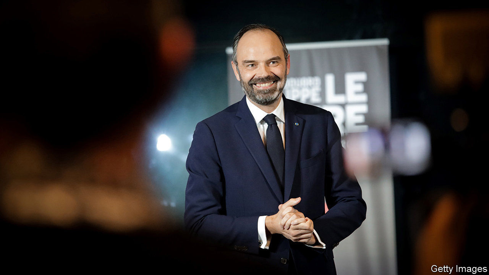

## Time for a reboot

# France’s President Emmanuel Macron mulls a reshuffle

> Some think he will ditch his prime minister

> Jun 6th 2020PARIS

WHEN EMMANUEL MACRON ran for president in 2017 as a first-time campaigner, sceptics repeatedly asked: but which party would he govern with? The 39-year-old had no deputies, few allies and a new-born movement. Against the odds, he went on to crush the established parties and secure a parliamentary majority for his centrist La République en Marche (LREM). Three years later, however, the cracks are showing. Mr Macron’s party has lost its absolute majority, and is facing disaster in coming local elections. The president is again struggling in the polls. As he searches for a way to reboot his presidency, Mr Macron could even decide to change his prime minister, Edouard Philippe (pictured), before the summer is out.

A sign of discontent within the governing party emerged last month when a group of deputies quit LREM to set up a new parliamentary group, “Ecology, Democracy, Solidarity”. The 17-member faction is almost entirely composed of former Macron supporters, disillusioned with what they consider to be an excessively centre-right government. The group has not formally joined the opposition, but says it will freely vote against Mr Philippe’s government if it dislikes what it sees.

By itself, the loss of LREM’s absolute majority will not affect Mr Macron’s policymaking. The government retains a solid working majority in parliament, thanks to the formal backing of 46 deputies belonging to a centrist party, MoDem, as well as over a dozen other deputies on the centre-right. Yet it is symbolically and structurally damaging. It is “not the end of the world”, says Roland Lescure, an LREM deputy, “but it does reveal that we are still missing an ideological backbone.”

Four years after Mr Macron founded a movement designed to be “not on the left, not on the right”, a cohesive unifying purpose is proving elusive for LREM. The party barely exists outside Paris. New strains are emerging in advance of the second round of local elections on June 28th, postponed from March due to covid-19. To the consternation of LREM, Gérard Collomb, a close ally of Mr Macron’s and his former interior minister, has teamed up with the right for the second round of voting in Lyon. LREM has withdrawn its backing from Mr Collomb’s candidacy. Mr Macron’s hopes of winning the Paris town hall, meanwhile, have evaporated after his candidate, Agnès Buzyn, came a disappointing third. Anne Hidalgo, the Socialist mayor, is likely to keep her job.

To try to get a grip, Mr Macron is now mulling over ways to reset the presidency for his remaining two years in office. Elected on a promise of disruption, he wants a purpose more suited to turbulent times. The president has already suspended—probably indefinitely—an unpopular pension reform, which in effect raised the retirement age and prompted weeks of strikes. France is bracing for a rude economic shock, with the government now expecting a drop in GDP of 11% in 2020. The covid-19 pandemic has pushed quite different concerns to the fore: safety, security, self-sufficiency and a stronger state. Mr Macron has installed a committee of international economists under Olivier Blanchard and Jean Tirole to help come up with ideas. In a televised address, the president said enigmatically that it was time for “reinvention, of myself first of all”.

Despite the post-partisan idea behind LREM, there is now a strong push among some insiders to shift the centre of gravity to the left, where Mr Macron is politically vulnerable. “He’s already captured the vote on the right, but he needs to regain credibility on the left, where there is a feeling that he has betrayed them,” says one supporter. A former right-hand man to Alain Juppé, a conservative ex-prime minister, Mr Philippe is indelibly linked to the right in French minds. So is Bruno Le Maire, the finance minister, another former conservative. As rumours swirl around Paris about a reshuffle, various names circulate as putative prime ministers. One is Jean-Yves Le Drian, the 72-year-old foreign minister. A former Socialist president of Brittany, he has strong provincial roots and is “a bit of a father figure”, says an LREM deputy; the antidote, in some ways, to the know-it-all, micro-managing president.

The irony is that Mr Philippe is emerging from the pandemic more popular than his boss. His poll ratings have risen, even as Mr Macron’s have dropped. But the prime minister’s whitening beard betrays the stress of the job. “He is exhausted,” says an LREM deputy. Mr Philippe also happens to be running in elections for his old job as mayor of Le Havre, a northern port. So an exit may be available, should it be needed.

Nobody can quite know what Mr Macron has in mind. A surprise cannot be ruled out. The president can make bewildering nominations and is often reluctant to ditch colleagues. As he turns these options over, he will know better than most that, once outside government, a former ally can turn into a rival. Which is exactly what Mr Macron did when he decided to quit his ministry, set up a party and run for the top job. ■

## URL

https://www.economist.com/europe/2020/06/06/frances-president-emmanuel-macron-mulls-a-reshuffle
