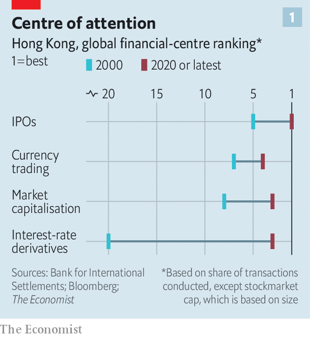
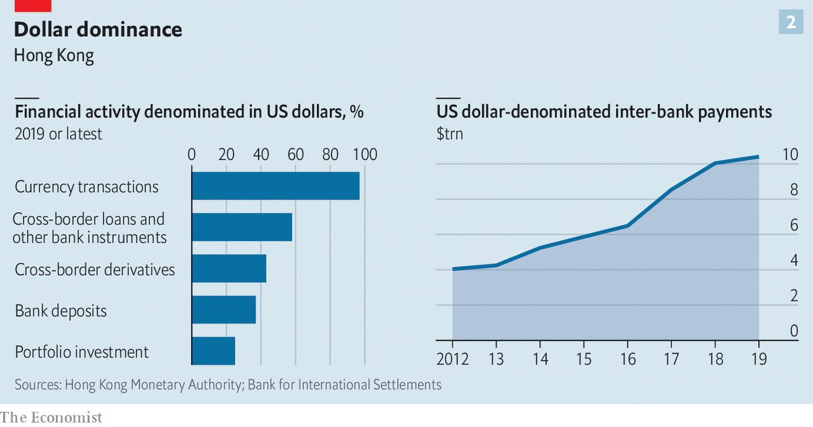
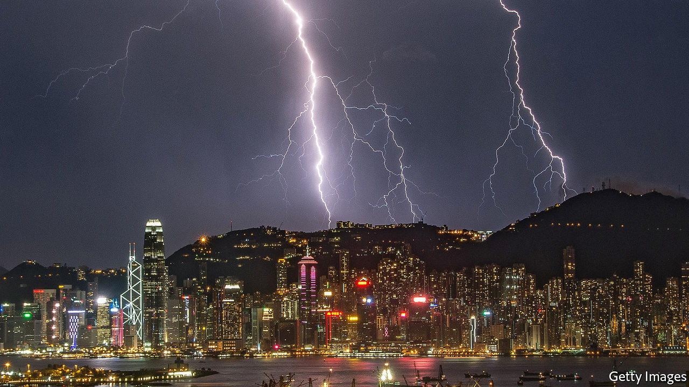

## Hong Kong’s uncertain future

# Can Hong Kong remain a global financial centre?

> The $10trn financial hub is in the eye of a geopolitical storm

> Jun 6th 2020HONG KONG

THE BEST way to get your head around the role that Hong Kong plays in the global financial system, says a business figure there, is to think of it as an electrical transformer that connects two circuits with different voltages. One is the global financial system with its freewheeling capital flows, open dissemination of information and the rule of law. The other circuit is China’s vast and growing financial system with its controls on capital, censorship and capricious enforcement of contracts.

Over the past two decades, as China has risen to become the world’s second-largest economy, Hong Kong has skilfully cultivated its role in the middle, such that it has become the most important international financial centre after New York and London. Around Victoria Harbour, China’s tech tycoons flog shares to Californian hedge funds, its state-run banks issue loans to fund Belt and Road projects and its authorities intervene to control its tightly managed exchange rate. Much of the business is denominated in the world’s reserve currency, the dollar, organised by Western firms and overseen by independent courts and regulators that have more in common with their peers in the rich world than with their counterparts in Beijing or Shanghai.

Under the wrong conditions transformers can become less efficient or even, in extremis, blow up. This risk is growing for Hong Kong’s position as a financial centre, as tensions build over China’s interference in its government and legal system, which, under the formulation of “one country, two systems”, are supposed to be largely autonomous until at least 2047. On May 28th China commissioned a national-security law to prevent sedition and terrorism in the territory. In response the White House has proposed removing some of the legal privileges that Hong Kong enjoys—privileges that help it connect seamlessly with the global economy.

The most likely scenario is that Hong Kong’s institutions face gradual decay and that it drifts away from being a globalised financial centre towards one that is more mainland Chinese. China would be left with more control over a less effective capital market, raising the cost of capital for its firms. The unlikely but not impossible worst case is that a miscalculation destabilises some of the $10trn edifice of cross-border financial claims that sits in Hong Kong, causing a shock that ripples across China and Asia. Local executives and officials often call this the nuclear outcome.

When Hong Kong returned to Chinese sovereignty in 1997, it was a lively entrepot known for its rags-to-riches magnates and well-oiled expatriate bankers, but not a global powerhouse. Since then it has been transformed. It is nine times bigger than in 2000, using the median of a panel of four capital-markets measures, and ranks third among global financial centres (see chart 1). It has learned new tricks, including how to sell derivatives, private banking, fintech and life insurance. Financiers have leapt to offer the services that mainland China cannot provide and tolerates being offered offshore. In the 1990s and early 2000s Hong Kong courted initial public offerings of Chinese state-owned firms, and then shifted to listing private companies. Since 2014 it has hosted “Stock Connect”, a platform that allows limited cross-border trading in securities between it and the mainland, and which now accounts for 8% of share trading in Hong Kong. Even when Chinese firms have conspicuously declined to use Hong Kong’s markets they have used legal structures engineered by its lawyers and accountants. When Alibaba, China’s most valuable firm, listed in New York in 2014, its prospectus mentioned Hong Kong 72 times (in November last year it floated in the territory, too, after worries about America punishing Chinese firms listed on Wall Street).

Of course mainland China’s financial markets have expanded, too. Shanghai has a stockmarket capitalisation that rivals Hong Kong’s, and China’s bond market is vast. Global bank chiefs love the entrepreneurial vim of Shenzhen, whose sizeable stockmarket hosts over 2,000 firms. But scale doesn’t mean compatibility with the requirements of global investors. Disclosure standards are often terrible; the government sometimes rigs prices; moving capital across the border is hard; and even in some fairly plain-vanilla areas mainland China lacks critical mass. It hosts only 1.6% of global currency trading, for example, and a puny 0.2% of worldwide interest-rate-derivatives activity.

A frequently made point is that Hong Kong’s markets have become more mainland Chinese. The share of local businesses in the stockmarket by value, for example, has dropped from 69% in 2000 to 24% now. A few, such as Li Ka-shing’s empire and Jardine Matheson, have successfully and discreetly diversified away from Hong Kong and China. But most have faded away and, disconcertingly, no Hong Kong firm has hit the big time in the mainland. Meanwhile the share of mainland firms in the stockmarket has risen from 31% to 73%, with nine of China’s ten most valuable firms listed in Hong Kong, including Tencent, a tech giant, and Ping An, the world’s most valuable insurance firm. China’s economy is not especially dependent on foreign capital. But, based on the total figures for equity and dollar-bond issuance, around two-thirds of the cross-border funds that it does raise are mobilised in Hong Kong.

Strikingly, even as Hong Kong has become more Chinese, its financial infrastructure has remained similar to that of an advanced Western economy. The constitutional formulation of “one country, two systems” has a cascade of benefits going beyond the rule of law. A layer down from the courts are world-class, independent regulators, including the Hong Kong Monetary Authority (HKMA), the central bank, and the securities regulator. Their rules require companies and financial firms in Hong Kong, especially big ones, to achieve a reasonable standard of corporate governance, and have accurate accounts and timely disclosure. Freedom of speech means firms and securities are subject to scrutiny, an essential part of the price-formation process in well-run markets.

Such squeaky-clean credentials mean Hong Kong has been granted access to the heart of the West’s financial systems, of a kind that China can only dream of. America’s 1992 Hong Kong Policy Act, though vague, says that it should treat the territory as a distinct customs zone and guarantees currency convertibility. There is a mesh of other less well-known agreements. Hong Kong firms are treated similarly to American ones by America’s derivatives regulator; Wall Street’s securities supervisor has an enforcement agreement with Hong Kong; and the territory is on the oversight board of CLS, a global currency-settlement platform backed by the Federal Reserve which deals in Hong Kong’s currency, among others. Most bank supervisors and risk officers treat a counterparty in Hong Kong like one in Heidelberg. These are all perks and symbols that China and the yuan do not have—and, perhaps, cannot get.

Of all Hong Kong’s privileges, the most important is its role as the dominant offshore dollar funding centre in Asia, a status that the Fed has tolerated, if not encouraged. Since 1983 its currency has been pegged to the greenback, underwritten by foreign reserves of about $440bn, over twice the value of the local money supply, narrowly defined. Firms dealing in Hong Kong’s currency assume that it is perfectly fungible with the greenback.

More importantly, they also assume that an American dollar in Hong Kong is perfectly fungible with one in New York. This belief explains why so much activity is denominated in American dollars, including 97% of foreign-exchange deals, 58% of cross-border loans and other bank instruments, 43% of cross-border derivatives and 37% of deposits (see chart 2). The stock of dollar cross-border claims is $4trn, equivalent to a tenth of the value of America’s stockmarket.

To command the confidence of investors, Hong Kong relies on a home-grown payments infrastructure that links it to America’s money markets. One monetary artery, called USD CHATS, allows banks in the territory to transact in dollars with each other and is then connected to New York by HSBC, a London-headquartered bank that does most of its business in Asia. Total payments pumped through this system amounted to $10.4trn last year. Nine of the ten largest mainland Chinese banks piggyback off it, using USD CHATS accounts with HSBC. Though it is not possible to estimate what share of China’s total dollar payments use this mechanism, it may be chunky. China does have alternatives. It can use bespoke arrangements with Western banks. Five mainland lenders participate in an American dollar-payments venue, known as CHIPS, although none is a member of the exclusive club of global banks that owns it.

Assured of Hong Kong’s fair play, good standing in the rest of the world and fungible money, financial firms have been happy to locate there. The territory has 163 licensed banks, three of the five largest of which are Western-controlled, and 1,600-odd asset managers, most of which are global and source half of their money from America, Europe and non-Chinese Asia. While mainland investment banks dominate business on the mainland, Western firms still reign over complex cross-border deals. Four of the five underwriters for Alibaba’s recent flotation were American or European, including Morgan Stanley and Credit Suisse. The participation of many global firms in Hong Kong is evidence that its markets are run well, and creates jobs: 13% of the territory’s employment and 26% of its GDP come from professional services and finance. For workers outside these gilded sectors, though, life is less easy. The high cost of living is one reason why protesters have repeatedly brought Hong Kong to a standstill.

Those at the pinnacle of Hong Kong’s financial world say that its role in the global system is not threatened by social unrest and geopolitics. China’s security law, though clumsy, will, they hope, dampen the protests. Both HSBC and Standard Chartered have voiced support for it. According to five sources, there is no sign of international bank depositors pulling money from Hong Kong in the past two weeks. A wave of Chinese firms, such as JD.com, are seeking listings in Hong Kong, drawing in capital.

The White House’s threat to revoke Hong Kong’s special status, according to this view, is bluster. Its status as a distinct customs zone might be withdrawn, but Hong Kong does not manufacture much any more. Doomsters have predicted the end of Hong Kong since the city began to be built in the 19th century.

Yet it is complacent to suppose that Hong Kong can be immune to worsening Sino-American relations and China’s rising authoritarianism. If the territory’s government has become a proxy of the Communist Party, it seems rational to worry about how long its independent institutions, including the courts and the central bank, can remain unaffected. HKEX, the thriving stock exchange, has long had government appointees on its board. The decline of free speech in Hong Kong may impede its efficiency as a financial market. Could an analyst’s note inviting speculation against China’s exchange rate, or identifying fraud at its banks, be designated as sedition?

The perception that Hong Kong is converging towards China could lead counterparties to apply a higher risk score to the territory. Stigma may become a problem: in the past Hong Kong firms have been able to buy strategic assets, from European utilities to American banks. That may be changing. In 2019 HKEX abandoned a bid for the London Stock Exchange, which controls some of America’s financial plumbing; it is possible that if it had gone ahead America’s foreign-investment board would have blocked the deal. Israel has reportedly blocked a deal involving a Li Ka-shing-backed firm, at America’s request.

In this base-case scenario there could eventually be a Hong Kong discount, instead of a halo. Firms doing business with China would still have nowhere better to be, but other activity could easily shift somewhere less controversial. This slice of mobile business could be material—almost two-thirds of currency trades involve neither the Hong Kong dollar nor the yuan; and over half of fund assets are invested in Europe, America and other parts of Asia.

If this global business shrinks, Hong Kong would still have China-related business to compensate. There will be many more public offerings. And as Chinese pension funds grow they may build up their efforts to invest globally: today only a fifth or so of asset managers in Hong Kong are controlled by mainland owners. The overall effect would be tolerable for Hong Kong and only modestly bad for China, which would lose some economic benefits from Hong Kong becoming less cosmopolitan.

But in the back of some minds is the nuclear scenario, in which Hong Kong’s role as a financial hub is destabilised. By accident or design the American authorities could clog or cut the payments arteries by imposing sanctions, additional administrative requirements or penalties on individuals, firms or banks operating in Hong Kong. Any of these measures could seed concern that money parked in Hong Kong is no longer perfectly interchangeable with that in the West.

Viewed narrowly, America doesn’t have much to lose: less than 1% of its banks’ assets are in Hong Kong. But fully weaponising the financial system would be a huge escalation. Hong Kong might find it harder to protect its currency peg from capital outflows. On June 3rd Paul Chan, the territory’s finance minister, said that if sanctions were imposed it would get help with dollar funding from China’s central bank, according to Bloomberg. China might still find that without easy access to the West via Hong Kong it has to scramble to find workarounds to make dollar payments. This could be traumatic and expensive. Paying an extra 0.5% on its dollar debts, for example, would cost China $7bn a year.

If the shock were severe China might lash out against American multinationals in China. Over time it might also seek to conduct cross-border finance on its own terms by coaxing more foreign financial firms to bulk up in mainland China on the condition that they accept China’s way of doing business, and use the yuan. And it might have another go at promoting the yuan as a global payments currency by pushing digital-payments systems, where Chinese technology is world-leading. The goal would be to end once and for all its dependence on the West’s financial system and, by implication, Hong Kong.

No one at the top of Hong Kong’s financial establishment believes that this bad scenario is likely. But everyone thinks that moves by America or China to disrupt its role as a global dollar centre would be dangerous. Consider a selection of comments from bigwigs: it would be “incredibly dangerous”; “ a really serious mistake”; “a very, very radical and extreme measure that would backfire”; “an act of war”. That Hong Kong has become so important to global finance that people are terrified by the prospect of its being damaged is a backhanded compliment—and a reminder of how hard it is to absorb the jolts and shocks from two superpowers moving apart.■

## URL

https://www.economist.com/finance-and-economics/2020/06/06/can-hong-kong-remain-a-global-financial-centre
