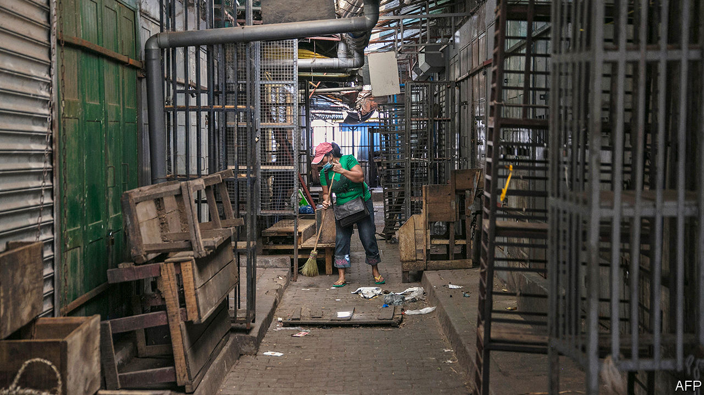
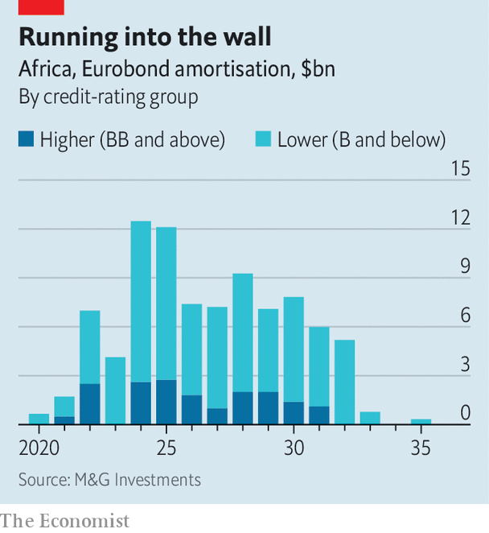

## A borrowers’ catch-22

# African governments face a wall of debt repayments

> But many are surprisingly reluctant to accept relief

> Jun 6th 2020

IT IS ALMOST a law of nature. Just as the female praying mantis eats her mate after copulation, so too can borrowers and lenders fall swiftly out of love. One minute they are sweetly wooing each other to consummate a deal. Then, the moment it is done, they are at each other’s throats.

So it is odd that African governments and their creditors have not yet fallen out. They have plenty to quarrel about. Africa’s debt crisis has been simmering for some time. Two years ago the IMF was already anxious about a growing number of African countries in “debt distress” or at high risk of it. This crisis was brought to the boil by covid-19, which has caused economies to shrink and tax revenues to plunge. Governments have ramped up spending to fight the virus. Investors are scared. In recent weeks the bonds of nine countries have traded at prices indicating that they might not be repaid.

The IMF and World Bank have lent emergency cash, but a financing gap of at least $44bn remains. Various bigwigs have called for debt relief, including Abiy Ahmed, Ethiopia’s prime minister, and Larry Summers, a former American treasury secretary. Yet neither borrowers nor lenders seem enthusiastic.

The G20 club of countries has agreed to suspend bilateral debt-service payments for the rest of this year for the world’s 73 poorest countries, if they ask. Yet uptake has been low. In seven weeks fewer than half of eligible countries have requested assistance. Only seven have been given it.

Struggling governments are not asking for help because they fear being seen as deadbeats. “We need to make sure we are protecting our hard-earned access to international capital markets,” says Amadou Hott, Senegal’s minister of economy. “The best way to do it is, at any cost, to protect our commitments with private creditors.” This, he adds, is the view of all the African finance ministers to whom he has spoken.

Most of the 21 African countries that have sold bonds abroad have done so for the first time only in the past decade. Long-term borrowing is even more recent, but in 2018 eight African countries successfully issued 30-year bonds. This borrowing is expensive. Interest rates on foreign-currency government bonds sold by African countries are roughly seven percentage points higher than those sold by rich countries, because investors see them as riskier.

Asking for help could confirm that view. Romuald Wadagni, Benin’s finance minister, writes that taking advantage of the G20 offer could be treated as a default by private creditors, even though they are not directly involved. Moody’s, a credit-rating agency, says it may downgrade its assessment of Cameroon, Pakistan and Ethiopia because they went for it. To avoid this fate, Senegal plans to shun the offer. Kenya says it will do likewise, because the small print would restrict its ability to borrow commercially.

Even if African countries were to take up the offer of help from bilateral creditors (these are usually governments or their export-finance arms), including the biggest of them all, China, they would still have other worries. Roughly a third of sub-Saharan Africa’s government debt is owed to private investors. Bondholders alone are owed $115bn. The mere act of asking private creditors for leniency would probably lead to a credit downgrade. And actually renegotiating repayment terms would probably be classed as a default, say rating agencies.

For the most troubled countries, such as Zambia, the point is moot. In 2012 it was able to borrow more cheaply than Spain. Now it is priced right out of the market and has hired Lazard, a financial advisory firm, to help it restructure its debt. Angola, which needs to hand over $500m to private bondholders this year and almost certainly more to China, has also begun talks.

But for countries such as Ivory Coast, Ghana and Senegal, which owe private creditors as well as G20 governments, the judgments are tougher. Stopping payments for a while would free up funds to fight the coronavirus. But after the crisis they will need cash from investors.

Under pressure from the G20 to offer debt relief, private creditors have come up with a grudging proposal. The Institute of International Finance, an industry group, has proposed allowing struggling governments to take a payment holiday. Afterwards, they would have to pay back everything they owe, including extra interest. This resolves little, since it would simply store up trouble, leaving weary countries with an even bigger mountain of debt to climb. And even in the short run it locks African governments into a catch-22. To have even a slim chance of avoiding being deemed in default, they will have to agree to new repayment terms that leave creditors no worse off than now. But if they ask, they risk a downgrade with no guarantee that private creditors will agree.

Vera Songwe of the UN Economic Commission for Africa hopes to find another solution. She favours creating a new body that would borrow cheaply and then lend money to governments. However, it would need backers with deep pockets willing to guarantee that private lenders would not take a loss. It has found few volunteers.

There is not much time to act. African bond issuers face a wall of payments starting in 2022 (see chart). Many hope they are just experiencing a short-term cash crunch. But unless their economies rebound quickly—or they get more help from the rich world—a wave of defaults seems inevitable. If so, it may be better to take the hit and restructure debt now, while hoping that credit markets have short memories. Ken Ofori-Atta, Ghana’s finance minister, pointed out in a webinar hosted by Harvard University that rich countries were taking extraordinary measures to protect their economies, while telling Africans to stick to the rules. “You really feel like shouting: ‘I can’t breathe,’” he said. ■

Editor’s note: Some of our covid-19 coverage is free for readers of The Economist Today, our daily [newsletter](https://www.economist.com/https://my.economist.com/user#newsletter). For more stories and our pandemic tracker, see our [coronavirus hub](https://www.economist.com//news/2020/03/11/the-economists-coverage-of-the-coronavirus)

## URL

https://www.economist.com/middle-east-and-africa/2020/06/06/african-governments-face-a-wall-of-debt-repayments
