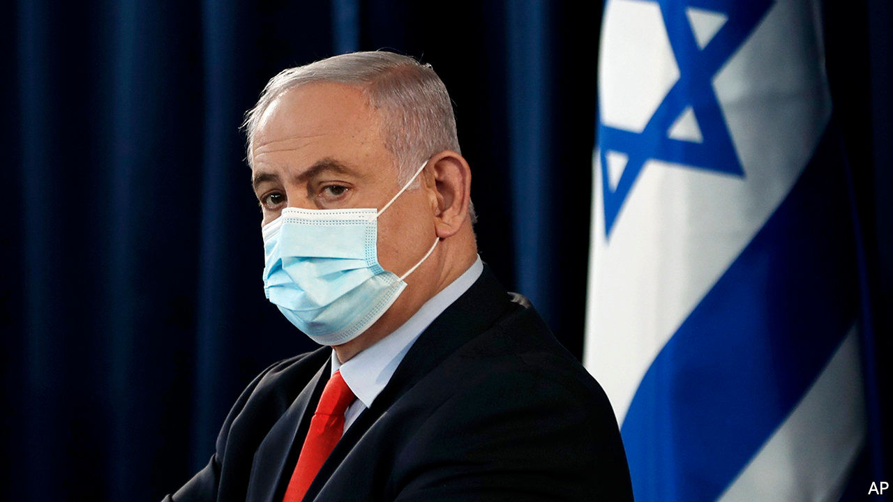
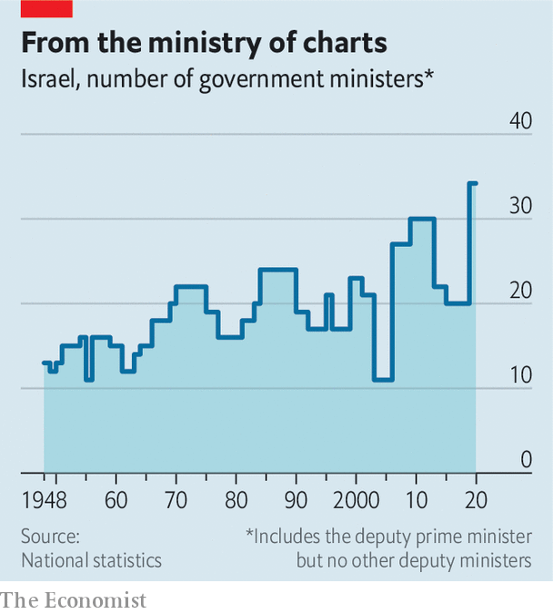

## Empty empires

# Binyamin Netanyahu has bought loyalty with meaningless titles

> But don’t tell the new minister of community empowerment and advancement

> Jun 4th 2020JERUSALEM

IT TAKES ABOUT a dozen ministries to run Sweden, a country of 10m people. Austria, with a population of 9m, has a similar number. Israel is about the same size, but apparently it needs a bigger government. The one sworn in on May 17th features at least 34 ministries, and as many ministers (over a quarter of all lawmakers), many of whom seem to share the same tasks or have little power.

There is, for example, a minister of education and a minister of higher education. There is a minister of cyber and national digital matters, though the police handle cybercrime, the army does cyber-warfare and a separate ministry deals with science and technology. The ministry of community empowerment and advancement has just been created, in case having a ministry in charge of social services and a ministry for social equality was not enough.

Half a century ago Israel had many fewer ministries (see chart). But the country’s proportional-representation system makes it difficult to form a stable governing coalition—just ask Binyamin Netanyahu, the prime minister. Three elections in the span of a year produced nothing but gridlock until Mr Netanyahu convinced his former opponent, Benny Gantz, to join him in government. Now the prime minister must keep politicians from eight parties happy. So, like past leaders, he has broken up existing departments and created new ones in order to reward allies and buy off opponents.

Mr Netanyahu has thus formed the biggest government in Israeli history. Several new ministries aim to satisfy loyal members of his Likud party. The ministry of community empowerment and advancement was invented to reward a defector from the opposition, Orly Levy-Abekasis. It is responsible for preventing drug abuse and violence against women and children, tasks previously handled by the ministry of public security (which still exists). Ms Levy-Abekasis will also oversee projects to strengthen Arab neighbourhoods. Her credentials include supporting Mr Netanyahu’s plans to annex parts of the occupied West Bank and breaking away from an alliance of left-wing parties because it was backed by a predominantly Arab party.

The proliferation of ministries has the potential to create confusion. Take the ministry of strategic affairs, which was created in 2006 by Ehud Olmert, then prime minister, to reward Avigdor Lieberman, leader of the Yisrael Beiteinu party. The ministry was meant to keep an eye on Iran and other threats. Of course, so were the ministries of defence, foreign affairs, and public security (which was the one Mr Lieberman actually wanted to lead). The strategic-affairs ministry was closed in 2008, after Mr Lieberman left the government—and reopened in 2009 by Mr Netanyahu, who had become prime minister. An article in the Jerusalem Post at the time asked: “Who’s in charge of whom and over what?”

Recently the ministry of strategic affairs has tried to undermine the international campaign to influence Israel through “BDS”—boycott, divestment and sanctions. That, predictably, caused tensions with the foreign ministry. Turf battles are common, and could increase given the government’s strange bedfellows. Mr Gantz will be taking the positions of alternate prime minister and defence minister. In 18 months he is supposed to swap places with Mr Netanyahu. Until then he has the right to veto nearly anything the government does.

Each ministry comes with its own budget and team of bureaucrats. The cost of Mr Netanyahu’s new creations is 85m shekels ($24m) a year, to be taken from existing departments. Despite criticism, he hasn’t even tried to claim that the new ministries are necessary. But, he says, they are worth it to avoid another election, which would cost 2bn shekels. And there may be other benefits for the imperious prime minister. “The more ministers he has, the less he has to take us seriously,” says a disconsolate member of the new cabinet.

## URL

https://www.economist.com/middle-east-and-africa/2020/06/04/binyamin-netanyahu-has-bought-loyalty-with-meaningless-titles
