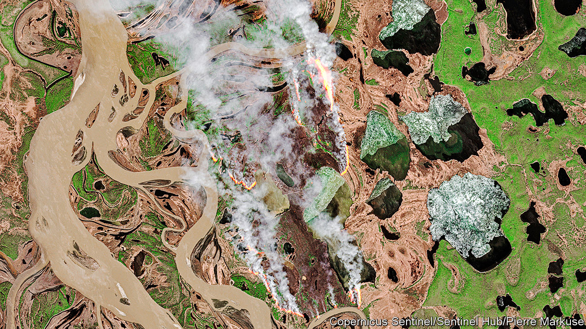

## The fires within the deep

# Have Siberian fires been smouldering underground all winter?

> If so it could be a warning

> Jun 6th 2020

SEEN FROM the sky, the northern stretches of Siberia in early May were a splodgy white, their thinning winter snow cover interrupted by the brown veins of meandering rivers. Nestled within some of these curves, though, satellites picked up patches of soil warmer than the ground around them. The patches grew and multiplied as the month went on. Before it was over, some were visibly ablaze.

Fires are not unheard of in the Arctic, even at this time of year. But the extraordinary fires seen last summer have put researchers on high alert for oddities. In June, July and August 2019 fires within the Arctic Circle pumped 173m tonnes of carbon dioxide into the atmosphere. The 182m tonnes emitted over the year as a whole smashed the previous record of 110m tonnes, set in 2004. Dense clouds of smoke smothered Siberian cities. The fires consumed not just trees and grasses but also peat which would normally have been frozen. Alaska experienced an unusually active fire season, too.

Last year’s inferno makes this year’s early-season hotspots and blazes particularly interesting. Fires can overwinter underground, particularly if they find their way to pockets of peat which offer the fire just enough oxygen for slow smouldering beneath the snow. After a wildfire singes a network of submerged layers of peat its descendant embers can pop up months later: though purists frown on the term, they have become known as “zombie fires”.

A recent Dutch study of overwintering-fire data, presented at a meeting of the European Geosciences Union held the same week that the satellites were seeing hotspots in Siberia, suggests that they are more likely to happen in years after large burns. Though such fires can travel some distance under the surface, and so do not have to reappear where last seen, most stay put. The fact that some of this May’s flames were in areas that burned last year and are rich in peat is thus suggestive. On-the-ground observations will be required to settle the matter, though.

If the fires did overwinter, that is not in itself a bad omen; the Dutch study did not find that overwintering fires make a new year particularly fire-prone. Exceptional fire seasons are normally preceded by hot, dry early summers, as last year’s was. Happily, the ground around the Arctic Ocean currently appears wetter than average, except in the north-eastern-most reaches of Siberia. That said, in Siberia and Greenland April’s temperatures were well above the 1981-2010 average—in places by more than 10°C. A warm, damp spring could yet become a hot, dry summer.

Arctic fires garner less attention than those in Brazil, which the world has been worrying about for decades, or California, Australia and the Mediterranean, which are more densely populated. But regional and global feedbacks make them peculiarly alarming. By leaving dark scars on the land they burn and spreading soot much farther afield they increase the land’s capacity to soak up summer sun, thus making the region warmer still. The warmer it gets, the more flammable it is—and the more carbon dioxide and methane get emitted.

On the scale of what humans do, last year’s 173m tonnes of carbon dioxide is appreciable—about 30 big coal-fired power stations working flat out for a year—but not overwhelming. There are, though, hundreds of billions of tonnes of carbon stored up in the Arctic, a region already warming at twice the global rate. It is a tipping point to watch. ■

Sign up to our fortnightly climate-change newsletter [here](https://www.economist.com//theclimateissue/)