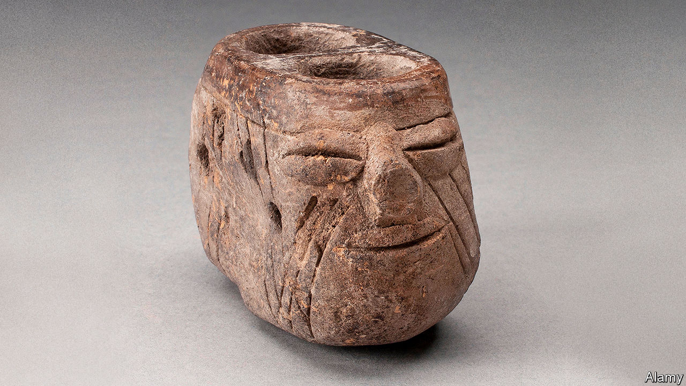

## Palaeo-musicology

# The lost instruments of Teotihuacan will soon be heard again

> An ancient city is about to have its “soundscape” recorded

> Jun 6th 2020

ONE AFTERNOON last December Arnd Adje Both, a researcher at Huddersfield University, in Britain, stood on top of the Pyramid of the Moon at Teotihuacan, in Mexico, and blew into a conch-shell trumpet, sounding a note that echoed in the plaza far below. Later this year—covid-19 permitting—he hopes to return with a group of colleagues to conduct an aural examination of the site using replicas of the ancient instruments dug up there.

Teotihuacan is a mysterious place. Once home to more than 100,000 people, at its zenith around 1,500 years ago it was among the biggest cities in the world. Its inhabitants, though, had no known system of writing. Even the city’s original name is unknown. “Teotihuacan”, meaning “birthplace of the gods”, is what the deserted settlement was called by the Aztecs, who took over control of what is now central Mexico in about 1300AD, some 650 years after the city was abandoned. All that is known about Teotihuacan’s inhabitants and their culture is what archaeologists have pieced together from the remaining buildings and other artefacts.

Dr Both’s curiosity about the music-making of these elusive people goes back to the 1990s. He took part in one of his first excavations at Teotihuacan. While doing so he got to know a group of Mexican musical-instrument makers and became interested in crafting replicas of the site’s double-chambered water-sounding vessels (pictured above), which whistle when water moves from one chamber to the other, quadruple flute pipes and other strange instruments. He has since spent many months in the collections of the National Anthropology Museum in Mexico City, and other institutes, plotting the dimensions and workings of these finds.

Since the genuine articles are too delicate and valuable to play, he has teamed up with Osvaldo Padrón, an instrument-maker in Amsterdam, to create replicas. He is not looking to reproduce pre-Columbian tunes on these facsimiles. The inhabitants’ apparent societal aliteracy extended to musical notation, so there are no scores to interpret. But by recording the replicas being played in their native site he nevertheless hopes to gain a better purchase on how sound moved around the ancient city.

Creating such “soundscapes” is a trendy if somewhat esoteric idea in archaeology at the moment. Kristy Primeau and David Witt of the State University of New York, for example, have mapped the spread of the sound of voices and conch-shell trumpets around the ancient Puebloan dwelling-sites of Chaco Canyon, New Mexico. To do so they modified programs employed for environmental-impact studies—specifically, for the modelling of levels of noise from vehicle engines that might be perceived in a wilderness area as a result of economic development. Using this software they have shown that the sites of platform mounds built in the canyon were not chosen accidentally. Rather, they are well placed to propagate sound through the area’s now-abandoned settlements.

Listen on: [Apple Podcasts](https://www.economist.com/https://itunes.apple.com/us/podcast/id1449631195?mt=2&ls=1) | [Spotify](https://www.economist.com/https://open.spotify.com/show/12zKAMNyS2GNentUzxq9QN) | [Google](https://www.economist.com/https://www.google.com/podcasts?feed=aHR0cHM6Ly9yc3MuYWNhc3QuY29tL3RoZWludGVsbGlnZW5jZXBvZGNhc3Q) | [Stitcher](https://www.economist.com/https://www.stitcher.com/s?fid=357733&refid=stpr) | [TuneIn](https://www.economist.com/https://tunein.com/podcasts/News--Politics-Podcasts/The-Intelligence-p1186979/)

Similarly, a team led by Margarita Díaz-Andreu of the Catalan Institution for Research and Advanced Studies has discovered that spaces in rock shelters in western Spain that are decorated with prehistoric art also have striking acoustic properties of reverb and echo—whereas undecorated areas used for shelter at the same time did not. And Miriam Kolar of Amherst College, in Massachusetts, has shown that the top of a towering central platform in the Inca city of Huánuco Pampa was not just a place from which to address the masses. It also had excellent internal acoustic properties. It would have made a good private venue for the local elite.

When Dr Both returns to Teotihuacan, he and his colleagues will play their replicas from spots on the Sun and Moon pyramids, and from other places among the palaces and temples that line the city’s main thoroughfare, the Avenue of the Dead. Rupert Till, Huddersfield’s professor of music, who is also a recording engineer, will record these from various places and attempt to build a model showing how sounds change in the city as the listener moves from one place to another. Or the listener can stop this virtual tour, turn off the sound of the instrument and hear the breeze blowing over the stones.■

## URL

https://www.economist.com/science-and-technology/2020/06/06/the-lost-instruments-of-teotihuacan-will-soon-be-heard-again
