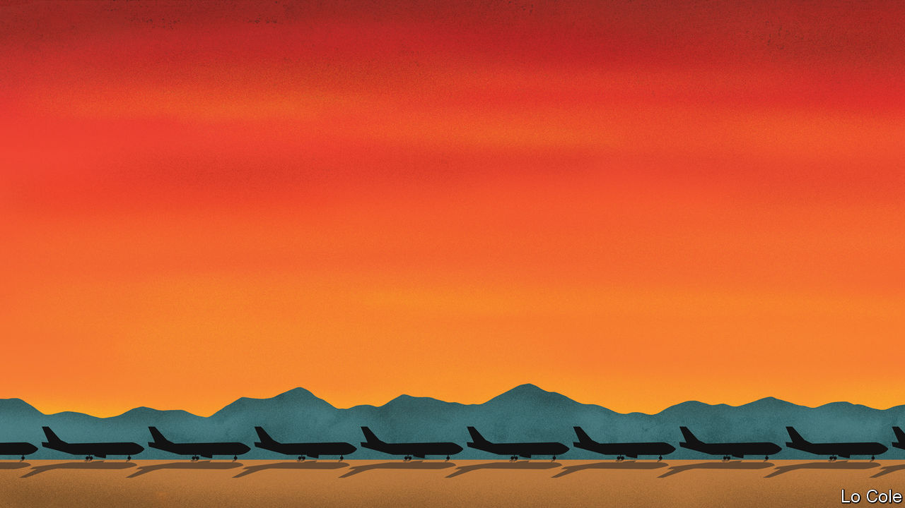

## Bello

# Latin America’s empty skies

> Airlines are in trouble. The region cannot do without them

> Jun 4th 2020

LAST DECEMBER, in a different era, Avianca celebrated its centenary. Based in Colombia, it claims to be the world’s second-oldest airline, and the one that has flown continuously for longest. It is Latin America’s second-biggest carrier by revenues. Now, thanks to covid-19 and its associated lockdowns, Avianca’s planes are parked, its crews and ground staff furloughed. Last month it filed for relief from creditors in a New York court under Chapter 11 of the American bankruptcy code. A fortnight later, LATAM, a Chilean-Brazilian airline that is the region’s biggest, followed suit. Ecuador’s government has liquidated TAME, an ailing state-owned carrier.

This poses a policy dilemma. Governments in Europe and the United States have funnelled billions of dollars to their countries’ stricken airlines. Their counterparts in Latin America have less spare cash and different priorities. They must help tens of millions of citizens who face poverty and unemployment. Air travel in the region has historically been seen as a luxury. With their sometimes irksome pricing and unpunctuality, airlines are rarely loved and are a source of carbon emissions to boot. So far no Latin American government has offered them any financial help.

Flying matters in Latin America perhaps even more than in other regions, as Avianca’s long history testifies. That is partly because of its vast distances and geographical obstacles, characteristics which attracted the interest of pioneers of flight. Antoine de Saint-Exupéry, the author of “The Little Prince”, was a professional pilot between the two world wars. His jobs included carrying the mail between Paris, Buenos Aires and Chile. In a memoir he writes vividly of flying over the Andes, where “blustering gusts sweep through the narrow walls of…rocky corridors and force the pilot to a sort of hand-to-hand combat.”

As a result, the alternatives to flying are often laborious, even within countries. The journey from Bogotá, Colombia’s capital, to Cali, its third city, takes just an hour by air but almost ten hours by road, traversing two Andean ranges. Nowadays there are few passenger trains in the region, and no high-speed ones. The result is that “the airline industry is a public service carried out by private companies,” argues Eliseo Llamazares of the Santiago office of KPMG, a consultancy.

It increasingly serves a mass market. As a new lower-middle class grew, many of its members took to the skies for the first time. Passengers in Brazil began to reflect the country’s racial rainbow. This trend was helped by the arrival of low-cost airlines, which serve around half of Mexico’s domestic market and have also moved into South America. If the cost of international flights remains high, that is because more than half the ticket price is taxes.

Although the expansion in passenger numbers slowed with Latin America’s recent economic stagnation, the region remains one of the world’s growth markets for air travel. That prompted American carriers to move in, as part of a global restructuring of airline alliances. In October Delta spent $1.9bn on a stake in LATAM. United had previously taken control of Avianca after its former owner got into financial difficulties. Before the virus, United planned a broader alliance with Copa, of Panama, the region’s fifth-biggest airline, and Azul, a Brazilian carrier, in which it has a stake.

Consolidation may now accelerate. Entering Chapter 11 is a way for airlines to negotiate with creditors while still operating, without the risk that their planes will be seized, Mr Llamazares points out. He says that even after Latin America’s carriers get back into the sky, perhaps from next month, it may take until 2023 before they return to the passenger numbers and profitability they had in 2019. Even Copa, which is financially strong and does not plan to seek state aid, will operate at only about 40% of capacity in December, according to its boss, Pedro Heilbron.

There are two reasons why governments should worry about all this. First, if the airlines lack cash, that may itself slow economic recovery. And second, competition may be distorted, as subsidised foreign carriers gobble up more international traffic to and from the region. After an initial laissez-faire response, the governments of both Chile and Colombia are considering providing aid. If they do, it should come with strings, such as lowering emissions and trying to stimulate rather than restrict competition in the medium term. Latin America needs its airlines. It does not need to coddle them.