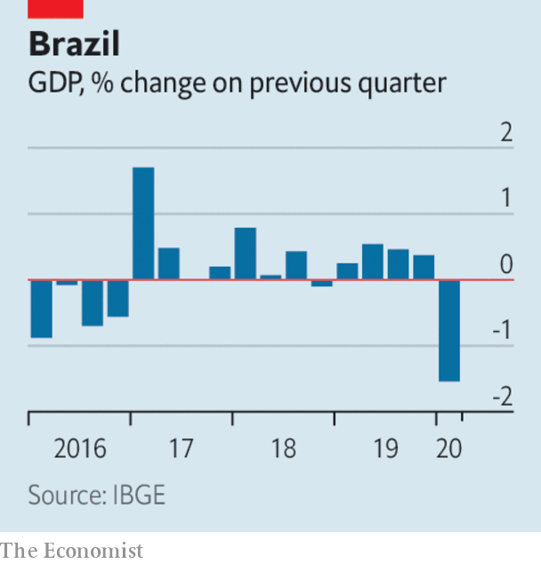

# Business this week

> Jun 4th 2020

The Centre for Democracy and Technology, an internet-privacy watchdog, filed the first lawsuit against Donald Trump’s executive order seeking to strip social-media firms of liability protections for content posted on their platforms. The courts will probably rule eventually that the president does not have the authority to proclaim such a law, though federal agencies may try to implement it in the meantime. Mr Trump issued the order in a spat with Twitter over its policing of his tweets. It labelled one of his posts as “glorifying violence” the day after he pronounced his edict. See [article](https://www.economist.com//international/2020/06/04/donald-trump-has-reignited-a-debate-about-regulating-speech-online).

Facebook faced a revolt from staff for leaving the same post by Mr Trump untouched on its platform. Some employees staged a virtual walkout by not logging on for work. See [article](https://www.economist.com//business/2020/06/04/twitter-and-facebook-have-differing-business-models).

A class-action lawsuit was filed in California claiming $5bn in damages from Google for collecting data from users of its Chrome browser when they switch to private mode, termed Incognito. The complaint alleges that Google’s hoarding of the information is “covert”, but the company says it has always notified people when they use Incognito mode that websites can still tap into their browsing activity.

Lufthansa pledged to step up the restructuring of its business. The German airline wants to offer more tourist flights as it gradually recovers from covid restrictions, but still only expects to fly 40% of its schedule by September. At the end of the crisis, which it expects in 2023, the group’s fleet will be smaller by 100 planes. The board signed off on a €9bn ($10bn) rescue package from the German government, under which the EU requires Lufthansa to give up slots at Germany’s big airports.

Renault “finalised” a €5bn ($5.6bn) credit facility from the French government, which it can draw in whole or in parts until the end of the year. The French carmaker recently announced 15,000 job cuts worldwide, including 4,600 in France, where it faces stiff political opposition to any factory closures.

In Germany  ZF Friedrichshafen, one of the world’s biggest suppliers of car transmissions, was reportedly considering laying off 15,000 staff, half of them in Germany. The company employs 150,000 people in 40 countries.

The euro zone’s unemployment rate rose slightly in April to 7.3%. Almost 12m people were officially counted as jobless, far fewer than America’s 23m.

The British government announced that its scheme paying the wages of furloughed workers will end in October. In the final two months the government’s contribution will drop from 80% to 60%; employers will have to cover 10% of the cost in September and 20% in October. People will be allowed to work part-time and still participate in the scheme from July, which is when the government is expected to unveil a huge stimulus package. Covid payments were also extended to the self-employed.

An index of manufacturing activity in Britain improved in May, though IHS Markit, which compiled the survey, said conditions in the industry were still “at depths unseen outside of the current pandemic and the global financial crisis” of 2007-09. 

Brazil’s economy shrank by 1.5% in the first three months of the year compared with the previous quarter. With the number of covid cases and deaths increasing steadily Brazilians are almost certainly heading into another deep downturn. Australia’s GDP contracted by 0.3%: the Lucky Country is facing its first recession in three decades. 

JDE Peet’s raised €2.25bn ($2.5bn) when it floated on the Amsterdam stock exchange, making it Europe’s biggest IPO in two years. JAB Holdings retains a majority stake in the coffee company, which includes Douwe Egberts, Kenco, Peet’s Coffee and Tassimo among its brands. In New York Warner Music’s IPO on the Nasdaq raised $1.9bn, valuing the company at $12.8bn. See [article](https://www.economist.com//business/2020/06/04/companies-are-still-raising-cash-by-floating).

An increase in passenger rides at Lyft was seen as a sign that the American economy is starting its journey to recovery. The ride-hailing company reported that despite the lockdown rides had increased by 26% in May over April, though they were down by 70% compared with May last year.

Meanwhile, Volvo sold 41% more cars in May than April, as lockdowns eased in several markets. Showroom traffic in Europe increased and sales in China continued to grow.

One big beneficiary from the lockdowns reported a 169% jump in revenue for the first quarter, year on year. Zoom said 265,400 firms with more than ten staff were now using its videoconference platform, a rise of 354%. Zoom’s stock has soared. The company is worth over $63bn, up from $16bn when it went public 14 months ago. Zoom’s boss, Eric Yuan, said he was “humbled”.

## URL

https://www.economist.com/the-world-this-week/2020/06/04/business-this-week
