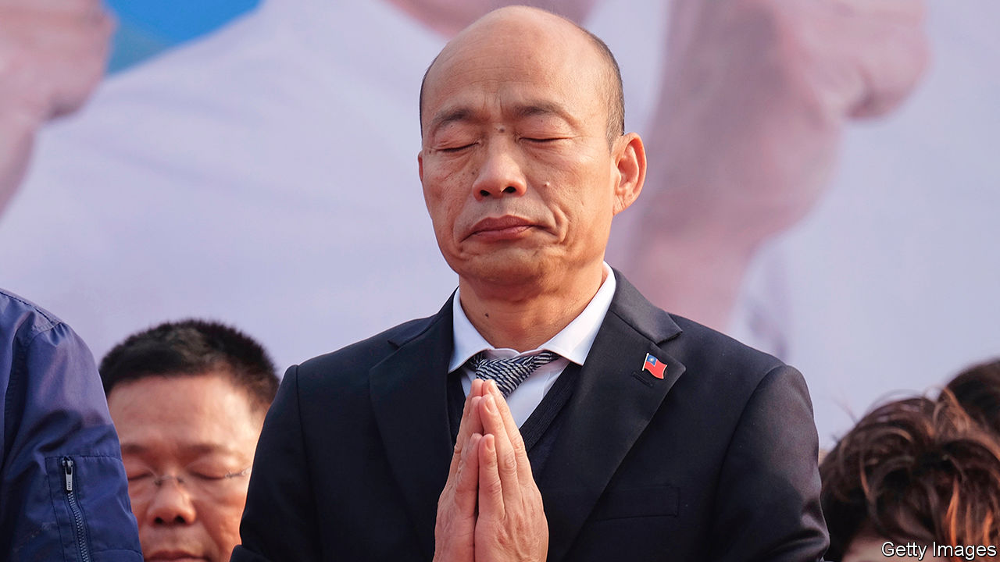

## Han’s down

# A China-friendly politician is humiliated in Taiwan

> Events in Hong Kong have made voters wary of anything that smacks of closer ties

> Jun 11th 2020TAIPEI

“KAOHSIUNG PEOPLE are writing their own history” and “God bless Taiwan” read the yellow bandannas worn by many in the crowd that had gathered in the southern port city of Kaohsiung on June 6th, to wait for the results of a vote to recall their China-friendly mayor, Han Kuo-yu (pictured). On hearing that he would be sacked, they burst into loud applause.

Almost 1m residents, 97% of those who went to the polls, voted against the mayor, the first recall of a senior politician in Taiwan’s history. Mr Han was once the golden boy of the opposition Kuomintang (KMT), having wrested control of Kaohsiung from the ruling Democratic Progressive Party (DPP) in 2018 for the first time in a generation. Encouraged by his strong showing in a DPP stronghold, the KMT chose him as its candidate to take on Tsai Ing-wen, the incumbent, in January’s presidential poll. Many expected the folksy Mr Han to defeat the dour Ms Tsai. Instead, the would-be toppler has himself been toppled.

This reversal of fortune reflects a sea-change in Taiwanese politics over the past two years. Mr Han became mayor by promising wealth through stronger economic ties with China. That struck a chord with voters disillusioned with Ms Tsai’s handling of the torpid economy. But as the presidential race got under way last year, so did protests in Hong Kong in favour of greater democracy and autonomy from China. Ms Tsai switched the focus of her campaign from the economy to protecting Taiwan from the menace of China, which claims Taiwan as part of its territory and threatens to retake it by force. She portrayed Mr Han’s desire for closer ties with China as a threat to Taiwan’s independence, and won hands down.

Mr Han did not help his cause by holding private meetings at the offices of the Chinese government in Hong Kong and Macau. He also once described Taiwan and China as partners in an arranged marriage that had fallen madly in love. But pursuing less tetchy relations with China, the policy of the KMT for decades, is becoming ever less marketable. Fan Shih-ping of National Taiwan Normal University thinks China’s recent imposition on Hong Kong of a national-security law that could be used to suppress dissent may help explain the resounding slap Kaohsiung’s voters gave Mr Han. The KMT’s chairman, Johnny Chiang, has been trying to tone down the party’s pro-China image. When the results were announced, he reiterated that the KMT opposes communism; its members had always put Taiwan first, he said.

Several more mundane factors contributed to Mr Han’s downfall. Many Kaohsiung residents disapproved of him for breaking a promise not to run for president and were infuriated when he took a leave of absence to focus on his campaign after only ten months as mayor. The impression that he was neglecting his day job was reinforced in November when he missed the city council’s review of the municipal budget, prompting fisticuffs in the council chamber. Mr Han also failed to lure a Disney theme park to the city—one of his more ambitious campaign pledges.

There will now be a fresh election for mayor. Mr Han is not eligible to compete, and the KMT has not yet selected a candidate to run in his stead. But whenever it does, its choice is certain to sound much warier of China. ■

## URL

https://www.economist.com/asia/2020/06/11/a-china-friendly-politician-is-humiliated-in-taiwan
