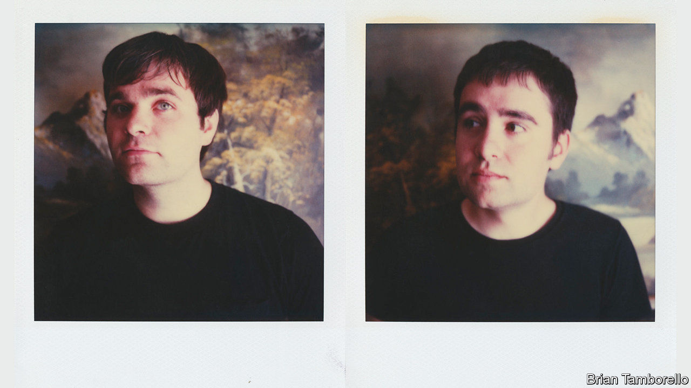

## Home Entertainment

# “Give Up” is a fitting pandemic soundtrack—in more ways than one

> The album by The Postal Service shows that great things can be accomplished at a distance

> Jun 13th 2020

THE THRILL is gone. Even over Zoom, millions have discovered, work stubbornly remains work. But if isolation seems a grind, have a listen to “Give Up” by the Postal Service, a collaboration in 2003 between Ben Gibbard of the indie band Death Cab for Cutie, and Jimmy Tamborello, aka Dntel, a pioneering electronica producer. Not only do its lyrics anticipate today’s claustrophobia; the way the album was made is itself a salutary tale of long-distance ingenuity.

Living at opposite ends of America’s west coast, the two men were unable to meet in person. So Mr Tamborello would record beats on CDs and post them to Mr Gibbard, who added instrumentation and vocals. Back and forth the CDs went, new layers added with each mailing, until after a year they had amassed an album’s worth of material. In honour of the deliveries that made their teamwork possible, they decided to call themselves the Postal Service.

The United States Postal Service (USPS) responded with a cease-and-desist letter. But the two sides came to an arrangement: in exchange for some promotional work, the Postal Service could keep the name. The USPS would even sell their records on its website—though it insisted on a morality clause voiding the agreement should the duo do anything truly shocking.

The resulting album is a gem. Mr Tamborello’s signature glitchy sounds are built into rhythms plundered from dance music, which Mr Gibbard’s guitar and vocals turn into energetic yet charming pop songs. Some of his lyrics deal with pop staples—young love and break-ups—but the melancholic turns elevate the record above cliché, and make it resonate now.

Take the song “We Will Become Silhouettes”, which recounts being trapped inside after a nuclear strike. “I wanted to walk through the empty streets/And feel something constant under my feet,” Mr Gibbard sings. “But all the news reports recommended that I stay indoors”: different disaster, same outcome. “Sleeping In” is about clinging to consoling dreams. “Recycled Air” evokes a yearning for air travel, and its anxieties, “knuckles clenched to white as the landing gear retract for flight”.

This genre-bending music looked forward to later developments in pop. But the Postal Service was ahead of its time in another way, too. Even before covid-19 confined them to their home studios, other artists were undertaking remote collaborations. For example, “Old Town Road”, a blend of country & western and hip-hop, was made from a beat that Lil Nas X, an American rapper, bought online from YoungKio, a Dutch music producer, for $30. Though they had never met, the track they made together enjoyed a record-breaking 19 weeks at the summit of the Billboard Top 100, and was certified diamond faster than any song before it. After your next dreary Zoom meeting, remember that great things have been accomplished at a distance. ■