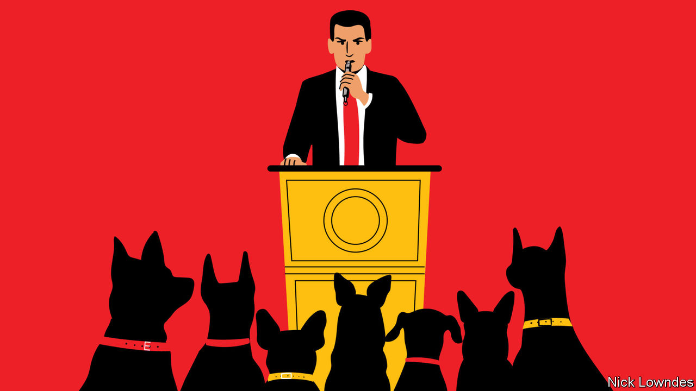

## Johnson

# Language is a telling clue to unacknowledged racial attitudes

> Overt racism is declining, but studies show that unconscious bias remains widespread

> Jun 13th 2020

“WHEN THE looting starts, the shooting starts,” tweeted Donald Trump (invoking a slogan from the 1960s), when unrest broke out after the killing of George Floyd. “THUGS”, the president wrote, were disrespecting Mr Floyd’s memory. Mr Trump likes “thugs”, tweeting it often. He almost always does so when some matter of race is at issue—either the treatment of African-Americans or in reference to “illegals” and “gang members”, implicitly Latinos.

Are “looting” and “thugs” a kind of racist code? Many people detect a “dog-whistle” which, without saying anything explicitly racist, the president intends listeners to hear. Mr Trump forcefully disagrees. In 2015 he tweeted: “They now say using the word ‘thug’ is, like so many other words, not politically correct (even though Obama uses it). It is racist. BULL!” Plenty of people approve of calling thugs thugs, and object to being labelled racists for doing so.

The intentional dog-whistle is not unknown. But people can allude to race without realising it, too. Explicit racism is declining in America, as a pile of evidence shows. For instance, there is a widespread reluctance to admit racist attitudes that many Americans were once perfectly comfortable with. On the other hand, unconscious and semi-conscious prejudice is alive and well. When people use racially linked language, without overt slurs or other racist tropes, linguists call it “racialisation”.

Some ingenious research has teased out the links between prejudice and language. A classic method for fingering implicit bias asks subjects to take a quick-fire, button-pushing test that associates positive or negative words with white and black faces. In one such study (at implicit.harvard.edu), 58% of online test-takers are slower to associate positive language with black faces than with white ones. Just 14% display the opposite tendency.

Or consider more deliberate forms of language, formulated by people who are generally unlikely to consider themselves racist—journalists. A study by Dana Mastro of the University of California at Santa Barbara looked at hundreds of news reports in three big American papers (the New York Times, the Los Angeles Times and  USA Today) about professional athletes accused of crimes. Such articles were more accusatory of the alleged perpetrators when they were black. They were more likely to provide context and humanising detail when the accused were white.

Praise can be racialised, too. Crystal Dunn Soubrier, a black player for America’s women’s football team, wrote recently that commentators attribute her ability to play in several positions to athleticism, never to her reading or study of the game. This seems a persistent pattern in sportswriting. Kelly Wright, a doctoral student of linguistics at the University of Michigan, used machine-learning to predict an athlete’s race based on words that appear in an article containing their name. Purely relying on the language of news reports, the model was able to predict that Ronda Rousey, a wrestler, was white with a 96% certainty, whereas there was only a 3% probability that Eric Berry, a National Football League player, was white. So it went with other athletes; the algorithm’s guesses were almost always loaded starkly towards black or white.

When racialisation happens, words do not change their dictionary definition; rather, they take on associations with other words. Brains are statistical machines, in which learning involves a gradual strengthening or weakening of different synapses. Introduce one concept and related concepts are “primed”, or made more quickly available to the consciousness. Just because these associations are hard to prove conclusively does not make them less real.

The difference between “racist” and “racialised” helps explain why Americans often talk fruitlessly past each other when discussing words such as “thug”. With overt racism waning, it has become painfully obvious to some people—though not all—that the submerged part of the iceberg, implicit racial beliefs and associations, plays a bigger role than was once realised. Overcoming those is particularly difficult because of their semi-conscious nature.

A long struggle has made “racist” one of the worst things you can be. That counts as a great success, but the corollary is that the remaining problems are hard to talk about. Some fear being branded racist just for trying. Seeing the bias in even innocently intended language is a first step towards understanding that there is still work to do.