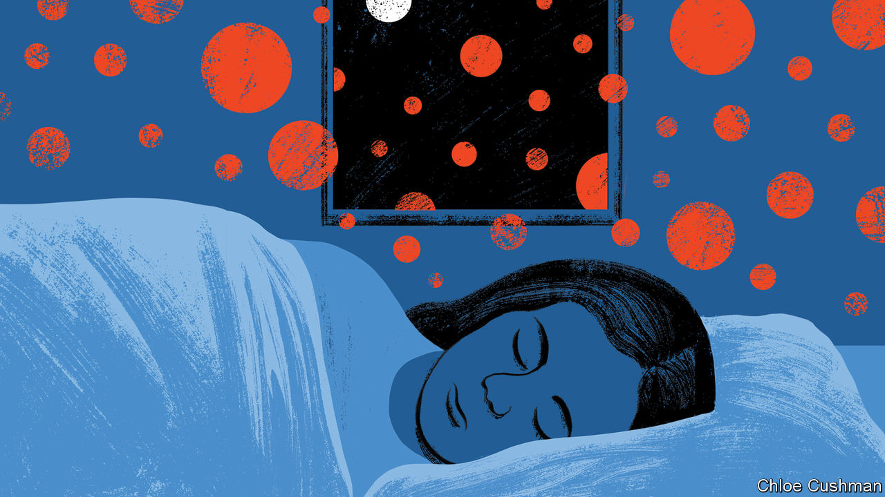

## Bedtime story

# Britons are dreaming more

> And the dreams are more vivid too

> Jun 11th 2020

FEW WORDS in the English language are more terrifying than “I had a weird dream last night.” They tend to be followed by a series of pointless vignettes and the question, “So, what do you make of it?”

Lots of Britons have probably had to sit through a conversation like this since the lockdown started. That is because, according to a study by King’s College London and Ipsos Mori, a pollster, some 40% of people report having more vivid dreams during the lockdown than they usually would.

The changes in people’s domestic arrangements are probably largely responsible. For many, day-to-day life is stressful and busy. Four out of five people use an alarm to wake up. School and work start too early in the morning. About a third of Brits have poor sleep, according to the National Health Service. But over the past 12 weeks, as much of the country has stayed home, people have been sleeping more. The timing of the extra sleep matters: dreaming occurs when the body is in something called REM sleep, which occurs mainly towards the end of the night, says Dr Guy Leschziner of Guy’s Hospital (no relation). People who have been catching an extra hour in the morning will have had deeper dreams. And because they are waking up more gently, they are more likely to remember their dreams, says Dr Hugh Selsick of the Royal London Hospital.

That may be only part of the explanation. Some people suffering from depression or post-traumatic stress disorder report increased dreaming and nightmares too. Doctors believe this is a way for the mind to deal with difficult things. Even for those who are not finding the covid-19 crisis difficult, it is distinctly odd. “It might be that vivid dreams reported by the participants in our survey are therapeutic, and that they may help us process the extraordinary reality” that we are living in, says Dr Ivana Rosenzweig of King’s College, who advised on the study.

Weird dreams are normal during and after periods of collective trauma. Researchers found that the 9/11 attacks in 2001 made Americans’ dreams more intense. Charlotte Beradt, a Jewish writer in Berlin, documented the night-time confections of Germans in “The Third Reich of Dreams”. Dr Russell Foster of the Sleep & Circadian Neuroscience Institute at Oxford says that when Boris Johnson was struck with covid-19, he dreamed of the prime minister. He is not sure whether that was out of concern for Mr Johnson or concern for the country. “All of this is conjecture,” he says, “but what you can say with certainty is you would expect vivid dreams in times of stress. It’s the brain trying to make sense of the emotional world.”

When life does eventually return to normal, with children to feed and clothe and drop off at school, and trains and buses to catch to work, Britons can expect to sleep less and dream less, and to remember their dreams less. But there are things they can do to improve their sleep, like keeping to a routine and avoiding phones before bed. And there are things employers can do to ensure their workers are well rested, and therefore more productive, too. Dr Foster suggests replacing high-sugar snacks with small protein-rich ones and lighting offices brightly enough to match employees’ circadian rhythms. For many of the nation’s tired workers, a good night’s sleep would be a dream come true. ■

Editor’s note: Some of our covid-19 coverage is free for readers of The Economist Today, our daily [newsletter](https://www.economist.com/https://my.economist.com/user#newsletter). For more stories and our pandemic tracker, see our [coronavirus hub](https://www.economist.com//news/2020/03/11/the-economists-coverage-of-the-coronavirus)